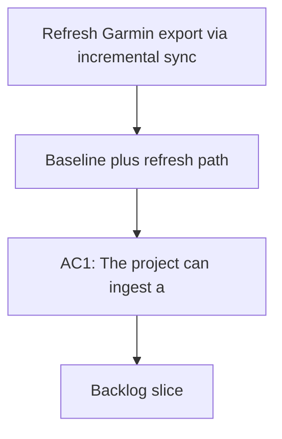

## req_010_refresh_garmin_export_via_incremental_sync_and_harden_training_data_foundation - Refresh Garmin export via incremental sync and harden training data foundation
> From version: 0.1.0
> Schema version: 1.0
> Status: Done
> Understanding: 96
> Confidence: 93
> Progress: 0
> Complexity: High
> Theme: Health
> Reminder: Update status/understanding/confidence/progress and dependencies/references when you edit this doc.

# Summary
Harden the Garmin data foundation so the project keeps a ZIP export as the main baseline import, while still being able to refresh that export with the latest Garmin data and activities collected later. In parallel, add the research-backed training signals that matter most for coaching: experimental auth sync via python-garminconnect, dual load models, pace and benchmark intelligence, and a stronger local state plus analytics split between SQLite and DuckDB.

# Why
The current project already proves that local Garmin exports can be imported, normalized, and used for coaching. The remaining gap is freshness and robustness:
- the ZIP export should stay the stable source of truth baseline
- the project should be able to append or refresh with the latest Garmin data instead of rebuilding everything manually
- the coaching layer should read more than raw volume and a few generic flags
- the project should keep operational state separate from analytics so incremental syncs remain predictable

The goal is to make the data layer strong enough that later coaching improvements can rely on it without constantly fighting missing freshness, brittle import flows, or overly generic metrics.

# User value
As a user, I want to:
- start from a trusted local Garmin export
- refresh it with later Garmin activities and health data when available
- keep everything local-first by default
- get better training analysis from readiness, load, pace, and benchmark signals
- avoid rebuilding the whole dataset manually every time I want a more recent view

# Context
The repository already supports:
- local Garmin export import
- DuckDB-based analytics
- local raw retention with provenance
- a coaching CLI and a PWA shell

The next step is to make the pipeline more durable and more up to date by combining:
- a ZIP export baseline
- optional authenticated refreshes for the latest Garmin data
- a split between operational state and analytical history
- richer coaching signals from recent performance

This request is informed by the earlier research on similar projects and by the observed needs of the current codebase:
- Garmin auth flows are useful when they work, but they should not be the only path
- local exports are more stable and should remain the baseline
- training analysis improves a lot when pace and benchmark history are explicit
- operational sync state is easier to manage in SQLite, while feature analytics are better suited to DuckDB

# Scope
- In scope: keep the local ZIP export as the primary baseline import.
- In scope: add a refresh/update path that can ingest newer Garmin data and activities after the baseline export.
- In scope: support an experimental auth backend using `python-garminconnect` behind an adapter boundary.
- In scope: maintain a dual-load model:
  - Garmin or Firstbeat-style load when available
  - a local derived load model as fallback or complement
- In scope: add pace and benchmark intelligence so the coach can reason from actual recent performances.
- In scope: keep operational sync state in SQLite when that improves incremental refresh robustness.
- In scope: keep analytical features in DuckDB.
- In scope: preserve local-first behavior and support the project even when auth refresh is unavailable.
- Out of scope: cloud-only sync dependence, mobile sync redesign, and a full product UI rewrite.

# Non-goals
- This request does not aim to replace the ZIP import baseline.
- This request does not aim to make Garmin auth the only supported ingestion path.
- This request does not aim to build a full mobile sync stack yet.
- This request does not aim to solve all future training analytics in one wave.

# Desired outcomes
- A ZIP export remains the stable source of truth baseline.
- The project can ingest newer Garmin data and activities on top of that baseline.
- The pipeline has an explicit state layer for incremental updates.
- The coach can use richer metrics such as readiness, body battery, recovery, pace, and benchmark history.
- The data model becomes easier to reason about, refresh, and validate.

# Acceptance criteria
- AC1: The project can ingest a local Garmin ZIP export as the baseline source of truth.
- AC2: The project can refresh or extend that baseline with newer Garmin data and activities when available.
- AC3: The sync flow has an explicit state layer that records what was already seen, what was refreshed, and what remains pending.
- AC4: The project supports both Garmin-provided load and a derived local load model.
- AC5: The coach can access pace and benchmark intelligence from recent training history and recent race or workout data.
- AC6: SQLite is used for operational state if needed, and DuckDB remains the primary analytics engine.
- AC7: The incremental refresh path remains local-first and does not require a cloud dependency to function at baseline.
- AC8: Tests cover at least one baseline ZIP import case, one incremental refresh case, and one coaching-relevant pace or benchmark signal case.
- AC9: The implementation preserves provenance and traceability across baseline and refreshed data.

# Clarifications
- The ZIP export should remain the baseline, not a disposable bootstrap.
- The update flow should reuse the baseline rather than forcing a full reimport every time.
- Experimental auth support is useful, but the project must remain useful without it.
- The main goal is freshness plus robustness, not a fragile auth-only dependency.
- The storage split should reduce operational ambiguity, not add complexity for its own sake.

# Open questions
- The following choices are now set:
  - refresh flow merges newest Garmin records into the same local workspace
  - SQLite holds sync state and checkpoints only
  - Garmin load is primary when trustworthy, with derived load as fallback and cross-check
  - incremental refresh starts as manual only
  - pace and benchmark intelligence should prefer recent benchmark races first

# Deferred topics
- readiness, body battery, and recovery time are intentionally deferred to a later wave
- Which pace and benchmark strategy should be emphasized after the race-first baseline?
  - Suggested default: benchmark races first, with strong quality sessions as secondary evidence.

# Companion docs
- Product brief(s): `prod_000_local_first_pwa_coach_dashboard`
- Architecture decision(s): `adr_001_choose_local_pwa_storage_and_provider_integration`
# AI Context
- Summary: Keep ZIP as the baseline Garmin export, add an incremental refresh path for newer Garmin data and activities, and harden the training-data foundation with load, pace, benchmark, SQLite, and DuckDB layers.
- Keywords: garmin, sync, incremental refresh, zip export, python-garminconnect, load model, pace, benchmark, sqlite, duckdb
- Use when: Use when the project needs a trustworthy baseline export plus a way to update local data with newer Garmin records without rebuilding the entire dataset.
- Skip when: Skip when the work is only about UI polish or coaching copy changes.

# Backlog
- `item_011_refresh_garmin_export_via_incremental_sync_and_harden_training_data_foundation`

- `logics/backlog/item_011_refresh_garmin_export_via_incremental_sync_and_harden_training_data_foundation.md`
