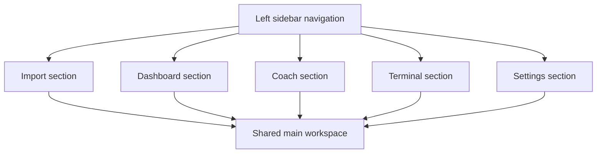

## req_011_sidebar_led_pwa_workspace_for_import_dashboard_coach_terminal_and_settings - Sidebar-led PWA workspace for import, dashboard, coach, terminal, and settings
> From version: 0.1.0
> Schema version: 1.0
> Status: Done
> Understanding: 96
> Confidence: 93
> Progress: 100
> Complexity: High
> Theme: UI
> Reminder: Update status/understanding/confidence/progress and dependencies/references when you edit this doc.

# Summary
Redesign the local-first PWA into a clearer workspace-style application with a left sidebar and a large main content area. The application should expose five main sections in a stable order: Import, Dashboard, Chat, Terminal, and Settings. The goal is to make the app feel coherent, easier to navigate, and better suited for a real daily coaching workflow.

# Why
The current PWA works, but the UX is still too fragmented for a serious daily workflow. The user needs a cleaner structure that makes it obvious:
- where the local Garmin data lives
- whether data is present and fresh
- which metrics are already analyzed
- where the coach chat happens
- where live technical output can be inspected
- where settings can be adjusted without hunting through the app

This request is about information architecture and interaction clarity, not just visual polish.

# User value
As a user, I want:
- a stable sidebar navigation so I can move between import, dashboard, coach, terminal, and settings
- a clear import process that shows if local data already exists and what the latest date is
- a dashboard that summarizes the important metrics and lets me click into a larger view
- a coach area that clearly shows whether data has been imported and analyzed
- a terminal view where I can inspect action logs and debug live behavior
- a settings area for useful technical controls such as theme and terminal visibility

# Context
The project already has:
- a local-first Garmin data foundation
- a coach chat
- import and analytics layers
- a PWA shell

The current UX improvements should build on that foundation and reduce friction around:
- data freshness
- import clarity
- model/provider visibility
- terminal/debug access
- dashboard readability

The intended layout is:
- left sidebar for navigation
- main workspace on the right taking roughly 70 percent or more of the width
- a single layout that swaps the active section in the main area instead of a collection of disconnected pages

# Scope
- In scope: add a left sidebar navigation with the five sections in this order:
  - Import
  - Dashboard
  - Chat
  - Terminal
  - Settings
- In scope: make Import the default landing section.
- In scope: keep a single layout with a large main workspace on the right.
- In scope: improve import clarity by showing:
  - whether local data exists
  - the latest date present in local data
  - whether a sync refresh may be needed
  - the active local workspace
- In scope: make the dashboard show 6 to 9 key cards by default, with the ability to click cards for a larger view.
- In scope: show several coaching metrics, starting from the most useful ones already known to be available.
- In scope: show a clear coach section that surfaces whether data is imported and analyzed, whether the active objective exists, and which provider is selected.
- In scope: make the terminal accessible through its own section in the menu.
- In scope: add log level controls above the terminal so the user can choose what to see.
- In scope: make the settings section useful for technical configuration:
  - theme selection
  - terminal visibility behavior
  - provider selection
  - workspace selection
  - import source selection
  - debug toggles
- In scope: keep the overall look sober, data-lab oriented, and not overly flashy.
- Out of scope: mobile app packaging, Android APK work, and a separate multi-page app architecture.

# Non-goals
- This request is not about changing the Garmin data model itself.
- This request is not about changing coaching algorithms first.
- This request is not about introducing a new backend stack.
- This request is not about adding decorative motion or heavy animation.

# Desired outcomes
- The PWA feels like a coherent workspace rather than a set of disconnected panels.
- Users can immediately understand the current data situation.
- The dashboard becomes more readable and more explorable.
- The coach area becomes clearer and less ambiguous.
- The terminal becomes a first-class debugging surface.
- Settings become the central place for technical preferences.

# Acceptance criteria
- AC1: The app shows a left sidebar navigation with Import, Dashboard, Chat, Terminal, and Settings in that order.
- AC2: Import is the default landing section when the app opens.
- AC3: The main workspace occupies the dominant right-hand area and switches content based on the selected section.
- AC4: The Import section clearly shows whether local Garmin data exists and what the latest date is.
- AC5: The Dashboard shows 6 to 9 primary cards and each card can be opened or enlarged for closer inspection.
- AC6: The Chat section makes data availability, analyzed state, provider selection, and active objective visible and editable where relevant.
- AC7: The Terminal section exposes logs or action output with selectable log levels above it.
- AC8: The Settings section includes at least theme selection, terminal visibility behavior, and other useful technical options.
- AC9: The app clearly indicates when data is available locally and when a refresh may be needed.
- AC10: The design remains sober, readable, and suitable for frequent daily use.

# Clarifications
- The sidebar should be visible on desktop and degrade cleanly on smaller screens.
- The Import section should act as the entry point for the data workflow.
- The app should reuse the last known local workspace by default.
- The coach section should make it obvious whether there is enough local data to work with.
- The terminal should be visible through navigation, not always forced on screen.
- The user wants the app to feel more like a data workspace than a toy dashboard.

# Open questions
- Should dashboard card enlargement use a modal, a dedicated details panel, or an in-place expand behavior?
  - Suggested default: a dedicated details panel inside the main workspace, to keep the layout consistent.
- Should the terminal section remember the last selected log level?
  - Suggested default: yes, persist it in local settings.
- Should the settings section also allow the user to pick the default start section?
  - Suggested default: yes, but keep Import as the initial default for first-time users.
- Should the provider status be shown as a compact badge in the sidebar or only inside Chat and Settings?
  - Suggested default: compact badge in the sidebar plus detail in Chat and Settings.

# Companion docs
- Product brief(s): `prod_000_local_first_pwa_coach_dashboard`
- Architecture decision(s): `adr_001_choose_local_pwa_storage_and_provider_integration`
# AI Context
- Summary: Redesign the local-first PWA into a sidebar-led workspace with Import, Dashboard, Chat, Terminal, and Settings as the main sections, with clear data freshness, analysis visibility, and technical controls.
- Keywords: pwa, sidebar, navigation, workspace, import, dashboard, coach, terminal, settings, local-first, ui, ux
- Use when: Use when the app needs a stronger information architecture and clearer daily workflow around data import, analysis, coaching, and debugging.
- Skip when: Skip when the change is only about charts, model behavior, or data normalization.

# Backlog
- `item_012_sidebar_led_pwa_workspace_for_import_dashboard_coach_terminal_and_settings`
