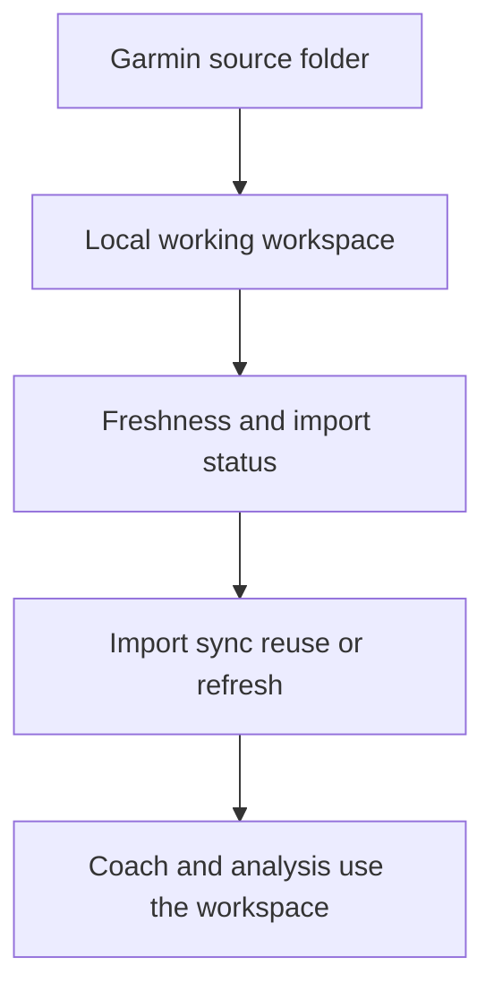

## req_012_clarify_import_workflow_accent_handling_and_refresh_actions - Clarify import workflow, accent handling, and refresh actions
> From version: 0.1.0
> Schema version: 1.0
> Status: Done
> Understanding: 98%
> Confidence: 95%
> Complexity: Medium
> Theme: UI
> Reminder: Update status/understanding/confidence and linked backlog/task references when you edit this doc.

# Needs
- Make the import workspace easier to understand, especially the difference between source Garmin data, local working workspace, last import, and refresh.
- Fix the remaining accent and encoding issues in the PWA labels, statuses, and import workflow copy.
- Reorganize the import page so the main actions and status signals read in a clear order.
- Make the four import actions understandable:
  - import Garmin
  - sync Garmin Connect
  - reuse the last workspace
  - refresh
- Keep the Garmin source path input visible near the import button, but move the local workspace path input out of this page and into Settings.
- Keep the terminology consistent across the sidebar, dashboard, terminal, and settings.

# Context
- The current PWA already exposes a local-first Garmin workflow, but the import section mixes status information, source selection, freshness, and action buttons in a way that is hard to read.
- The UI currently shows a mix of local workspace state, last import state, and source path selection, but their meaning is not obvious enough.
- Some strings still display broken accent characters or mojibake-like output in the import workflow and related dashboard labels.
- The user now wants the import page to answer four questions immediately:
  - Do I have local data?
  - How fresh is it?
  - Where is the Garmin source folder?
  - What does each action do?
- The user wants the import flow to answer the remaining questions immediately:
  - Which workspace am I working in?
  - What is the difference between import, sync, reuse, and refresh?
- The import flow should remain local-first and continue to work with the Garmin export folder already copied locally.
- The current data foundation and coach features should keep working while the wording and ordering are improved.
- Clarifying the workflow should reduce ambiguity before the user launches a larger import or refresh action.
- A non-blocking Garmin Connect sync button should be available, and its failure should only be reported, not block the rest of the workflow.

# Scope
- In scope:
  - rewrite the import page copy and labels with correct accents and consistent terminology
  - separate source folder, workspace, last import, and freshness information more clearly
  - make the import actions visually and semantically distinct
  - add a non-blocking Garmin Connect sync action that reports failure without stopping the app
  - keep the current local-first flow intact
  - preserve the ability to reuse the last workspace and manually pick a different one
- In scope:
  - clarify what each button does
  - clarify what the workflow status badges mean
  - show the last import more explicitly
  - make the source vs workspace distinction understandable at a glance
  - move the local workspace path input into Settings and keep the Garmin source input near the import action
- Out of scope:
  - changing the underlying import engine
  - changing Garmin sync backends
  - redesigning the coach dashboard
  - changing the local storage model

# Acceptance criteria
- AC1: The import page clearly distinguishes between source Garmin folder, local working workspace, and last import metadata.
- AC2: The import page explains the difference between the four main actions:
  - import Garmin
  - sync Garmin Connect
  - reuse the last workspace
  - refresh
- AC3: The import page and related labels no longer show broken accent characters or mojibake in the main workflow text.
- AC4: The freshness signal is understandable, including the age of the latest local activity and whether the workspace looks stale.
- AC5: The primary action order reads naturally from top to bottom and reduces ambiguity about what to do next.
- AC6: The coach and dashboard continue to work with the updated import workflow wording and layout.
- AC7: Automated checks cover the main import labels, the action semantics, and the accent-sensitive strings.
- AC8: The Garmin Connect sync action may fail gracefully without blocking the import page or the rest of the app.

# Definition of Ready (DoR)
- [x] Problem statement is explicit and user impact is clear.
- [x] Scope boundaries (in/out) are explicit.
- [x] Acceptance criteria are testable.
- [x] Dependencies and known risks are listed.

# Risks and dependencies
- The import page is tied to the local workspace state, so wording changes must not break the data flow.
- Broken accent rendering can come from source text, HTML, JS strings, or a cached shell, so the fix must be applied consistently.
- The refresh command must stay clearly different from first import and workspace reuse to avoid accidental re-import confusion.
- The existing PWA cache behavior can keep stale labels alive if the build version is not refreshed.

# Clarifications
- `Garmin source folder` means the local folder that contains the raw export files to ingest.
- `Local working workspace` means the folder where the app stores the working copy, normalized data, and analysis artifacts.
- `Last import` means the metadata of the most recent import run: when it happened, how many files or records were processed, and what changed.
- `Reuse the last workspace` means point the UI and workflow back to the most recent local workspace without reimporting by default.
- `Refresh` means run a new import or incremental update using the current local source and current workspace.
- `Sync Garmin Connect` means try to fetch newer data from Garmin Connect through the API or auth adapter, then surface success or failure without blocking the user.
- The user wants the import page to make freshness and workflow decisions obvious before any action is launched.
- The local workspace path belongs in Settings because it is a configuration value, not a primary import action.

# Open questions
- Should the import page keep the current three-button structure or collapse the actions into one primary button with two secondary actions?
- Should the workflow summary at the top emphasize freshness first or workspace first?
- Should the last import metadata be shown as a compact badge row or as a full detail card?
- Should `sync Garmin Connect` appear as a secondary action next to import, or in its own grouped action row?
- Should the source path field stay visible in the import section or be collapsed behind an advanced toggle once the wording is clearer?

# Companion docs
- Product brief(s): [prod_001_import_workflow_clarity_and_non_blocking_garmin_sync](../product/prod_001_import_workflow_clarity_and_non_blocking_garmin_sync.md)
- Architecture decision(s): [adr_002_place_workspace_in_settings_and_add_non_blocking_garmin_sync](../architecture/adr_002_place_workspace_in_settings_and_add_non_blocking_garmin_sync.md)

# AI Context
- Summary: Improve the import page so source folder, freshness, import actions, and non-blocking Garmin Connect sync are obvious, while fixing remaining accent rendering issues.
- Keywords: import, workflow, workspace, source folder, refresh, freshness, accents, ui, local-first, pwa
- Use when: Use when refining the import experience and cleaning up accent-sensitive UI text.
- Skip when: Skip when the work targets coach logic, analytics models, or backend sync algorithms.
# Backlog
- `item_013_clarify_import_workflow_accent_handling_and_refresh_actions`
