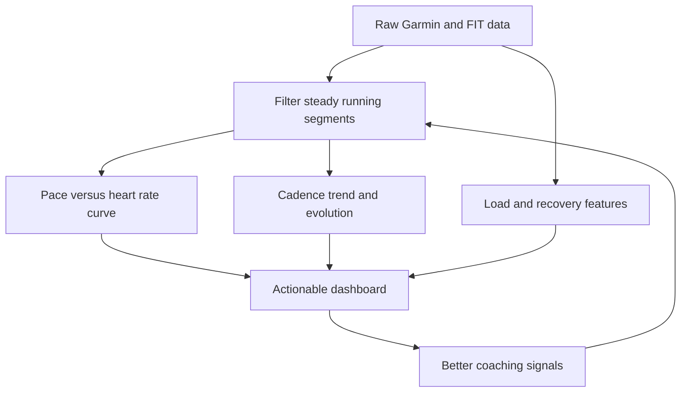

## req_013_refine_dashboard_metrics_and_data_processing_for_pace_hr_cadence_coach_analytics - Refine dashboard metrics and data processing for pace HR cadence coach analytics
> From version: 0.1.0
> Schema version: 1.0
> Status: Done
> Understanding: 98%
> Confidence: 95%
> Complexity: High
> Theme: Health
> Reminder: Update status, understanding, confidence, and linked backlog/task references when you edit this doc.

# Needs
- Simplify the dashboard by removing low-value cards and keeping only the metrics that help the coach make better running decisions.
- Replace the current pace/HR card with a monotonic smoothed pace-vs-heart-rate curve built from recent running points and filtered steady segments.
- Add cadence trend and cadence evolution so the user can see progress toward a higher cadence target.
- Improve the processing pipeline so derived metrics are robust against interval spikes, warmup/cooldown noise, and very short unstable segments.
- Use a longer analysis window when needed, up to roughly 3 months, because the evolution is not always obvious on short windows.
- Keep coverage, import plumbing, and other debug-only signals out of the main dashboard unless they are genuinely useful for the user.

# Context
- The current PWA dashboard already shows volume, load, load ratio, sleep, HRV, pace/HR, sortie longue, and several utility cards.
- User feedback says several of those cards are not helpful in their current form:
- `coverage` is unclear in the main dashboard and should probably move to debug-only visibility.
- `import local` and `coach summary` do not explain a useful running decision on the dashboard.
- `sortie longue` does not look like a primary dashboard metric.
- `HRV trend` is too detached from the other recovery signals when shown alone.
- `load ratio` and `load` need clear high and low references so they can be interpreted.
- `sleep recent` should be renamed and contextualized, for example as `sleep 7d average`, `sleep consistency`, or another rolling signal with low and high norms.
- The current pace/HR card should become a monotonic smoothed curve instead of a simple summary or a raw regression line.
- Cadence is an important target for the user and should be visible as a first-class metric.
- A local PDF analysis file titled `Panorama technique pour coach_garmin` suggests the best overall direction:
- keep raw Garmin and FIT data immutable when possible
- prefer a local-first pipeline with SQLite for state and DuckDB for analytics
- use FIT as the richest activity source
- build a coverage report and feature contract for what the coach actually consumes
- use robust filtering for transient points and unstable interval segments
- keep load models and derived metrics explainable rather than overly magical
- use high and low norms wherever a single value is too hard to interpret on its own

# Scope
- In scope: remove dashboard clutter that does not help running decisions.
- In scope: keep volume, load, recovery, pace/HR, and cadence signals that the coach can actually use.
- In scope: redesign the pace/HR view as a curve built from nearest heart rate values per pace band, then smoothed into a monotonic shape.
- In scope: color the pace/HR points or curve by HR zones so effort intensity stays readable.
- In scope: filter out unstable data such as intervals, warmup, cooldown, and very short samples when they distort the trend.
- In scope: expose cadence trend and cadence progression in a clear, coach-friendly way.
- In scope: use enough history to make the curve meaningful, potentially up to 3 months of data.
- In scope: improve the data processing so metrics are derived from a stable and explainable pipeline.
- In scope: keep coverage and similar technical diagnostics available in debug or hidden views if needed.
- Out of scope: new Garmin sync work, auth changes, or a full redesign of the PWA shell.
- Out of scope: medical analysis, injury prediction claims, or a full machine learning project.

# Dashboard direction
- Keep:
- weekly volume
- training load with clear high and low reference bands
- sleep as a rolling average and/or consistency signal with norms
- pace versus heart rate monotonic curve
- cadence trend and cadence evolution
- a contextual recovery composite if it helps explain readiness
- Remove from the main dashboard:
- coverage
- import local
- coach summary
- sortie longue
- standalone HRV trend without context

# Data processing direction
- Use recent running sessions as the main source for pace/HR and cadence analysis.
- Prefer a broader window when the data is sparse or noisy, up to about 3 months.
- Prefer steady segments over noisy transient segments.
- Exclude or down-weight:
- warmup and cooldown
- interval bursts shorter than a stable threshold
- points with highly unstable pace or heart rate
- very high resting HR moments that do not represent steady effort
- Build the pace/HR curve from all usable points in recent runs, not only session summaries.
- Derive a nearest-value curve per pace band, then smooth it so the final function stays monotonic and easier to read.
- Use high and low references for load and sleep instead of naked raw numbers.
- Keep the output explainable: the user should understand why a point is included or ignored.
- Reuse the raw FIT or export data as the source of truth when possible.

# Acceptance criteria
- AC1: The main dashboard no longer shows low-value cards that do not help the running coach decision flow.
- AC2: The dashboard contains a clear pace versus heart rate curve built from filtered recent running data.
- AC3: The pace versus heart rate curve uses a nearest-value plus monotonic smoothing treatment that resists outliers and unstable interval-like points.
- AC4: The dashboard surfaces cadence trend or cadence evolution as a first-class metric.
- AC5: Load and sleep are displayed with understandable high and low references or context, not as isolated raw labels.
- AC6: Coverage and other technical diagnostics are available outside the main user-facing dashboard.
- AC7: Tests cover the dashboard metric selection and the data filtering used for the regression or trend views.
- AC8: The implementation remains local-first and does not require a paid cloud service to compute or display the metrics.

# Clarifications
- The dashboard should answer the question: `What should I do next, based on my recent running data?`
- Coverage is only useful if it tells us how much of the available raw data is actually consumed by the coach pipeline; it is not a primary user-facing metric.
- `Sleep recent` should be renamed to a clearer rolling metric, such as `sleep 7d average`, `sleep consistency`, or another rolling normed signal.
- `Pace / FC` should not be a simple summary label; it should be a visible monotonic relationship between pace and heart rate.
- `HRV trend` should either be contextualized with recovery or moved behind another more actionable metric.
- `Sortie longue` can stay in analysis if needed, but it should not take a primary dashboard slot if cadence and pace/HR provide better coaching value.
- `Load` and `sleep` should show high and low reference bands where possible.

# Open questions
- Should the pace versus heart rate curve be built from pace bands, nearest heart rate values, or another aggregation before smoothing?
- Should the analysis window default to 21 days, 28 days, or a broader window closer to 3 months?
- Should cadence be shown as a weekly average, a trend line, a cadence versus pace relationship, or all three if space allows?
- Should load use Garmin load when available and a derived fallback only when needed, or should both always be shown with reference bands?
- Should the dashboard keep one compact recovery card that combines sleep, HRV, and resting HR, or should those stay separate?

# Suggested answers
- Recommendation: build the curve from pace bands and nearest heart rate values, then apply a monotonic smoothing step rather than a plain linear regression.
- Recommendation: default to a broad analysis window, with the option to go up to roughly 3 months when the trend needs more context.
- Recommendation: show cadence as both a trend line and a pace relationship if the space allows it.
- Recommendation: show Garmin load as the primary source when available, with derived fallback in the processing layer, plus high and low reference bands.
- Recommendation: keep one compact recovery card if it helps the coach, but do not let it hide the main running signals.

# Companion docs
- Product brief(s): `prod_002_refine_dashboard_metrics_and_data_processing_for_running_analytics`
- Architecture decision(s): `adr_003_choose_monotone_pace_hr_curve_and_cadence_first_dashboard_metrics`

# AI Context
- Summary: Rework the running dashboard and data processing so the coach sees actionable metrics, a monotonic pace and heart rate curve, and cadence evolution.
- Keywords: dashboard, pace, heart rate, cadence, curve, load, sleep, HRV, running, data processing, local-first
- Use when: Use when refining running analytics and the treatment of Garmin data for coaching decisions.
- Skip when: Skip when the work is about Garmin auth, sync plumbing, or shell navigation.

# Backlog
- `item_014_refine_dashboard_metrics_and_data_processing_for_pace_hr_cadence_coach_analytics`
