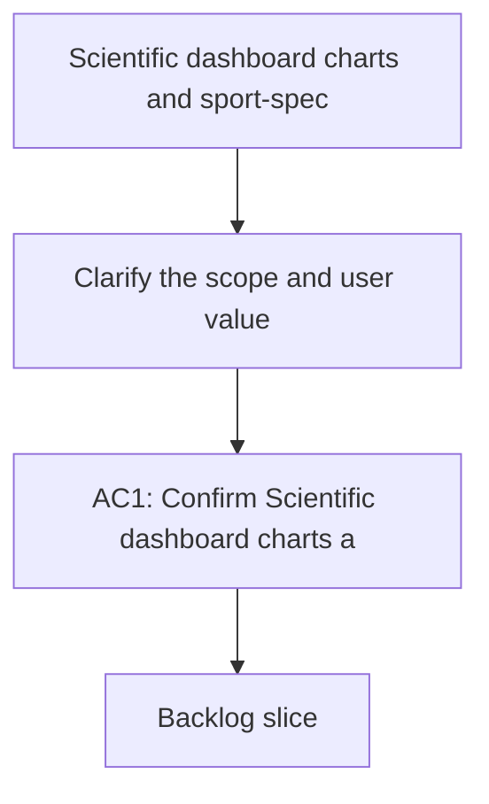

## req_014_scientific_dashboard_charts_and_sport_specific_volume_filtering - Scientific dashboard charts and sport-specific volume filtering
> From version: 0.0.0
> Schema version: 1.0
> Status: Draft
> Understanding: 90%
> Confidence: 85%
> Complexity: Medium
> Theme: General
> Reminder: Update status/understanding/confidence and linked backlog/task references when you edit this doc.

# Needs
- Clarify the scope and user value of Scientific dashboard charts and sport-specific volume filtering.

# Context
- Capture the relevant context, constraints, and stakeholders for Scientific dashboard charts and sport-specific volume filtering.

# Acceptance criteria
- AC1: Confirm Scientific dashboard charts and sport-specific volume filtering is framed clearly enough for backlog grooming.

# Definition of Ready (DoR)
- [ ] Problem statement is explicit and user impact is clear.
- [ ] Scope boundaries (in/out) are explicit.
- [ ] Acceptance criteria are testable.
- [ ] Dependencies and known risks are listed.

# Companion docs
- Product brief(s): (none yet)
- Architecture decision(s): (none yet)

# AI Context
- Summary: Scientific dashboard charts and sport-specific volume filtering
- Keywords: scientific, dashboard, charts, and, sport-specific, volume, filtering
- Use when: Use when framing scope, context, and acceptance checks for Scientific dashboard charts and sport-specific volume filtering.
- Skip when: Skip when the work targets another feature, repository, or workflow stage.
# Backlog
- (none yet)
