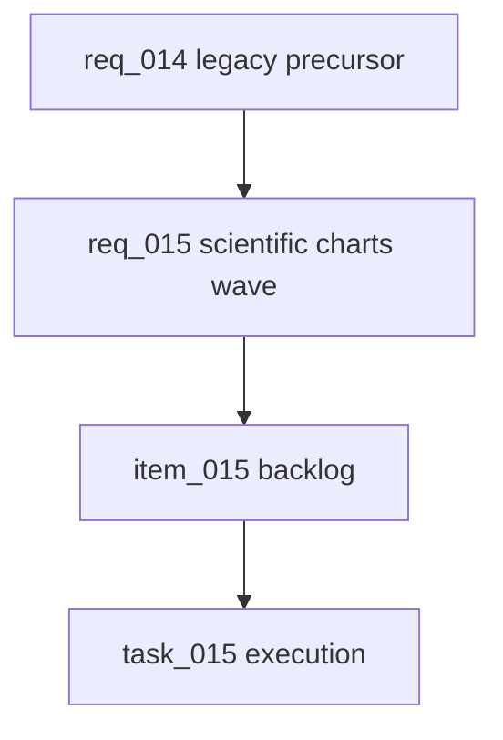

## req_014_scientific_dashboard_charts_and_sport_specific_volume_filtering - Legacy precursor to scientific charts and sport-specific filtering
> From version: 0.0.0
> Schema version: 1.0
> Status: Archived
> Understanding: 90%
> Confidence: 85%
> Complexity: Medium
> Theme: General
> Reminder: This request is a legacy precursor. Keep it as a traceability stub only and route new work through req_015 and item_015.

# Summary
This request was the first framing pass for scientific dashboard charts and sport-specific volume filtering.
It has now been superseded by the more complete request/backlog/task chain:
- `req_015_scientific_charts_sport_specific_volumes_and_data_recalculation_controls`
- `item_015_scientific_charts_sport_specific_volumes_and_data_recalculation_controls`
- `task_015_scientific_charts_sport_specific_volumes_and_data_recalculation_controls`

# Context
- The original idea remains useful as historical traceability.
- The execution path now lives in the refined scientific charts wave.
- Do not create new implementation work from this stub; extend the req_015 chain instead.

# Companion docs
- Product brief(s): `prod_003_scientific_dashboard_charts_and_sport_specific_volume_filtering`
- Architecture decision(s): `adr_004_scientific_charts_for_sport_specific_volumes_and_data_recalculation`
- Superseded by: `req_015_scientific_charts_sport_specific_volumes_and_data_recalculation_controls`

# AI Context
- Summary: Legacy precursor for scientific dashboard charts and sport-specific volume filtering.
- Keywords: scientific, dashboard, charts, sport-specific, volume, filtering, superseded
- Use when: Use only for historical traceability or to understand the origin of the req_015 wave.
- Skip when: Skip for all new implementation work.

# Backlog
- (none; superseded)
