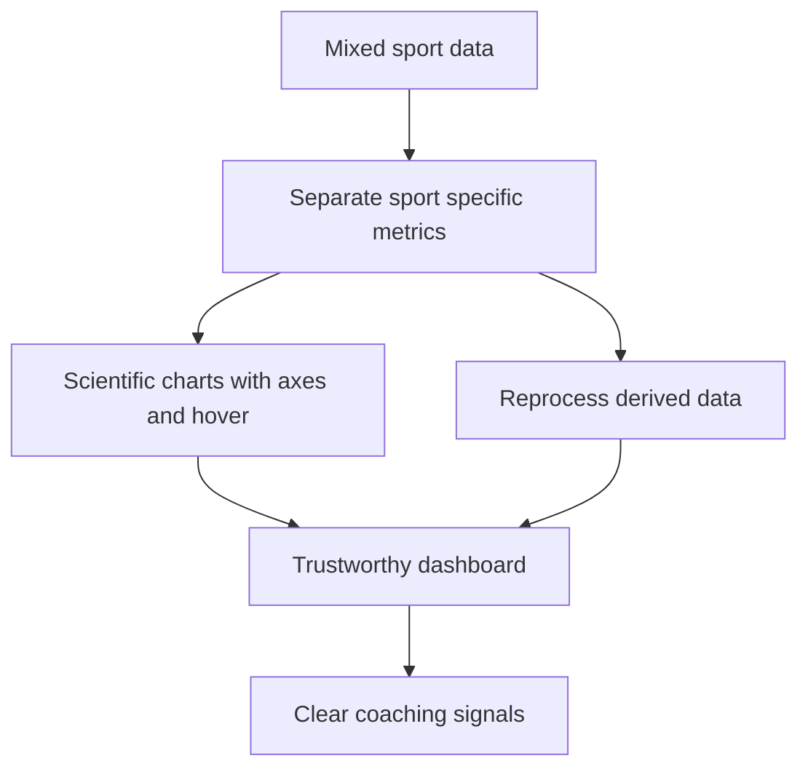

## req_015_scientific_charts_sport_specific_volumes_and_data_recalculation_controls - Scientific charts sport-specific volumes and data recalculation controls
> From version: 0.1.0
> Schema version: 1.0
> Status: Done
> Understanding: 96%
> Confidence: 94%
> Complexity: High
> Theme: Health
> Reminder: Update status/understanding/confidence and linked backlog/task references when you edit this doc.

# Needs
- Make the dashboard scientifically readable with axes, ticks, values, and hover tooltips on curves.
- Separate running volume from cycling and strength work so the running dashboard stays trustworthy.
- Add a visible weekly cycling volume graph without mixing it into the running metrics.
- Add a non-blocking recalculation / reprocessing action so derived data can be refreshed after filtering or source changes.
- Surface additional curves when useful, including charge ratio, sleep, and resting heart rate, in a readable chart style.

# Context
- Current build: `20260414-navfix16`.
- The existing dashboard build is active, but some metrics still feel misleading because mixed-sport volume can leak into running views.
- The current curve rendering is too minimal for the user: no visible axes, no readable ticks, and too little detail when hovering points.
- The user wants the dashboard to remain local-first, but the analytics should be easy to recalculate when the data contract changes or when the source needs reprocessing.
- The running dashboard should not include cycling or strength volume in running totals, but the user still wants cycling volume visible as a separate weekly trend.
- Pace/FC curves may be missing or stale when the processed data has not been recalculated after filtering or data-model changes.
- The main value of this slice is trust: clearer sport separation, clearer graphs, and a direct way to refresh derived metrics.

# Acceptance criteria
- AC1: The running dashboard excludes bike and strength volume from running totals.
- AC2: A separate weekly bike volume graph is available and does not contaminate the running metrics.
- AC3: The main charts use scientific plotting conventions, including axes, ticks, readable labels, and hover values.
- AC4: Pace/FC, charge ratio, sleep, and resting HR can be rendered as readable trend or curve charts when the data is available.
- AC5: A recalculation / reprocessing action is available and does not block the UI while derived data is refreshed.
- AC6: The dashboard remains local-first and continues to work with local data when sync or auth is unavailable.

# Definition of Ready (DoR)
- [x] Problem statement is explicit and user impact is clear.
- [x] Scope boundaries (in/out) are explicit.
- [x] Acceptance criteria are testable.
- [x] Dependencies and known risks are listed.

# Companion docs
- Product brief(s): `prod_003_scientific_dashboard_charts_and_sport_specific_volume_filtering`
- Architecture decision(s): `adr_004_scientific_charts_for_sport_specific_volumes_and_data_recalculation`

# AI Context
- Summary: Improve the dashboard so sport-specific metrics are separated, charts are scientifically readable, and derived data can be recalculated on demand.
- Keywords: scientific, charts, axes, ticks, hover, running, cycling, sport-specific, recalculation, dashboard
- Use when: Use when refining the dashboard presentation and data processing pipeline for trustworthy running analytics.
- Skip when: Skip when the work targets Garmin auth, shell navigation, or unrelated UI surfaces.
# Backlog
- `item_015_scientific_charts_sport_specific_volumes_and_data_recalculation_controls`
# Open questions
- Should the bike volume graph live in the same dashboard page or in a separate sport subsection?
- Should the recalculation button rebuild only analytics, or also re-import and normalize the latest local source files?
- Should pace/FC, charge ratio, sleep, and resting HR use one shared scientific chart component or separate chart variants?

# Suggested answers
- Recommendation: keep bike volume in the dashboard, but as a separate graph and summary from the running totals.
- Recommendation: make recalculation refresh analytics and derived charts first, while keeping import as a separate explicit action.
- Recommendation: build one reusable scientific chart component with axes, ticks, and hover values so every curve stays readable.
