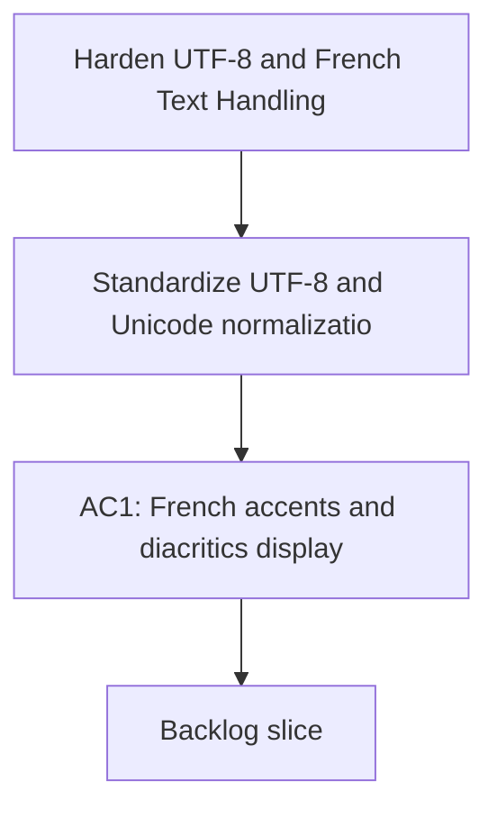

## req_016_harden_utf_8_and_french_text_handling_end_to_end - Harden UTF-8 and French Text Handling End to End
> From version: 0.0.0
> Schema version: 1.0
> Status: Done
> Understanding: 96%
> Confidence: 95%
> Complexity: High
> Theme: General
> Reminder: Update status/understanding/confidence and linked backlog/task references when you edit this doc.

# Needs
- Standardize UTF-8 and Unicode normalization across the app so French accents, diacritics, and punctuation survive every read, write, and render path.
- Remove mojibake and broken characters from the PWA, CLI, diagnostics, logs, launcher, and generated reports without needing one-off fixes for each screen.
- Make text handling predictable across Windows batch files, PowerShell, Python, browser HTML and JS, JSON, markdown, and stored local data.
- Add regression tests and debug signals that catch encoding drift early, especially for French strings and round-trip persistence.
- Keep the solution local-first and low-friction so future text bugs are prevented by default rather than patched manually.
- Define a single default text policy for the repo: normalize incoming user text, preserve UTF-8 internally, and emit readable French text in every user-facing surface.

# Context
- The project has repeatedly shown character corruption such as `Donn?es`, `prêt`, `Analyse: prête`, and other mojibake patterns in the PWA, diagnostics, logs, launcher flow, and generated text outputs.
- Some fixes already exist in isolated places, but the handling is still fragmented enough that text bugs keep reappearing in different surfaces.
- The desired outcome is an end-to-end text hygiene baseline: normalize once at boundaries, preserve Unicode in storage and transport, and render French text correctly everywhere.
- The implementation should treat the following as boundaries that must be clean:
- user input from the browser and CLI
- persisted local JSON, markdown, logs, and reports
- generated HTML and browser rendering
- Windows `.cmd` and PowerShell launch paths
- test fixtures and regression data
- The solution should make hidden encoding issues visible in diagnostics instead of silently propagating broken strings.

## Decisions
> From version: X.X.X
> Understanding: ??%
> Confidence: ??%

- Normalize user-visible free text to Unicode NFC before persistence and provider calls.
- Keep internal storage UTF-8 only; do not introduce alternate encodings for convenience.
- Prefer explicit escape handling and UTF-8 declarations over per-string patches.
- If a text source cannot be made safe, fail loudly in diagnostics and tests rather than silently substituting mojibake.

# Acceptance criteria
- AC1: French accents and diacritics display correctly in the PWA, terminal logs, diagnostics, and generated text outputs.
- AC2: User-entered text is normalized consistently before persistence so round trips preserve readable French characters.
- AC3: Batch files, PowerShell launchers, Python outputs, JSON, markdown, and HTML pages all use a coherent UTF-8 path end to end.
- AC4: The project includes regression tests or validation checks that fail when mojibake or encoding regressions reappear.
- AC5: The resulting behavior prevents recurring manual fixes for the same family of accent and encoding bugs.
- AC6: Known French strings in the UI and debug surfaces remain readable after a full reload, cache refresh, and local persistence round trip.
- AC7: The launcher, logs, and browser shell expose enough diagnostics to show where a text corruption originated when one still appears.
- AC8: New or edited text-bearing files in the active workflow do not reintroduce raw mojibake artifacts in committed output.

# Definition of Ready (DoR)
- [x] Problem statement is explicit and user impact is clear.
- [x] Scope boundaries are explicit: text encoding, normalization, rendering, and regression detection.
- [x] Acceptance criteria are testable.
- [x] Dependencies and known risks are listed.

# Companion docs
- Product brief(s): (none yet)
- Architecture decision(s): (none yet)

# AI Context
- Summary: Harden UTF-8 and French text handling end to end so accents and French strings survive every UI, log, file, and launcher path.
- Keywords: utf-8, unicode, nfc, french, accents, mojibake, encoding, logs, pwa, windows
- Use when: Use when fixing recurring character corruption, broken accents, or inconsistent text rendering in the Coach Garmin app and tooling.
- Skip when: Skip when the work is unrelated to text handling, encoding, or French string preservation.

# Backlog

- [item_016_clarifications](../backlog/item_016_clarifications.md)

# Task

- [task_016_clarifications](../tasks/task_016_clarifications.md)
- [task_017_french_text_encoding_regression_tests_and_diagnostics](../tasks/task_017_french_text_encoding_regression_tests_and_diagnostics.md)
