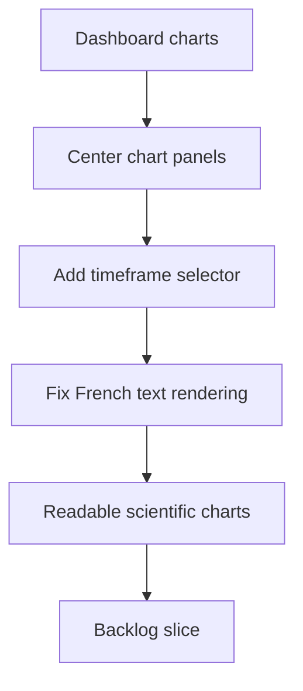

## req_017_scientific_charts_centered_timeframe_selector_and_french_text_fixes - Scientific charts centered, timeframe selector, and French text fixes
> From version: 0.0.0
> Schema version: 1.0
> Status: Draft
> Understanding: 96%
> Confidence: 93%
> Complexity: Medium
> Theme: General
> Reminder: Update status/understanding/confidence and linked backlog/task references when you edit this doc.

# Needs
- Center the chart area inside the modal and improve the visual balance of graph panels.
- Add a chart timeframe selector with 1 month, 3 months, and 1 year views.
- Fix French text rendering in chart titles, axis labels, legends, and helper copy.
- Keep axes, ticks, grid, and hover values visible and readable in the enlarged charts.

# Context
- The current graph layout feels too offset and leaves too much unused space.
- The current time coverage appears inconsistent with the displayed label, so the user needs explicit window control.
- The chart text still shows corrupted French characters in several labels and legends.
- The user wants the charts to feel more scientific, with centered composition, clear axes, ticks, and hover values.
- The chart controls should support quick switching between 1 month, 3 months, and 1 year without changing the overall dashboard flow.

# Acceptance criteria
- AC1: Chart modals are centered and the main plot area visually dominates the available space.
- AC2: Each chart can switch between 1 month, 3 months, and 1 year windows.
- AC3: The selected window updates the data shown on the chart and its labels.
- AC4: French text is rendered correctly in titles, legends, axes, helper copy, and diagnostics.
- AC5: Axes, ticks, grid, and hover values remain visible in enlarged chart views.

# Definition of Ready (DoR)
- [ ] The target charts to update are identified.
- [ ] The chart timeframe behavior is explicit and testable.
- [ ] French text rendering fixes are scoped to the relevant UI surfaces.
- [ ] The request identifies any data window constraints or fallback behavior.

# Companion docs
- Product brief(s): (none yet)
- Architecture decision(s): (none yet)

# AI Context
- Summary: Scientific charts centered, timeframe selector, and French text fixes
- Keywords: charts, centered, timeframe, selector, French text, axes, ticks, hover
- Use when: Use when framing chart layout, timeframe selection, and French text rendering fixes.
- Skip when: Skip when the work targets another feature, repository, or workflow stage.
# Backlog
- `item_017_scientific_charts_centered_timeframe_selector_and_french_text_fixes`
