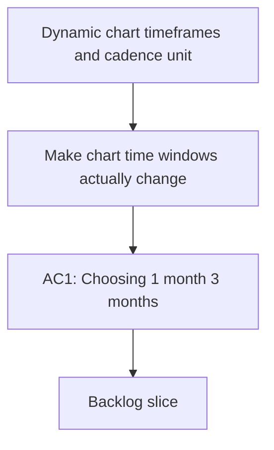

## req_018_dynamic_chart_timeframes_and_cadence_unit_correction - Dynamic chart timeframes and cadence unit correction
> From version: 20260414-navfix26
> Schema version: 1.0
> Status: Done
> Understanding: 95%
> Confidence: 93%
> Complexity: High
> Theme: UI
> Reminder: Update status/understanding/confidence and linked backlog/task references when you edit this doc.

# Needs
- Make chart time windows actually change the data shown in the graph.
- Make the y-axis scale adapt to the selected time window so the plotted area uses the available vertical space well.
- Investigate and fix cadence so it is consistently treated as steps per minute, not a distance metric or a mixed unit.

# Context
- The dashboard already exposes timeframe buttons for 1 month, 3 months, and 1 year, but the graph rendering still appears partially static.
- Some charts look visually compressed because the plotted range does not fully adapt to the selected window.
- Cadence output appears suspicious: it should be SPM or step rate, yet some displayed values suggest a unit mix-up with distance-based data.
- French labels and accents must remain correct in titles, axes, tooltips, legends, and chart summaries.

# Open questions
- Which charts must always honor the selected time window first: running volume, bike volume, load, sleep, resting HR, HRV, cadence, pace / FC, or all of them?
- Should the cadence investigation rebuild the pipeline at the metric source level, or first add a diagnostic view showing the raw fields and the final normalized value?
- Do we want a shared chart helper for x-axis periods and y-axis auto-scaling, or should each chart type own its own scaling logic?

# Acceptance criteria
- AC1: Choosing 1 month, 3 months, or 1 year changes the actual dataset used by the chart, not only the label.
- AC2: The graph y-axis rescales to the selected time window and uses the available chart height effectively.
- AC3: Cadence is traced back to a step-rate source and displayed as steps per minute, with any distance-unit confusion removed or explained.
- AC4: Charts keep French text correctly rendered in titles, axes, labels, legends, and helper copy after reloads and cache refreshes.
- AC5: The pace / cadence / FC related graphs expose enough diagnostics to explain when data are missing, filtered, or not yet stable.

# Definition of Ready (DoR)
- [x] The problem statement is explicit and the chart behavior gap is demonstrated.
- [x] The cadence source of truth is identified, or a diagnostic path is defined to find it.
- [x] Scope boundaries between chart rendering, data windowing, and metric normalization are explicit.
- [x] Acceptance criteria are testable.
- [x] Dependencies and known risks are listed.

# Companion docs
- Product brief(s): (none yet)
- Architecture decision(s): (none yet)

# AI Context
- Summary: Make graph time windows dynamic and fix cadence unit handling.
- Keywords: chart, timeframe, y-axis, autoscale, cadence, step rate, spm, French text
- Use when: Use when refining chart windowing, axis scaling, or cadence normalization.
- Skip when: Skip when the work targets another feature, repository, or workflow stage.

# Backlog
- `item_018_dynamic_chart_timeframes_and_cadence_unit_correction`
