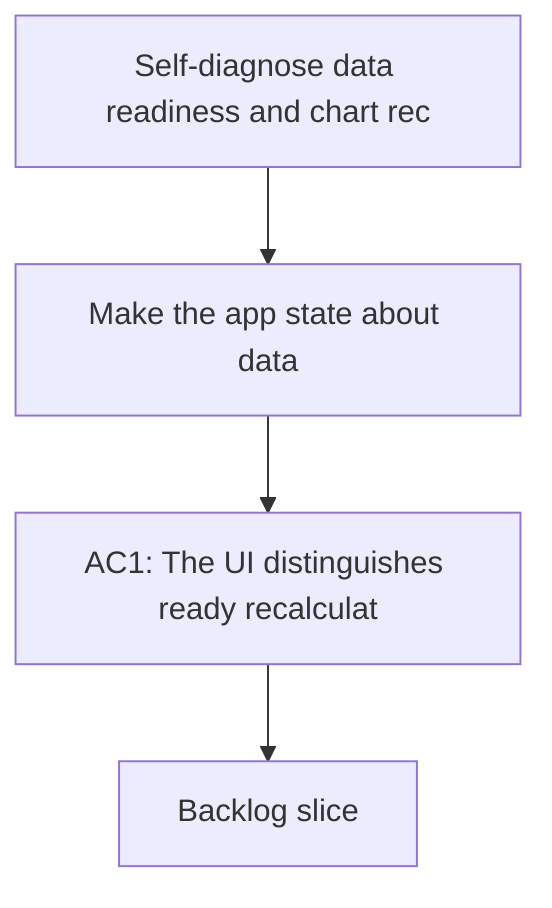

## req_019_self_diagnose_data_readiness_and_chart_recovery - Self-diagnose data readiness and chart recovery
> From version: 20260414-navfix26
> Schema version: 1.0
> Status: Done
> Understanding: 94%
> Confidence: 91%
> Complexity: High
> Theme: General
> Reminder: Update status/understanding/confidence and linked backlog/task references when you edit this doc.

# Needs
- Make the app state about data readiness explicit instead of a generic "analysis ready" label.
- Surface when the workspace needs a recalculation, when charts have partial data, and when data are genuinely ready.
- Prevent chart previews and modal opens from turning empty data into a JS error or a broken boot state.
- Show why a chart is unavailable when the underlying points are missing, filtered, or not yet stable.

# Context
- On reload, the app can show "analysis ready" even when some derived series are missing or stale.
- After a recalculation, some chart previews may still not render, even though the workspace itself looks available.
- Clicking a trend card or preview can currently show "no exploitable data" and then flip the app into a JS error state.
- The user wants the UI to self-diagnose the data state and tell the difference between:
  - ready
  - recalculation required
  - partial data
  - unavailable
- The user also wants chart recovery to be resilient: an empty chart should explain why it is empty, not break the shell.

# Acceptance criteria
- AC1: The UI distinguishes ready, recalculation required, partial data, and unavailable states with explicit labels.
- AC2: Reloading the app with stale or incomplete data shows a clear "recalculation required" or equivalent state instead of a generic ready state.
- AC3: Opening an empty or incomplete chart shows an explanation of missing inputs or filters instead of triggering a JS error.
- AC4: Recalculating data refreshes the derived chart payloads and the preview/modals follow the refreshed state.
- AC5: The app keeps running even when a chart has no exploitable points.

# Definition of Ready (DoR)
- [x] Problem statement is explicit and user impact is clear.
- [x] Scope boundaries (in/out) are explicit.
- [x] Acceptance criteria are testable.
- [x] Dependencies and known risks are listed.

# Companion docs
- Product brief(s): (none yet)
- Architecture decision(s): (none yet)

# AI Context
- Summary: Self-diagnose data readiness and chart recovery
- Keywords: data readiness, recalculation, chart recovery, empty state, JS error, diagnostics
- Use when: Use when the app needs to explain stale, partial, or missing chart data and avoid empty-chart crashes.
- Skip when: Skip when the work targets another feature, repository, or workflow stage.
# Backlog
- `item_019_self_diagnose_data_readiness_and_chart_recovery`
