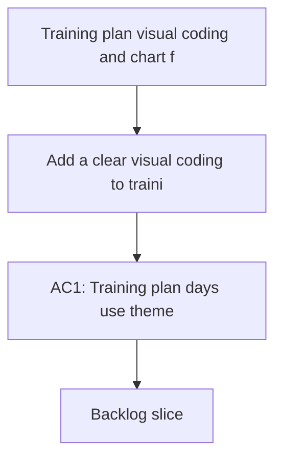

## req_020_training_plan_visual_coding_and_chart_fidelity_repairs - Training plan visual coding and chart fidelity repairs
> From version: 20260415-navfix29
> Schema version: 1.0
> Status: Done
> Understanding: 96%
> Confidence: 93%
> Complexity: High
> Theme: UI
> Reminder: Update status/understanding/confidence and linked backlog/task references when you edit this doc.

# Needs
- Add a clear visual coding to training-plan days so rest, easy runs, and specific sessions are readable at a glance.
- Repair chart interactions and rendering so hover, timeframe changes, modal layouts, and detail sections behave consistently.
- Improve chart data quality and presentation for running volume, bike volume, resting HR, sleep, HRV, pace / FC, and cadence.
- Eliminate remaining French text and accent corruption in chart titles, legends, axes, and helper copy.

# Context
- Training plans are currently readable functionally, but not visually structured enough to distinguish:
  - rest days
  - easy runs
  - quality sessions
  - long runs
- The user wants:
  - rest days in green
  - easy runs in blue
  - quality or long sessions in orange
  - with colors that adapt cleanly to the active theme rather than looking bolted on
- Several chart issues remain:
  - the black hover box appears but often looks empty
  - changing `1 mois / 3 mois / 1 an` inside graph modals does not refresh the current modal live
  - some charts still do not expose the same level of scientific context as the HRV chart
  - running and bike volume plots feel visually cluttered, especially around zero values
  - resting HR, sleep, and HRV appear overly smoothed and lose their natural day-to-day noise
  - the `pace / cadence / FC` graph is buggy and too small
  - the `allure / FC` curve still lacks density and usable point coverage
  - cadence is still using the wrong source or wrong normalization, with values around `70` instead of expected running step-rate values around `150 spm`
  - multiple chart labels, legends, and figure annotations still contain mojibake or broken French characters
- This request builds on previous chart and UTF-8 waves, but focuses on:
  - chart fidelity
  - chart interaction consistency
  - source-of-truth metric quality
  - theme-native visual encoding for the training plan

# Acceptance criteria
- AC1: Training plan days use theme-aware visual coding:
  - rest day = green family
  - easy run = blue family
  - quality or long session = orange family
- AC2: The visual coding works across the existing theme system without breaking contrast or readability.
- AC3: Hover tooltips on charts always show meaningful values, labels, and details instead of an empty black box.
- AC4: Switching `1 mois / 3 mois / 1 an` while a chart modal is open refreshes the active modal immediately, without needing to close and reopen it.
- AC5: All main chart modals expose the same explanation structure as the most complete HRV modal:
  - calculation
  - provenance
  - reading
  - references
- AC6: Running and bike volume charts render zero-heavy periods in a less cluttered way, either by hiding redundant zero emphasis or by reducing visual noise while preserving true zero data.
- AC7: Resting HR, sleep, and HRV charts preserve realistic day-to-day variability instead of appearing over-smoothed.
- AC8: The `pace / cadence / FC` chart renders at a readable size and uses the modal space correctly.
- AC9: The `allure / FC` curve becomes denser or explains clearly why enough usable points are still missing.
- AC10: Cadence is traced back to the correct running step-rate source and displayed in steps per minute, with implausible low values investigated and corrected.
- AC11: French text and accented characters render correctly in figure titles, axes, legends, tooltips, helper text, and modal sections.

# Open questions
- Should long runs share the same orange family as other specific sessions, or do we eventually want a fourth visual family just for long endurance work?
- For zero-heavy charts, do we prefer:
  - plotting real zeros with a lighter treatment
  - or compressing zero stretches visually while keeping them inspectable on hover
- For `allure / FC`, should we prioritize:
  - more raw points in the modal
  - or a denser derived point cloud plus explicit diagnostics about excluded points

# Definition of Ready (DoR)
- [x] The visual and data-quality problems are explicit.
- [x] The affected chart families and plan UI areas are identified.
- [x] Acceptance criteria cover rendering, interaction, metric quality, and text correctness.
- [x] Dependencies on theme tokens, chart helpers, and cadence normalization are implicit but manageable.

# Companion docs
- Product brief(s): `prod_003_scientific_dashboard_charts_and_sport_specific_volume_filtering`, `prod_004_scientific_chart_centering_and_timeframe_selector`
- Architecture decision(s): `adr_004_scientific_charts_for_sport_specific_volumes_and_data_recalculation`, `adr_006_choose_dynamic_chart_windows_and_cadence_normalization`

# AI Context
- Summary: Repair chart fidelity, tooltip behavior, cadence sourcing, and training-plan visual coding.
- Keywords: training plan colors, chart tooltip, modal refresh, chart fidelity, cadence spm, pace fc, hrv, utf-8, french text
- Use when: Use when refining the visual quality, data correctness, or interaction behavior of dashboard charts and training plan presentation.
- Skip when: Skip when the work targets another feature, repository, or workflow stage.

# Backlog
- `item_020_training_plan_visual_coding_and_chart_fidelity_repairs`
- `task_021_training_plan_visual_coding_and_chart_fidelity_repairs`
