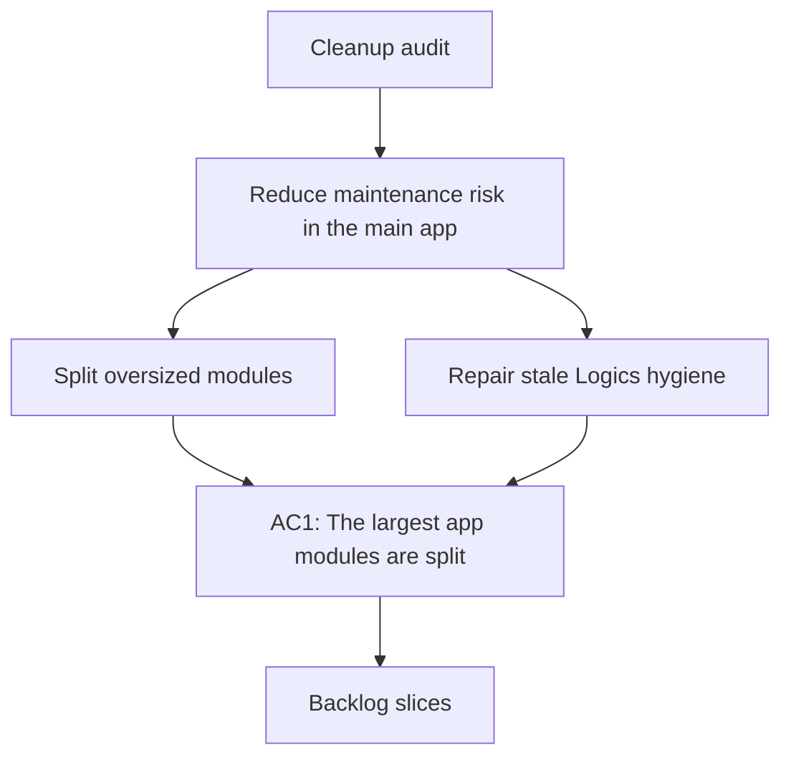

## req_021_clean_up_oversized_app_modules_and_stale_logics_hygiene - Clean up oversized app modules and stale Logics hygiene
> From version: 0.1.0
> Schema version: 1.0
> Status: Done
> Understanding: 96%
> Confidence: 93%
> Progress: 100%
> Complexity: Medium
> Theme: General
> Reminder: Update status/understanding/confidence and linked backlog/task references when you edit this doc.

# Needs
- Reduce maintenance risk in the main app by splitting the remaining oversized orchestration modules into clearer bounded units.
- Clean stale or incoherent Logics metadata so request/backlog/task indicators can be trusted again during future delivery waves.
- Keep the repository easy to review, evolve, and audit without changing the current user-visible behavior.

# Context
- The latest full-project audit on `2026-04-16` found no blocking functional regression:
  - `git status` clean
  - submodule `logics/skills` reachable and aligned
  - `36/36` tests passing
- The remaining risk is structural rather than behavioral.
- Several high-traffic application files are still large enough to slow review and future refactors:
  - `coach_garmin/analytics.py`
  - `coach_garmin/pwa_service_support.py`
  - `coach_garmin/coach_chat.py`
- Those files currently mix several responsibilities such as:
  - data models and normalization helpers
  - analytics orchestration and reporting
  - web handlers, UI support logic, and runtime plumbing
  - coach dialogue shaping, prompt assembly, and plan normalization
- The same audit also found stale Logics hygiene:
  - some request docs still contain placeholder-like or legacy framing noise
  - some indicators are inconsistent, such as `Status: Done` with `Progress: 0`
- This request is a bounded cleanup wave, not a feature wave.
- The goal is to improve structure and trustworthiness without reopening product scope or changing the project direction.

# Scope
- In scope: split the remaining oversized app modules into smaller cohesive modules while preserving current behavior and public entrypoints.
- In scope: keep orchestration files thin and move heavy helpers or domain-specific logic into support modules or domain-scoped files.
- In scope: preserve CLI, PWA, import, auth, analytics, and coach behavior unless a cleanup requires a safe bug fix tightly coupled to the refactor.
- In scope: clean stale or incoherent Logics indicators, placeholder remnants, and legacy request metadata that were called out by the audit.
- In scope: keep the cleanup reviewable in bounded slices rather than one uncontrolled rewrite.
- Out of scope: redesigning product behavior, changing training logic, or introducing new user-facing features.
- Out of scope: broad renaming for style only, when it does not improve boundaries or readability.
- Out of scope: changing the Logics workflow model itself.

# Desired outcomes
- The largest app modules have clearer seams and reduced line counts.
- The main entrypoint files remain stable and easier to inspect.
- Logics request/backlog/task indicators match the actual delivery state.
- Future audits produce fewer structural warnings and less metadata drift.

# Acceptance criteria
- AC1: The largest remaining app modules are split along coherent boundaries, with stable public entrypoints preserved.
- AC2: `coach_garmin/analytics.py`, `coach_garmin/pwa_service_support.py`, and `coach_garmin/coach_chat.py` each become materially easier to review because part of their logic is extracted into bounded support modules or domain files.
- AC3: The cleanup does not regress current behavior:
  - existing automated tests still pass
  - existing CLI and PWA import paths keep working
- AC4: Refactors are behavior-preserving by default and do not silently change user-visible outputs unless explicitly documented as a coupled fix.
- AC5: The audit-detected Logics inconsistencies are cleaned:
  - stale indicators are corrected
  - placeholder or legacy remnants are clarified, archived, or aligned
  - request/backlog/task metadata becomes coherent again
- AC6: Validation evidence records the commands run and confirms that the repository remains clean and test-passing after the cleanup wave.

# Definition of Ready (DoR)
- [x] Problem statement is explicit and user impact is clear.
- [x] Scope boundaries (in/out) are explicit.
- [x] Acceptance criteria are testable.
- [x] Dependencies and known risks are listed.

# Risks and dependencies
- Splitting large modules can accidentally break private import paths or monkeypatched test seams if the facade layer is not preserved carefully.
- Some current file size comes from legitimate orchestration, so the cleanup should optimize boundaries rather than chase arbitrary line-count targets.
- Logics cleanup can accidentally erase historical traceability if legacy docs are rewritten too aggressively instead of clarified.
- The wave should stay bounded; otherwise a structural cleanup can expand into an open-ended refactor.

# Clarifications
- This request is about cleanup and maintainability, not shipping a new feature.
- The preferred strategy is thin facade plus extracted support modules when behavior must stay stable.
- Logics hygiene cleanup should favor coherent metadata and traceability over cosmetic rewriting.
- The cleanup should be sliced so each step leaves the repo in a coherent, commit-ready state.

# Open questions
- Should the code cleanup be delivered as one bounded backlog item, or split into one item for app structure and one item for Logics hygiene?
- Should `coach_garmin/coach_chat.py` be split by conversation flow versus prompt generation, or by provider-facing versus local-analysis responsibilities?
- Do we want an explicit local guardrail later, such as a size threshold report in CI, or is this wave limited to manual cleanup only?

# Suggested answers
- Recommendation: split the work into at least two backlog slices:
  - app module cleanup
  - Logics hygiene cleanup
- Recommendation: split `coach_chat` by domain responsibility rather than by arbitrary helper count.
- Recommendation: keep CI guardrails out of this request unless the cleanup lands quickly and leaves enough room for one small enforcement step.

# Companion docs
- Product brief(s): (none yet)
- Architecture decision(s): (none yet)

# AI Context
- Summary: Reduce structural maintenance risk by splitting oversized app modules and cleaning stale Logics metadata highlighted by the latest audit.
- Keywords: cleanup, refactor, module boundaries, analytics, pwa, coach chat, logics hygiene, indicators, audit
- Use when: Use when planning or executing the next bounded cleanup wave after the project audit.
- Skip when: Skip when the work is about new product behavior, Garmin data expansion, or dashboard feature additions.

# Backlog
- `item_021_clean_up_oversized_app_modules_with_bounded_refactors`
- `item_022_repair_stale_logics_hygiene_and_indicator_coherence`

# Outcome
- App module cleanup executed through `task_022_clean_up_oversized_app_modules_with_bounded_refactors`.
- Logics hygiene cleanup executed through `task_023_repair_stale_logics_hygiene_and_indicator_coherence`.
- Validation completed on `2026-04-16` with `36/36` automated tests passing and Logics review/lint rerun.
