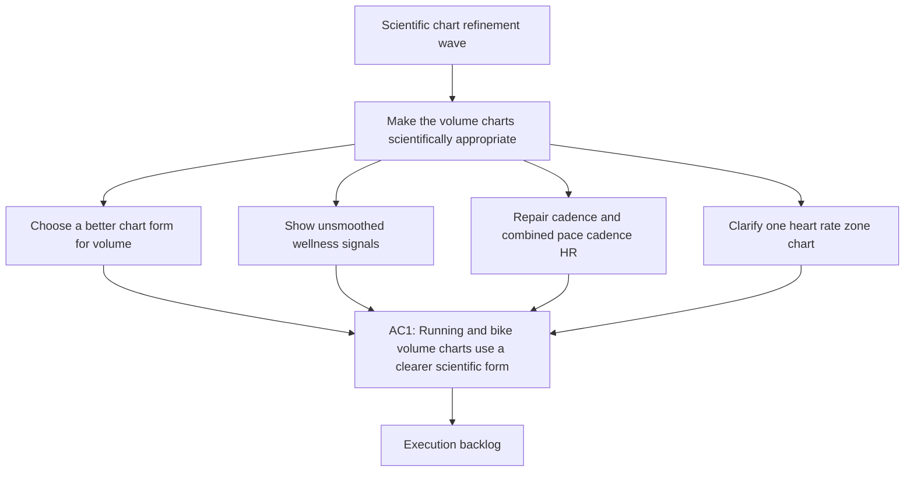

## req_022_refine_scientific_chart_semantics_unsmoothed_wellness_views_and_cadence_zone_repairs - Refine scientific chart semantics, unsmoothed wellness views, and cadence / zone repairs
> From version: 20260416-chart31
> Schema version: 1.0
> Status: Done
> Understanding: 97%
> Confidence: 94%
> Complexity: High
> Theme: UI
> Reminder: Update status/understanding/confidence and linked backlog/task references when you edit this doc.

# Needs
- Make the volume charts scientifically more appropriate for running and cycling history. A continuous line joined by sparse points is not the right default for weekly or daily volume accumulation.
- Expose richer scientific explanation for relative load, including calculation details, data provenance, reading guidance, and references.
- Remove or make optional the smoothing currently applied to resting HR, HRV, and sleep so the user can inspect the real day-to-day signal.
- Repair remaining French accent corruption in chart explanations, especially around HRV and chart reference blocks.
- Investigate and correct the cadence chart because the displayed data density and y-axis scale are inconsistent with plausible running step-rate values.
- Rebuild the pace / cadence / HR combined chart into a single readable scientific panel instead of the current broken triple-curve presentation.
- Simplify duplicated heart-rate zone visualizations and clarify the physiological meaning of each zone in BPM.

# Context
- The current chart wave already improved layout, timeframe controls, and several chart interactions, but important scientific and interpretability issues remain.
- The user feedback is explicit:
  - bike and running volume should not default to a line linked through isolated points
  - bike and running volume must stay on separate charts rather than being merged into one combined comparison graph
  - relative load needs a stronger explanation block
  - resting HR, HRV, and sleep should not be over-smoothed
  - HRV explanations still contain visible accent corruption
  - cadence currently shows only around `J-0` to `J-2`, values near `155`, but the y-axis still appears around `44` to `70 spm`
  - the pace / cadence / HR view is visually broken and should become one coherent graph with hover-driven detail
  - duplicated heart-rate zone charts create noise and should be reduced to one clearer scientific display
- This request is a follow-up to the earlier chart fidelity work, but it is narrower and deeper:
  - chart type selection
  - metric explanation quality
  - raw versus smoothed signal visibility
  - cadence source and axis correctness
  - heart-rate zone scientific readability
  - UTF-8 and French text correctness in explanations

# Scope
- In scope: evaluate and implement better default chart types for running and cycling volume.
- In scope: add a stronger explanation block for relative load with calculation, provenance, reading, and references.
- In scope: remove smoothing from resting HR, HRV, and sleep, or expose a clear UI toggle between raw and smoothed views.
- In scope: fix accent corruption in chart explanations, legends, helper text, and references, with special attention to HRV.
- In scope: investigate cadence data density, cadence source, y-axis domain, and unit labeling until the plotted chart becomes plausible.
- In scope: redesign the pace / cadence / HR scientific visualization so the three metrics are readable together in one graph, with hover-based detail rather than three broken mini-curves.
- In scope: keep a single heart-rate zone visualization that can distinguish all activities versus running while clarifying zone thresholds in BPM.
- Out of scope: reworking unrelated dashboard cards, changing ingestion scope, or redesigning the whole PWA shell.

# Candidate chart directions
- Running volume candidate A: daily or weekly vertical bars, one bar per day or per week, as the default scientific histogram-style view.
- Bike volume candidate A: daily or weekly vertical bars, one bar per day or per week, as the default scientific histogram-style view.
- Running and bike must stay on separate charts even when they use the same visual grammar.
- Preferred default: simple bars or histogram-style columns, because they represent accumulated volume more honestly than sparse linked points.

# Acceptance criteria
- AC1: Running and bike volume charts use a chart form more appropriate than sparse connected lines, with bars or another justified histogram-style representation chosen explicitly.
- AC2: Running and bike volume remain on separate charts, and each selected volume chart form stays readable across `1 mois`, `3 mois`, and `1 an`, without hiding zero-volume periods or producing misleading continuity.
- AC3: The relative load chart modal exposes a complete scientific explanation block:
  - calculation
  - provenance
  - reading
  - references
- AC4: Resting HR, HRV, and sleep charts show the unsmoothed day-to-day signal by default, or provide an explicit raw versus smoothed toggle with both modes behaving correctly.
- AC5: French text and accents render correctly in HRV explanations, chart references, legends, helper text, and all related scientific copy.
- AC6: The cadence chart uses plausible cadence values and axis bounds in steps per minute, with the low-density and wrong-scale issue investigated and corrected or explicitly diagnosed.
- AC7: The pace / cadence / HR chart becomes a single coherent graph where the three signals can be inspected together, with hover or focus interaction used to reveal detailed values when needed.
- AC8: Only one heart-rate zone chart remains in the UI, while still distinguishing all activities and running in a clear way.
- AC9: The surviving heart-rate zone chart explains what each zone corresponds to in BPM, with French text and accents rendered correctly.
- AC10: Validation evidence shows that chart behavior remains correct on the current local dataset, especially for cadence, HRV, sleep, resting HR, relative load, and heart-rate zones.

# Open questions
- For volume charts, should the default granularity be daily bars or weekly bars when the selected window is `1 an`?
- For resting HR, HRV, and sleep, should the default be fully raw, or should the UI remember the user's last smoothing preference?
- For the single heart-rate zone chart, should the distinction between all activities and running be:
  - two stacked series inside one chart
  - a switch or segmented control
  - or an overlay that remains readable on hover
- For the combined pace / cadence / HR graph, do we want:
  - three y-axes in one panel
  - or one main axis plus normalized overlays and a detailed hover readout

# Locked decisions
- Running and bike stay on separate charts and must not be merged into one comparison graph.
- Use daily bars for `1 mois` and `3 mois`, then switch to weekly bars for `1 an`.
- Resting HR, HRV, and sleep default to raw data.
- Keep one zone chart with a simple switch between `all activities` and `running`.
- Build one combined pace / cadence / HR graph with three visible y-axes.
- Add a cadence diagnostic view or debug surface that exposes:
  - raw source value
  - normalized value
  - detected unit
  - y-axis domain or min/max bounds used for plotting

# Definition of Ready (DoR)
- [x] The chart semantics and readability problems are explicit.
- [x] The affected metrics and graph families are named.
- [x] The request distinguishes data-quality repair from visual redesign.
- [x] The expected scientific explanation structure is testable.
- [x] The operator decisions on smoothing, chart separation, axis strategy, and yearly aggregation are locked.

# Companion docs
- Product brief(s): `prod_003_scientific_dashboard_charts_and_sport_specific_volume_filtering`, `prod_004_scientific_chart_centering_and_timeframe_selector`
- Architecture decision(s): `adr_004_scientific_charts_for_sport_specific_volumes_and_data_recalculation`, `adr_005_choose_end_to_end_utf_8_and_nfc_text_policy`, `adr_006_choose_dynamic_chart_windows_and_cadence_normalization`

# AI Context
- Summary: Refine scientific chart semantics, remove over-smoothing from wellness charts, and repair cadence, HRV text, and heart-rate zone displays.
- Keywords: charts, volume bars, histogram, relative load, hrv, resting hr, sleep, cadence, pace cadence hr, heart rate zones, bpm, utf-8, french text
- Use when: Use when scoping the next chart-quality wave around scientific readability, explanation quality, and signal correctness.
- Skip when: Skip when the work is about Garmin ingestion, auth, or non-chart PWA navigation.

# Backlog
- `item_023_refine_volume_relative_load_and_heart_rate_zone_chart_semantics`
- `item_024_repair_wellness_raw_views_cadence_and_combined_pace_cadence_hr_chart`

# Delivery
- Completed on `2026-04-16` through:
  - `task_024_refine_volume_relative_load_and_heart_rate_zone_chart_semantics`
  - `task_025_repair_wellness_raw_views_cadence_and_combined_pace_cadence_hr_chart`
