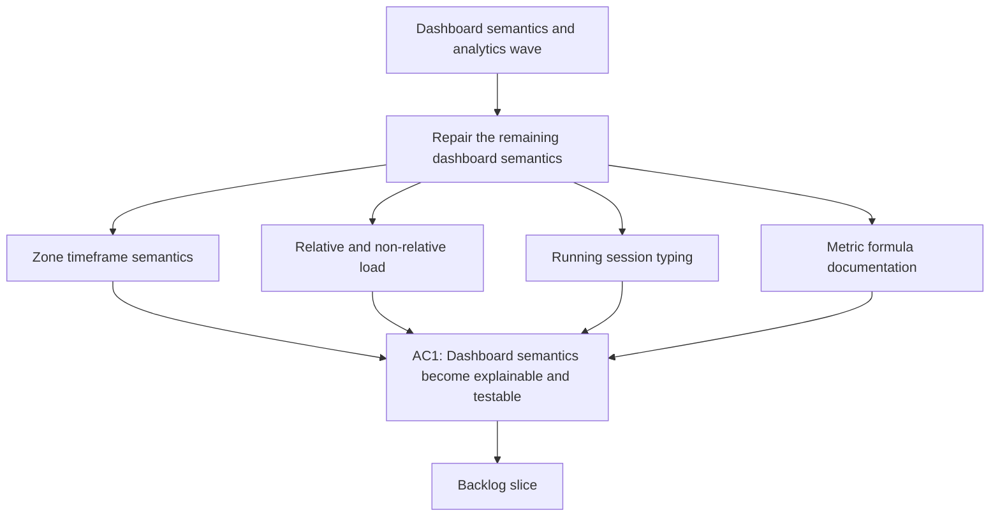

## req_023_refine_dashboard_zone_load_session_typing_and_metric_documentation - Refine dashboard zone controls, load semantics, session typing, and metric documentation
> From version: d4506d3
> Schema version: 1.0
> Status: Done
> Understanding: 98%
> Confidence: 95%
> Complexity: High
> Theme: Analytics
> Reminder: Update status/understanding/confidence and linked backlog/task references when you edit this doc.

# Needs
- Repair the remaining dashboard semantics issues around heart-rate zones, relative load, and missing non-relative load so the graphs match the underlying coaching meaning.
- Add explicit session-type classification for running sessions and expose its distribution over `1 mois`, `3 mois`, and `1 an`.
- Add optional 7-day smoothing for sleep and HRV without losing access to the raw signal.
- Document the analytics formulas, provenance, and extraction rules used to derive dashboard metrics from raw data.

# Context
- The current dashboard has already improved chart structure, cadence handling, and scientific explanations, but several coaching semantics are still not trustworthy enough.
- The user feedback is explicit:
  - the heart-rate zone chart exposes `1 mois / 3 mois / 1 an`, but the control appears ineffective
  - the combined pace / cadence / HR graph is too busy because the cadence reference band shows both low and high bounds
  - sleep and HRV need an optional smoothed view using a 7-day moving average
  - relative load appears suspiciously low, often below `0.4`, which does not match the intended interpretation of a `7j / 28j` style ratio
  - the non-relative load graph used to exist and should return
  - the dashboard should help classify running sessions into practical categories such as:
    - easy jog
    - quality session
    - long run
  - the user wants a visual representation of those running session types over `1 mois`, `3 mois`, and `1 an`
  - the project also needs a dedicated document that explains how raw data becomes dashboard metrics
- This request sits on top of the recent dashboard/chart waves and is focused on:
  - semantic correctness
  - coaching interpretability
  - session classification
  - analytics documentation

# Scope
- In scope: make the heart-rate zone period control actually affect the displayed data, or remove it if that behavior is not justified.
- In scope: simplify the combined pace / cadence / HR graph by removing the low/high cadence band if it adds more noise than value.
- In scope: add a 7-day moving-average option for sleep and HRV while preserving raw-view access.
- In scope: investigate and correct the relative-load calculation or interpretation if the displayed values are systematically implausible.
- In scope: restore a visible non-relative load chart.
- In scope: classify running sessions into coach-meaningful types and display their distribution over `1 mois`, `3 mois`, and `1 an`.
- In scope: document the formulas, extraction rules, transformations, assumptions, and provenance behind the dashboard metrics in a dedicated document.
- Out of scope: reworking Garmin auth, import UX, or unrelated shell/navigation concerns.

# Candidate additions for the dashboard
- Session-type distribution for running:
  - easy jog
  - quality
  - long run
- Running frequency:
  - sessions per week
  - active running days per period
- Time in motion:
  - running duration over period
  - bike duration over period
- Recovery context:
  - resting HR delta versus 28-day baseline
  - HRV delta versus 28-day baseline
- Training density:
  - share of easy versus quality versus long sessions
  - time in HR zones for running only

# Acceptance criteria
- AC1: The heart-rate zone visualization handles `1 mois / 3 mois / 1 an` coherently:
  - either the selected period changes the displayed data
  - or the period control is removed from that chart if the concept is not meaningful there
- AC2: The combined pace / cadence / HR graph removes the low/high cadence band overlay if it reduces readability more than it adds signal.
- AC3: Sleep and HRV expose:
  - a raw view
  - and an optional 7-day moving-average view
  with the active mode clearly indicated
- AC4: The relative-load metric is audited and either:
  - corrected
  - or explicitly redefined and explained
  so that its displayed value is physiologically plausible and coach-readable
- AC5: A non-relative load chart is visible again in the dashboard or in its detailed modals.
- AC6: Running activities are classified into session types with a documented heuristic or rule set.
- AC7: The dashboard shows the distribution of running session types over `1 mois`, `3 mois`, and `1 an`.
- AC8: The new running session-type visualization makes it possible to distinguish the recent mix of:
  - easy jog
  - quality
  - long run
- AC9: A dedicated documentation artifact explains for each key dashboard metric:
  - raw source
  - extraction logic
  - transformation
  - smoothing if any
  - formula
  - interpretation
- AC10: The documentation and UI stay consistent with `ADR 005`, so French text and accented characters remain correct.

# Open questions
- For the zone chart, should the timeframe filter affect:
  - total time in zones
  - percentage share only
  - or both
- For running session typing, should long runs be:
  - a sub-type of easy endurance
  - or a first-class type separate from easy jogs
- For the documentation artifact, should it live as:
  - a product-facing explainer in `logics/product`
  - an architecture/analytics note in `logics/architecture`
  - or a dedicated spec in `logics/specs`

# Locked decisions
- Relative load should be re-centered on a definition where a stable athlete sits around `1`, not permanently around `0.4`.
- Non-relative load should return as a simple daily load chart, without a moving-average overlay in the default view.
- Running session typing should follow:
  - `long run` first by duration and/or distance threshold
  - `quality` next by structure, intensity, or explicit workout characteristics
  - `easy jog` otherwise
- Session-type representation should prioritize:
  - a histogram-style view across the selected period
  - plus a distribution summary
- Sleep and HRV should arrive in raw mode by default, with an explicit user-triggered toggle for 7-day smoothing.
- The metric-calculation documentation should be very technical, with formulas, provenance, transformations, assumptions, and extraction details.

# Refinement decisions
- Zone chart: make the period affect both absolute time and percentage share, otherwise the control is misleading.
- Non-relative load: use raw daily load bars/points only in the default view.
- Session typing: keep `long run` as its own first-class type.
- Session-type dashboard view: pair a histogram with a distribution summary.
- Sleep and HRV smoothing: raw first, optional 7-day moving average on demand, not persisted.
- Documentation location: prefer a dedicated technical analytics spec or architecture note over a product-facing summary.

# Definition of Ready (DoR)
- [x] The semantic problems are explicit and coach-facing.
- [x] The request distinguishes UI repair from metric-definition repair.
- [x] The session-typing ask is separate from the load and zone semantics.
- [x] The need for a dedicated analytics documentation artifact is explicit.
- [x] The expected relative-load semantics and default smoothing behavior are locked.

# Companion docs
- Product brief(s): `prod_003_scientific_dashboard_charts_and_sport_specific_volume_filtering`, `prod_004_scientific_chart_centering_and_timeframe_selector`
- Architecture decision(s): `adr_004_scientific_charts_for_sport_specific_volumes_and_data_recalculation`, `adr_005_choose_end_to_end_utf_8_and_nfc_text_policy`, `adr_006_choose_dynamic_chart_windows_and_cadence_normalization`
# AI Context
- Summary: Refine dashboard semantics around heart-rate zones, load, session classification, and analytics documentation.
- Keywords: heart-rate zones, relative load, load chart, sleep smoothing, hrv smoothing, session typing, easy run, quality, long run, analytics formulas, dashboard documentation
- Use when: Use when scoping a dashboard analytics wave that must improve both metric trustworthiness and metric explainability.
- Skip when: Skip when the work is about auth, import orchestration, or unrelated shell UX.

# Backlog
- `item_025_refine_dashboard_zone_controls_load_semantics_session_typing_and_metric_documentation`

# Task
- `task_026_refine_dashboard_zone_load_session_typing_and_metric_documentation`
