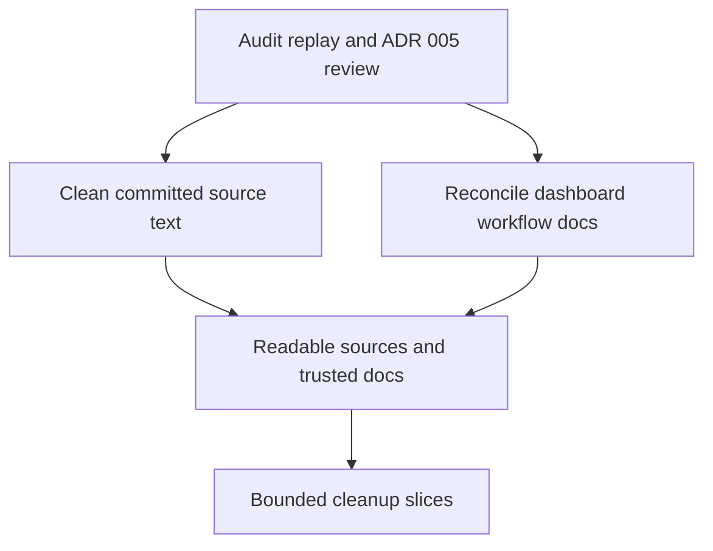

## req_024_finish_adr_005_source_text_cleanup_and_reconcile_dashboard_logics_continuity - Finish ADR 005 source text cleanup and reconcile dashboard Logics continuity
> From version: 20ee215
> Schema version: 1.0
> Status: Done
> Understanding: 95%
> Confidence: 93%
> Complexity: High
> Theme: General
> Reminder: Update status/understanding/confidence and linked backlog/task references when you edit this doc.

# Needs
- Remove the remaining text corruption that still exists in committed source files so ADR 005 is enforced at the source, not only repaired at runtime.
- Reconcile the dashboard Logics chain so requests, backlog items, and tasks reflect what was actually delivered across the recent chart and analytics waves.
- Leave the repository with trustworthy text sources, trustworthy workflow metadata, and a clear next-step baseline for future work.

# Context
- The project already adopted ADR 005 as an active constraint: user-facing and workflow-facing text must remain `UTF-8 + NFC` end to end.
- The current codebase still contains committed mojibake-like source strings in some places, especially inside PWA JavaScript and some analytics-facing messages, while the runtime also includes repair helpers that mask part of the problem during execution.
- This means the app can appear correct in some paths while the repository source is still not fully clean, which weakens the ADR and creates regression risk for future edits.
- In parallel, the dashboard and chart work delivered between the `017`, `018`, `022`, `023`, `024`, `025`, and `026` waves is no longer perfectly reflected by the request/backlog/task chain:
  - some earlier docs still look open even though later waves absorbed part of their scope
  - `logics/INDEX.md` lags the current document set
  - the remaining open work is not cleanly separated from already delivered work
- The operator now needs a cleanup wave that is administrative and technical at the same time:
  - correct committed text at the source
  - keep runtime safeguards only as defensive fallback where still justified
  - reconcile Logics status and traceability around the dashboard waves
  - avoid rewriting git history or losing the narrative of how the dashboard evolved
- This request is intentionally not a new product-feature wave. It is a trust and continuity wave for the existing delivery.

# Acceptance criteria
- AC1: Committed source files no longer contain avoidable mojibake or broken French strings on active user-facing or workflow-facing paths when the text can be corrected directly at the source.
- AC2: The cleanup keeps ADR 005 intact by preserving `UTF-8 + NFC` handling across edited text-bearing files, including PWA UI copy, diagnostics, logs, docs, JSON-related outputs, and Windows launcher surfaces when touched.
- AC3: Runtime text-repair hooks remain only as defensive compatibility paths where needed; they are no longer the primary mechanism for fixing text that is already known to be wrong in the repository source.
- AC4: Automated validation covers the cleanup with targeted encoding checks and the relevant existing test suite so text fixes do not silently regress the dashboard, PWA, or CLI behavior.
- AC5: The request/backlog/task chain around the recent dashboard waves is reconciled so already delivered work is marked coherently and genuinely remaining work is explicit.
- AC6: The reconciliation preserves traceability across `req/item/task_017`, `018`, `022`, `023`, `024`, `025`, and `026`, rather than collapsing the history into a single rewritten story.
- AC7: Derived workflow views such as `logics/INDEX.md` and `logics/RELATIONSHIPS.md` are refreshed if they are left stale by the reconciliation work.
- AC8: The resulting repository state gives the operator a clear baseline of:
  - what was delivered
  - what was documentation drift only
  - what still remains to be done after this cleanup wave

# Definition of Ready (DoR)
- [x] Problem statement is explicit and user impact is clear.
- [x] Scope boundaries (in/out) are explicit.
- [x] Acceptance criteria are testable.
- [x] Dependencies and known risks are listed.

# Scope
- In scope: correct committed mojibake or broken French strings in active source files where the right text is already known.
- In scope: review whether current runtime repair utilities are still justified as fallback after the source cleanup.
- In scope: inspect and reconcile the dashboard Logics chain across the recent request/backlog/task waves.
- In scope: update stale workflow views generated from Logics docs when needed.
- Out of scope: inventing a new dashboard feature wave.
- Out of scope: broad code refactors unrelated to text handling or workflow reconciliation.
- Out of scope: rewriting git history or deleting traceability that still explains the delivery sequence.

# Risks and dependencies
- Some mojibake-like text may still exist intentionally inside tests that verify repair behavior, so cleanup must distinguish source regressions from regression fixtures.
- Earlier dashboard requests may have been partially superseded rather than fully completed, so workflow reconciliation must be careful not to mark real remaining UX work as done by mistake.
- The request depends on preserving ADR 005 semantics while avoiding overreliance on late-stage text repair.

# Clarifications
- The preferred strategy is source correction first, runtime repair second.
- The preferred Logics strategy is traceable reconciliation, not cleanup by deletion.
- If an older request still contains a meaningful remainder, keep that remainder explicit instead of forcing artificial closure.

# Companion docs
- Product brief(s): `prod_003_scientific_dashboard_charts_and_sport_specific_volume_filtering`, `prod_004_scientific_chart_centering_and_timeframe_selector`
- Architecture decision(s): `adr_005_choose_end_to_end_utf_8_and_nfc_text_policy`, `adr_006_choose_dynamic_chart_windows_and_cadence_normalization`

# AI Context
- Summary: Clean the remaining ADR 005 source-text regressions and reconcile the dashboard Logics chain after several overlapping chart and analytics waves.
- Keywords: adr 005, utf-8, nfc, mojibake, french text, source cleanup, logics reconciliation, dashboard history, workflow continuity
- Use when: Use when preparing or executing a cleanup wave that must repair source text and restore trustworthy Logics traceability without introducing new product scope.
- Skip when: Skip when the work is about a new feature, auth flows, Garmin ingestion expansion, or unrelated refactors.

# References
- `logics/architecture/adr_005_choose_end_to_end_utf_8_and_nfc_text_policy.md`
- `logics/request/req_016_harden_utf_8_and_french_text_handling_end_to_end.md`
- `logics/request/req_017_scientific_charts_centered_timeframe_selector_and_french_text_fixes.md`
- `logics/request/req_018_dynamic_chart_timeframes_and_cadence_unit_correction.md`
- `logics/request/req_021_clean_up_oversized_app_modules_and_stale_logics_hygiene.md`
- `logics/request/req_022_refine_scientific_chart_semantics_unsmoothed_wellness_views_and_cadence_zone_repairs.md`
- `logics/request/req_023_refine_dashboard_zone_load_session_typing_and_metric_documentation.md`

# Backlog
- `item_026_finish_adr_005_source_text_cleanup_and_reconcile_dashboard_logics_continuity`

# Task
- `task_027_finish_adr_005_source_text_cleanup_and_reconcile_dashboard_logics_continuity`

# Outcome
- Completed on `2026-04-25`.
- Source-text regressions on active PWA and analytics-facing paths were corrected directly in the repository source.
- The older `req_017` execution path was reconciled as `Obsolete`, with its scope explicitly traced to `req_018`, `req_022`, `req_023`, and this cleanup wave.
- `logics/INDEX.md` and `logics/RELATIONSHIPS.md` were refreshed into concise current-state views centered on the active dashboard continuity story.
