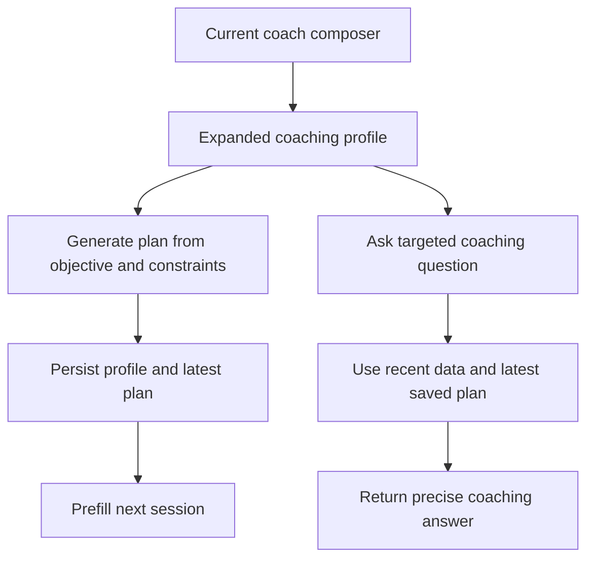

## req_025_expand_coaching_inputs_persist_constraints_and_add_targeted_training_questions_flow - Expand coaching inputs, persist constraints, and add a targeted training questions flow
> From version: 20260416-navfix30
> Schema version: 1.0
> Status: Done
> Understanding: 95%
> Confidence: 93%
> Complexity: High
> Theme: Health
> Reminder: Update status/understanding/confidence and linked backlog/task references when you edit this doc.

# Needs
- Expand the coaching intake so the user can define a richer training context before generating a plan.
- Keep `objective` mandatory, while all new constraint and question fields remain optional and default to null when not filled.
- Persist those fields locally and prefill them on the next visit so the user can tweak small planning details without rewriting the whole context.
- Add a second coaching mode for targeted training questions that uses the latest local data and the previously generated plan, without regenerating a new plan by default.
- Simplify the coach composer by removing the dedicated prepare button and reorganizing the action buttons around the new fields.

# Context
- The current PWA coaching section already supports:
  - one main `goal` textarea
  - provider and workspace selectors
  - a local `goal_profile.json` persistence path
  - a generated weekly plan stored under `data/reports/`
  - a clarification flow driven by `/api/coach/prepare`
  - a plan-generation flow driven by `/api/coach/plan`
- The current data model is still narrow for the coaching use case:
  - it persists the main goal
  - it can carry one generic `constraints` text
  - it does not expose explicit structured health and logistics constraints in the PWA UI
  - it does not expose a dedicated targeted Q and A flow tied to the current plan context
- The user now wants the coaching surface to support two distinct intents:
  - generate or update the planning context from a main objective plus constraints
  - ask a precise coaching question about the recent training block, likely linked to current sensations, last weeks, and the existing plan
- The operator explicitly does not want to keep the current clarification sub-flow once the richer form exists:
  - the planning form itself should expose enough useful inputs
  - plan generation should run directly from the entered context
  - missing optional fields should remain nullable rather than triggering follow-up questions
- This change matters both for usability and model behavior:
  - the UI needs richer, persistent, editable inputs
  - the backend needs a clearer separation between plan generation and plan-related questions
  - the LLM context needs to include recent local data plus the latest saved plan when answering a targeted question
- The requested flow is still local-first and must remain compatible with the current coaching persistence model and ADR 005 text rules.

# Scope
- In scope: extend the PWA coaching composer with additional persisted user inputs.
- In scope: keep `objective` mandatory and treat all added fields as optional nullable context.
- In scope: persist and prefill the coaching inputs through the existing local profile storage path.
- In scope: define a distinct targeted coaching question flow that does not regenerate the weekly plan by default.
- In scope: transmit recent local metrics, recent training history, the current coaching profile, and the latest saved plan when available for the targeted question flow.
- In scope: simplify the coaching buttons and update their layout order.
- In scope: remove the current clarification step as an explicit planning phase once the expanded fields exist.
- In scope: preserve UTF-8 + NFC French text handling across UI, payloads, persistence, and prompts.
- Out of scope: redesigning the full coaching engine into long-horizon periodization.
- Out of scope: adding calendar sync, race calendar management, or external scheduling integrations.
- Out of scope: turning the targeted question action into a second hidden plan-generation entrypoint.
- Out of scope: medical diagnosis or injury-risk guarantees beyond cautious training guidance.

# Acceptance criteria
- AC1: The coach composer exposes a mandatory `objective` field plus optional persisted fields for:
  - distinct health fields for `blessure`, `fatigue`, and `maladie`
  - distinct non-health fields for `emploi du temps`, `disponibilité`, `température`, `déplacements`, and `autres sports`
  - a free-form targeted training question field
- AC1b: All added coaching fields use free-form text inputs or textareas rather than rigid selectors in this delivery slice.
- AC2: If an optional coaching field is left empty, the application treats it as null or empty-by-design without blocking the user from generating a plan.
- AC3: The added coaching fields are always saved locally and prefilled when the user comes back, so the context can be edited incrementally instead of rewritten from scratch.
- AC4: The plan-generation action uses the mandatory objective plus all non-null saved constraints as part of the coaching context sent to the backend and LLM.
- AC5: The targeted question action sends the current coaching profile, recent local data, and the latest available saved plan when present, then returns an answer focused on the user question without generating a replacement weekly plan by default.
- AC6: If no previous plan exists, the targeted question flow still works from the current objective, constraints, and recent local data, while making the missing-plan fallback explicit.
- AC7: The dedicated `Poser les questions` button is removed from the PWA coaching composer.
- AC8: The `Générer le planning` action is placed after the objective and constraints fields, and the targeted question action is placed after the question field.
- AC9: The implementation keeps a clear separation between plan generation and targeted question answering at the API, persistence, and UI levels.
- AC10: The previous explicit clarification flow is removed from the main coaching journey:
  - the dedicated `Poser les questions` button no longer exists
  - plan generation does not depend on a separate clarification round
  - only `objective` remains blocking when missing
- AC11: Automated validation covers persistence, prefill behavior, null handling, question-versus-plan branching, and the main backend flows.
- AC12: All added or changed user-facing strings keep correct French accents and ADR 005 compliance.

# Definition of Ready (DoR)
- [x] Problem statement is explicit and user impact is clear.
- [x] Scope boundaries (in/out) are explicit.
- [x] Acceptance criteria are testable.
- [x] Dependencies and known risks are listed.

# Risks and dependencies
- The current `goal_profile` persistence shape is simple, so adding structured fields must stay backward-compatible with existing saved profiles.
- The targeted question flow must not silently overwrite the current weekly plan or confuse the operator about whether a new plan was created.
- Prompt context can become too large if recent metrics, recent history, and the latest plan are forwarded without curation.
- If the latest saved plan is missing, stale, or incompatible with the current objective, the question flow needs an explicit fallback policy.
- The existing clarification flow is tied to the current prepare and plan endpoints, so removing it changes both UX and backend orchestration.

# Clarifications
- The default intent is to keep one persistent coaching profile that can be edited in place between planning cycles.
- The default intent is to separate `plan generation` from `targeted coaching answer`, even if both use overlapping data and provider settings.
- The default storage path should remain the current local coaching profile and report artifacts unless implementation constraints require a new companion artifact.
- The targeted question flow should prefer the latest saved weekly plan as context when one exists, rather than recomputing a new plan first.
- Health and non-health constraints should be exposed as separate free-form fields, not grouped blocks and not rigid selectors.
- The first delivery slice should keep targeted question answers in the visible transcript only, without adding a dedicated persisted Q and A history.
- If no previous plan exists, the targeted question flow should still answer from the current profile and recent local data while stating that no saved plan context was available.
- The targeted question field should remain filled when the objective changes unless the user edits or clears it manually.
- The expanded form replaces the need for a separate clarification step during plan generation.

# Open questions
- What should be the final user-facing label of the targeted question button in the PWA: keep the current requested wording or normalize it to polished French UI copy during implementation?

# Suggested defaults
1. Use distinct fields for each requested constraint category so the user can edit one detail without touching the rest.
2. Persist those fields inside the existing goal profile structure with nullable values and explicit keys, rather than creating a second fragmented profile store.
3. Keep the targeted question as transcript-driven for the first slice, with no separate persisted Q and A archive beyond normal local app state unless later requested.
4. Remove the explicit clarification sub-flow and let plan generation rely directly on the expanded persisted form.
5. If no previous plan exists, answer the targeted question from recent data plus current profile and clearly state that no saved plan context was available.

# Companion docs
- Product brief(s): `prod_000_local_first_pwa_coach_dashboard`
- Architecture decision(s): `adr_005_choose_end_to_end_utf_8_and_nfc_text_policy`

# AI Context
- Summary: Expand the coaching composer with persistent constraint fields and add a separate targeted training question flow grounded in recent data and the latest saved plan.
- Keywords: coaching, goal profile, constraints, injury, fatigue, illness, availability, training question, plan context, pwa, local-first
- Use when: Use when planning or implementing richer coaching intake and a non-regenerative coaching question flow in the PWA.
- Skip when: Skip when the work is only about dashboard analytics, Garmin sync, or unrelated UI polish.

# References
- `web/index.html`
- `web/app.js`
- `coach_garmin/pwa_service_support.py`
- `coach_garmin/pwa_service_runtime_support.py`
- `coach_garmin/coach_chat_support.py`
- `coach_garmin/coach_tools_support.py`
- `logics/request/req_004_build_a_local_first_coach_garmin_chat_cli.md`
- `logics/request/req_008_local_first_pwa_coach_dashboard.md`
- `logics/architecture/adr_005_choose_end_to_end_utf_8_and_nfc_text_policy.md`

# Backlog
- `item_027_expand_coaching_inputs_persist_constraints_and_add_targeted_training_questions_flow`

# Task
- `task_028_expand_coaching_inputs_persist_constraints_and_add_targeted_training_questions_flow`

# Outcome
- Completed on `2026-04-27`.
- The PWA coaching surface now supports separate persisted free-form constraint fields, direct plan generation without the old clarification step, and a distinct targeted question flow grounded in recent local data and the latest saved plan when available.
- The active build for this wave is `20260427-coach31`.
