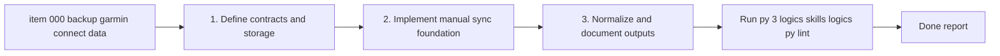

## task_000_backup_garmin_connect_data_and_build_first_interpretation_layer - Backup Garmin Connect data and build first interpretation layer
> From version: 0.1.0
> Schema version: 1.0
> Status: Done
> Understanding: 95
> Confidence: 92
> Progress: 100
> Complexity: High
> Theme: Health
> Reminder: Update status/understanding/confidence/progress and dependencies/references when you edit this doc.

# Context
- Derived from backlog item `item_000_backup_garmin_connect_data_and_build_first_interpretation_layer`.
- Source file: `logics\backlog\item_000_backup_garmin_connect_data_and_build_first_interpretation_layer.md`.
- Related request(s): `req_000_backup_garmin_connect_data_and_build_first_interpretation_layer`.
- Create a reliable local backup workflow for the user's Garmin Connect data, covering as much historical data as realistically possible.
- Implement one reusable foundation slice that:
  preserves raw Garmin data locally, normalizes the priority datasets into an analytical store, and exposes a first deterministic interpretation layer.
- This first task is the foundation wave: it should establish the sync entrypoint, raw storage contract, provenance model, normalized local model, and the first documented derived metrics contract.
- Vendor-computed Garmin indicators may be stored when available, but raw or minimally transformed measurements remain the primary analytical basis.

# Plan
- [x] 1. Define the local sync, storage, and provenance contract: target folders, sync-run identifiers, raw artifact naming, and supported priority datasets.
- [x] 2. Create the initial implementation skeleton for a manual Garmin sync entrypoint and isolate the extraction interfaces for official export and authenticated retrieval paths.
- [x] 3. Implement raw persistence so fetched or imported source artifacts are stored without lossy transformation and can be reprocessed later.
- [x] 4. Define and populate the first normalized local analytical model, with DuckDB as the default target, for the priority datasets available in this first wave.
- [x] 5. Add the first deterministic derived metric contract and report shape for running load, recovery/fatigue, sleep quality, cardio consistency, and progression signals.
- [x] 6. Document the storage layout, supported datasets, known gaps, and manual sync workflow, then update linked Logics docs with the implementation reality.
- [x] CHECKPOINT: leave the current wave commit-ready and update the linked Logics docs before continuing.
- [ ] CHECKPOINT: if the shared AI runtime is active and healthy, run `python logics/skills/logics.py flow assist commit-all` for the current step, item, or wave commit checkpoint.
- [x] GATE: do not close a wave or step until the relevant automated tests and quality checks have been run successfully.
- [x] FINAL: Update related Logics docs

# Delivery checkpoints
- Each completed wave should leave the repository in a coherent, commit-ready state.
- Update the linked Logics docs during the wave that changes the behavior, not only at final closure.
- Prefer a reviewed commit checkpoint at the end of each meaningful wave instead of accumulating several undocumented partial states.
- If the shared AI runtime is active and healthy, use `python logics/skills/logics.py flow assist commit-all` to prepare the commit checkpoint for each meaningful step, item, or wave.
- Do not mark a wave or step complete until the relevant automated tests and quality checks have been run successfully.

# AC Traceability
- AC1 -> Plan steps 1-3. Proof: run a manual sync flow and capture evidence that provenance metadata and dataset coverage are recorded for the sync run.
- AC2 -> Plan step 3. Proof: inspect raw artifacts on disk and confirm the normalized layer is not the only source of truth.
- AC3 -> Plan step 4. Proof: query the local analytical store and confirm supported entities are populated for the first-wave datasets.
- AC4 -> Plan steps 1 and 4. Proof: show that vendor-computed readiness/recovery fields, when present, are stored as optional secondary fields rather than primary analytical inputs.
- AC5 -> Plan step 5. Proof: produce at least one deterministic output artifact or report example with formulas or rules documented.
- AC6 -> Plan steps 1-6. Proof: confirm the implementation path stays local-only and does not require external storage or external AI services.
- AC7 -> Plan step 6. Proof: provide a repo-visible implementation note covering entrypoint, storage layout, supported datasets, and known limitations.

# Decision framing
- Product framing: Not needed
- Product signals: (none detected)
- Product follow-up: No product brief follow-up is expected based on current signals.
- Architecture framing: Required
- Architecture signals: data model and persistence, state and sync, security and identity
- Architecture follow-up: Create or link an architecture decision before irreversible implementation work starts.

# Links
- Product brief(s): (none yet)
- Architecture decision(s): `adr_000_choose_local_first_garmin_data_sync_and_storage_architecture`
- Backlog item: `item_000_backup_garmin_connect_data_and_build_first_interpretation_layer`
- Request(s): `req_000_backup_garmin_connect_data_and_build_first_interpretation_layer`

# AI Context
- Summary: Build the first reusable Garmin data foundation: manual local sync, raw backup, normalized local model, and deterministic interpretation...
- Keywords: garmin, connect, backup, export, sync, health, running, metrics, local, interpretation
- Use when: Use when implementing or refining Garmin data extraction, local storage structure, normalization, provenance, and deterministic first-pass insight generation.
- Skip when: Skip when the work is about later UX surfaces, conversational coaching, or non-Garmin product areas.
# References
- `logics/request/req_000_backup_garmin_connect_data_and_build_first_interpretation_layer.md`
- `logics/backlog/item_000_backup_garmin_connect_data_and_build_first_interpretation_layer.md`
- `logics/architecture/adr_000_choose_local_first_garmin_data_sync_and_storage_architecture.md`

# Validation
- `py -3 logics/skills/logics.py lint --require-status`
- `py -3 logics/skills/logics.py flow sync build-index --format json`
- Run the implemented manual sync entrypoint against a controlled sample or first real sync and confirm raw artifacts, provenance metadata, and normalized outputs are created without duplicate logical records.
- Run the project tests or smoke checks for the new sync and storage code once those commands exist in the repo, then record the exact commands in `# Report`.
- Confirm the completed wave leaves the repository in a commit-ready state.

# Definition of Done (DoD)
- [x] Scope implemented and acceptance criteria covered.
- [x] Validation commands executed and results captured.
- [x] No wave or step was closed before the relevant automated tests and quality checks passed.
- [x] Linked request/backlog/task docs updated during completed waves and at closure.
- [x] Each completed wave left a commit-ready checkpoint or an explicit exception is documented.
- [x] Status is `Done` and progress is `100%`.

# Report
- Implemented package: `coach_garmin/` with CLI entrypoint `python -m coach_garmin`.
- Implemented manual sync command: `python -m coach_garmin sync import-export --source <path>`.
- Implemented storage layers:
- `data/raw/<run_id>/...` for copied source artifacts
- `data/runs/<run_id>.json` for provenance manifests
- `data/normalized/coach_garmin.duckdb` for normalized storage
- `data/reports/latest_metrics.json` for deterministic report output
- Implemented first-wave dataset support for: activities, sleep, heart rate, HRV, stress, Body Battery, steps, intensity minutes, training readiness, and recovery time.
- Implemented deterministic outputs for: load_7d, load_28d, load_ratio_7_28, sleep_hours_7d, resting_hr_7d, hrv_7d, progression_delta, fatigue_flag, and overreaching_flag.
- Added project docs in `docs/garmin_data_foundation.md`.
- Added test coverage with fixtures in `tests/test_manual_import.py`.
- Validation executed:
- `.venv\Scripts\python -m pip install -e .`
- `.venv\Scripts\python -m unittest discover -s tests -p "test_*.py" -v`
- `.venv\Scripts\python -m coach_garmin sync import-export --source .\tests\fixtures\manual_export --data-dir .\data --format json`
- `.venv\Scripts\python -m coach_garmin report latest --data-dir .\data --format json`
- Validation summary:
- 1 sync run created from fixture data
- 10 artifacts imported
- 2 activity rows normalized
- 18 wellness rows normalized
- 2 derived daily metric rows generated
- Latest generated report date: `2026-04-02`
- Known gaps:
- live authenticated Garmin retrieval is not implemented yet
- normalization currently relies on practical field aliases for export formats
- a later task should harden schema mapping against real user exports and broaden provider coverage
