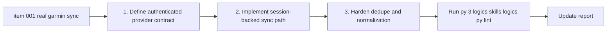

## task_001_connect_local_pipeline_to_a_real_garmin_source_and_harden_incremental_sync_on_user_data - Connect local pipeline to a real Garmin source and harden incremental sync on user data
> From version: 0.1.0
> Schema version: 1.0
> Status: In Progress
> Understanding: 96
> Confidence: 92
> Progress: 90
> Complexity: High
> Theme: Health
> Reminder: Update status/understanding/confidence/progress and dependencies/references when you edit this doc.

# Context
- Derived from backlog item `item_001_connect_local_pipeline_to_a_real_garmin_source_and_harden_incremental_sync_on_user_data`.
- Source file: `logics\backlog\item_001_connect_local_pipeline_to_a_real_garmin_source_and_harden_incremental_sync_on_user_data.md`.
- Related request(s): `req_001_connect_local_pipeline_to_a_real_garmin_source_and_harden_incremental_sync_on_user_data`.
- The repository already contains a local-first Garmin foundation with raw storage, provenance manifests, DuckDB normalization, deterministic reporting, and fixture-based validation.
- This task is the first real authenticated ingestion wave: it should replace the fixture-only path with a real Garmin provider integration that can be rerun safely on the user's own data.
- The first blocking datasets for success are activities, sleep, heart rate, HRV, stress, and steps.
- Session cookies or equivalent authenticated material must remain local, gitignored, and separate from versioned source files.
- Raw authenticated data remains the analytical source of truth, while Garmin-computed summary scores stay secondary when present.

# Plan
- [x] 1. Define the authenticated Garmin provider contract: session storage expectations, provider boundaries, source metadata, and the first supported endpoint or payload shapes for activities, sleep, heart rate, HRV, stress, and steps.
- [x] 2. Implement a local session-backed sync entrypoint that reads cookies or equivalent session state from gitignored local storage and fetches raw Garmin payloads without leaking secrets into versioned files.
- [x] 3. Extend raw persistence and provenance recording for authenticated fetches so every run captures source path, fetch timing, dataset coverage, and raw payload retention for reprocessing.
- [x] 4. Implement rerunnable incremental sync semantics for the blocking datasets, including dataset-level deduplication keys, overlapping window behavior, and duplicate-safe normalized upserts.
- [x] 5. Harden normalization against real Garmin payload variability for the blocking datasets and document the supported fields, field aliases, and unsupported gaps discovered during implementation.
- [x] 6. Verify that the current deterministic report pipeline still works on real imported data, and adjust or document metric gaps where real payloads differ from fixture assumptions.
- [x] 7. Add or update tests and smoke validations for authenticated sync plumbing, deduplication behavior, normalized outputs, and rerun safety using the safest practical local fixtures or captured payload samples.
- [x] 8. Update the project documentation and linked Logics docs with the authenticated sync workflow, local session expectations, supported datasets, known gaps, and validation evidence.
- [x] CHECKPOINT: leave the current wave commit-ready and update the linked Logics docs before continuing.
- [ ] CHECKPOINT: if the shared AI runtime is active and healthy, run `python logics/skills/logics.py flow assist commit-all` for the current step, item, or wave commit checkpoint.
- [x] GATE: do not close a wave or step until the relevant automated tests and quality checks have been run successfully.
- [x] FINAL: Update related Logics docs

# Delivery checkpoints
- Each completed wave should leave the repository in a coherent, commit-ready state.
- Update the linked Logics docs during the wave that changes the behavior, not only at final closure.
- Prefer a reviewed commit checkpoint at the end of each meaningful wave instead of accumulating several undocumented partial states.
- If the shared AI runtime is active and healthy, use `python logics/skills/logics.py flow assist commit-all` to prepare the commit checkpoint for each meaningful step, item, or wave.
- Do not mark a wave or step complete until the relevant automated tests and quality checks have been run successfully.

# AC Traceability
- AC1 -> Plan steps 1-2. Proof: run the authenticated sync using local session material from a gitignored path and confirm no secrets are added to tracked files.
- AC2 -> Plan step 4. Proof: execute overlapping sync runs on the same real dataset window and confirm logical record counts remain stable for activities, sleep, heart rate, HRV, stress, and steps.
- AC3 -> Plan step 3. Proof: inspect raw payload retention and run manifests for authenticated sync runs and confirm provenance continuity across reruns.
- AC4 -> Plan step 5. Proof: show successful normalization for the blocking datasets and document unsupported fields, aliases, or payload gaps discovered on real data.
- AC5 -> Plan steps 6-7. Proof: capture at least one successful real sync and one overlapping rerun, plus validation evidence for normalized outputs and report generation.
- AC6 -> Plan steps 1-6. Proof: confirm the implementation remains local-only and preserves raw or minimally transformed data as the primary analytical basis.
- AC7 -> Plan step 8. Proof: provide repo-visible documentation for the authenticated sync entrypoint, session storage, deduplication strategy, supported datasets, and caveats.
- AC8 -> Plan step 6. Proof: generate the deterministic report from real data or explicitly record the remaining incompatibilities in the task report.

# Decision framing
- Product framing: Not needed
- Product signals: (none detected)
- Product follow-up: No product brief follow-up is expected based on current signals.
- Architecture framing: Required
- Architecture signals: external integration, security and identity, state and sync, data model and persistence
- Architecture follow-up: Reuse the existing ADR baseline and create a focused ADR only if the chosen Garmin provider or session strategy introduces an irreversible architectural tradeoff.

# Links
- Product brief(s): (none yet)
- Architecture decision(s): `adr_000_choose_local_first_garmin_data_sync_and_storage_architecture`
- Backlog item: `item_001_connect_local_pipeline_to_a_real_garmin_source_and_harden_incremental_sync_on_user_data`
- Request(s): `req_001_connect_local_pipeline_to_a_real_garmin_source_and_harden_incremental_sync_on_user_data`

# AI Context
- Summary: Implement the first authenticated Garmin provider for the existing local-first pipeline and make incremental sync rerunnable, duplicate-safe, and validated on real user data.
- Keywords: garmin, authenticated, provider, cookies, session, incremental, deduplication, real-data, provenance, duckdb
- Use when: Use when implementing or refining authenticated Garmin access, local session persistence, rerunnable sync, duplicate-safe normalization, and validation on real data.
- Skip when: Skip when the work is limited to manual export import, fixture-only improvements, or later advisory layers unrelated to ingestion robustness.

# References
- `logics/request/req_001_connect_local_pipeline_to_a_real_garmin_source_and_harden_incremental_sync_on_user_data.md`
- `logics/backlog/item_001_connect_local_pipeline_to_a_real_garmin_source_and_harden_incremental_sync_on_user_data.md`
- `logics/architecture/adr_000_choose_local_first_garmin_data_sync_and_storage_architecture.md`

# Validation
- `py -3 logics/skills/logics.py lint --require-status`
- `py -3 logics/skills/logics.py flow sync build-index --format json`
- Run the authenticated sync entrypoint on real user-owned Garmin data and confirm raw payloads, provenance manifests, normalized outputs, and the latest report are created locally.
- Re-run the authenticated sync on an overlapping time window and confirm duplicate logical records are not introduced in the normalized layer.
- Run the project tests or smoke checks for the authenticated provider, normalization updates, and deduplication behavior, then record the exact commands in `# Report`.
- Confirm the completed wave leaves the repository in a commit-ready state.

# Definition of Done (DoD)
- [ ] Scope implemented and acceptance criteria covered.
- [ ] Validation commands executed and results captured.
- [ ] No wave or step was closed before the relevant automated tests and quality checks passed.
- [ ] Linked request/backlog/task docs updated during completed waves and at closure.
- [ ] Each completed wave left a commit-ready checkpoint or an explicit exception is documented.
- [ ] Status is `Done` and progress is `100%`.

# Report
- Implemented authenticated Garmin sync command: `python -m coach_garmin sync garmin-auth`.
- Added local token/session storage contract under `.local/garmin/garmin_tokens.json` with gitignore protection.
- Added authenticated provider orchestration with the maintained `garminconnect` library and date-range sync support for: activities, sleep, heart rate, HRV, stress, and steps.
- Added raw authenticated payload persistence as dataset JSON wrappers under `data/raw/<run_id>/<dataset>/`.
- Extended manifest metadata to record date range, tokenstore path, and sync warnings.
- Hardened normalized deduplication semantics so authenticated reruns keep stable logical counts for activities and daily dataset rows.
- Added automated test coverage for authenticated sync plumbing and overlapping rerun deduplication in `tests/test_garmin_auth_sync.py`.
- Updated project docs and README for the authenticated workflow.
- Validation executed:
- `.venv\Scripts\python -m pip install -e .`
- `.venv\Scripts\python -m unittest discover -s tests -p "test_*.py" -v`
- `.venv\Scripts\python -m coach_garmin sync garmin-auth --help`
- `.venv\Scripts\python -m coach_garmin sync garmin-auth --days 7 --format json`
- `.venv\Scripts\python -m coach_garmin sync import-export --source .\tests\fixtures\manual_export --data-dir .\data --format json`
- `.venv\Scripts\python -m coach_garmin report latest --data-dir .\data --format json`
- Validation summary:
- authenticated CLI wiring is available
- authenticated sync now fails fast with a clear configuration message when no tokenstore or Garmin credentials are present
- automated rerun deduplication passes in test coverage
- manual import flow still works after the authenticated changes
- repeated real Garmin login attempts on April 7, 2026 still fail upstream with `429 Rate Limit / Cloudflare blocked`
- Remaining blocker before closure: no real Garmin credentials or existing local tokenstore were available in this workspace, so actual user-account validation has not been executed yet.
