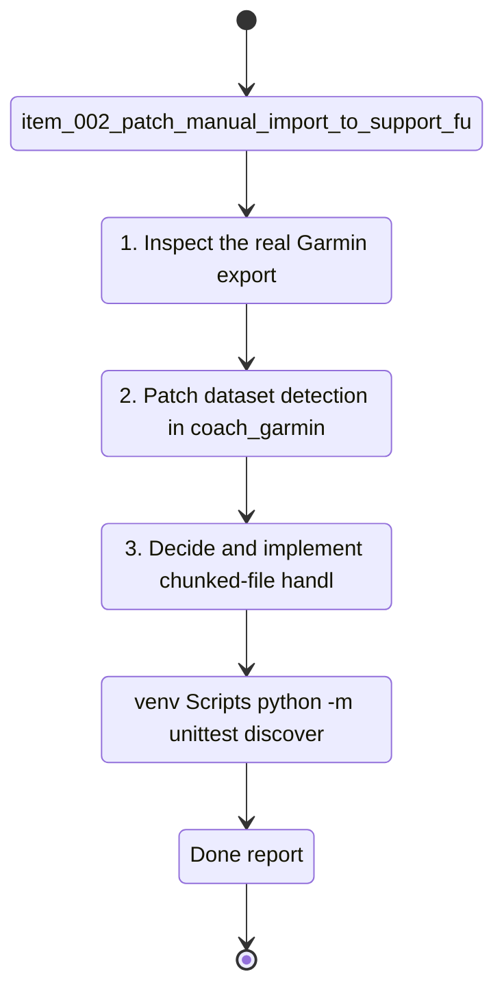

## task_002_patch_manual_import_to_support_full_garmin_connect_export_shapes - Patch manual import to support full Garmin Connect export shapes
> From version: 0.1.0
> Schema version: 1.0
> Status: Done
> Understanding: 95
> Confidence: 92
> Progress: 100%
> Complexity: Medium
> Theme: Health
> Reminder: Update status/understanding/confidence/progress and dependencies/references when you edit this doc.

# Context
Derived from `logics/backlog/item_002_patch_manual_import_to_support_full_garmin_connect_export_shapes.md`.
- Derived from backlog item `item_002_patch_manual_import_to_support_full_garmin_connect_export_shapes`.
- Source file: `logics\backlog\item_002_patch_manual_import_to_support_full_garmin_connect_export_shapes.md`.
- Related request(s): `req_002_patch_manual_import_to_support_full_garmin_connect_export_shapes`.
- Extend the manual import pipeline so it can ingest the real Garmin Connect full export already downloaded by the user.
- Map Garmin's actual export filenames and folder shapes to the internal datasets already used by the repository.
- Make the manual export path usable as a first post-processing and analytics validation path while authenticated sync remains blocked.
- The real export folder currently available is `C:\Users\Pmondou\Downloads\garmin-export`.
- The first delivery slice is intentionally narrow: activities, sleep, steps, heart rate, stress, and HRV.
- The implementation should prefer one canonical Garmin export source per supported dataset and keep unsupported files visible in the import summary.
- The implementation sequence should be two-phase: detection and mapping first, then parsing or normalization adjustments only where real payloads require them.

# Plan
- [x] 1. Inspect the real Garmin export files for the first slice and choose one canonical Garmin source for each supported dataset: activities, sleep, steps, heart rate, stress, and HRV.
- [x] 2. Patch dataset detection in `coach_garmin/storage.py` and any related manual-import discovery logic so Garmin-native filenames and folders resolve to the intended internal datasets.
- [x] 3. Decide and implement chunked-file handling for the supported datasets: merge before normalization or ingest independently with downstream deduplication, and document the chosen behavior.
- [x] 4. Patch parsing and normalization only where the real Garmin payload shapes differ from current fixture assumptions, while keeping the raw-first pipeline intact.
- [x] 5. Preserve raw artifact copying, provenance manifests, unsupported-file reporting, normalized DuckDB output, and latest-report generation for the patched manual import flow.
- [x] 6. Add or update targeted tests for dataset detection, Garmin-native filename mapping, and any parsing or normalization logic introduced by the real export shapes.
- [x] 7. Run a real manual import against `C:\Users\Pmondou\Downloads\garmin-export`, capture which datasets import successfully, and record which files remain unsupported after the first slice.
- [x] 8. Update README or relevant repo docs plus linked Logics docs with the supported real export shapes, canonical source choices, chunk-handling behavior, and validation evidence.
- [x] CHECKPOINT: leave the current wave commit-ready and update the linked Logics docs before continuing.
- [x] CHECKPOINT: if the shared AI runtime is active and healthy, run `python logics/skills/logics.py flow assist commit-all` for the current step, item, or wave commit checkpoint.
- [x] GATE: do not close a wave or step until the relevant automated tests and quality checks have been run successfully.
- [x] FINAL: Update related Logics docs

# Delivery checkpoints
- Each completed wave should leave the repository in a coherent, commit-ready state.
- Update the linked Logics docs during the wave that changes the behavior, not only at final closure.
- Prefer a reviewed commit checkpoint at the end of each meaningful wave instead of accumulating several undocumented partial states.
- If the shared AI runtime is active and healthy, use `python logics/skills/logics.py flow assist commit-all` to prepare the commit checkpoint for each meaningful step, item, or wave.
- Do not mark a wave or step complete until the relevant automated tests and quality checks have been run successfully.

# AC Traceability
- AC1 -> Plan steps 1-2. Proof: show that Garmin-native export filenames and folders from the real archive are recognized without renaming files by hand.
- AC2 -> Plan step 2. Proof: document the dataset detection and mapping rules added to the manual import path.
- AC3 -> Plan steps 2 and 4-5. Proof: demonstrate that mapped files still flow through the existing raw, normalized, and reporting pipeline rather than a separate importer.
- AC4 -> Plan step 7. Proof: run the import on `C:\Users\Pmondou\Downloads\garmin-export` and capture a successful end-to-end local result for the first slice.
- AC5 -> Plan steps 5 and 7. Proof: record the unsupported-file summary after the first-slice import.
- AC6 -> Plan steps 1-5. Proof: import and surface the first-slice datasets only: activities, sleep, steps, heart rate, stress, and HRV.
- AC7 -> Plan step 1. Proof: record the canonical Garmin source selected for each supported dataset.
- AC8 -> Plan step 3. Proof: document and validate the chosen chunk-handling behavior on the supported datasets.
- AC9 -> Plan steps 6-8. Proof: leave repo-visible tests, docs, and validation evidence that close the backlog slice cleanly.

# Decision framing
- Product framing: Not needed
- Product signals: (none required for this delivery slice)
- Product follow-up: No product brief follow-up is required for this importer patch.
- Architecture framing: Required
- Architecture signals: data model and persistence, state and sync, security and identity
- Architecture follow-up: Reuse the existing ADR baseline and create a focused follow-up ADR only if canonical source selection or chunk handling creates irreversible ingestion coupling.

# Links
- Product brief(s): (none yet)
- Architecture decision(s): `adr_000_choose_local_first_garmin_data_sync_and_storage_architecture`
- Backlog item: `item_002_patch_manual_import_to_support_full_garmin_connect_export_shapes`
- Request(s): `req_002_patch_manual_import_to_support_full_garmin_connect_export_shapes`

# AI Context
- Summary: Patch the manual Garmin import flow so the repository can ingest the user's full Garmin Connect export and run the existing analytics pipeline on the first supported real-data slice.
- Keywords: garmin, export, manual-import, dataset-mapping, normalization, duckdb, analytics, local-first
- Use when: Use when planning or implementing support for Garmin-native export filenames and folders in the existing manual import pipeline.
- Skip when: Skip when the work is about live Garmin authentication, UI, or unrelated analysis features.

# References
- `logics/request/req_002_patch_manual_import_to_support_full_garmin_connect_export_shapes.md`
- `logics/backlog/item_002_patch_manual_import_to_support_full_garmin_connect_export_shapes.md`
- `logics/architecture/adr_000_choose_local_first_garmin_data_sync_and_storage_architecture.md`
- `coach_garmin/manual_import.py`
- `coach_garmin/storage.py`
- `tests/test_manual_import.py`

# Validation
- `.venv\Scripts\python -m unittest discover -s tests -p "test_manual_import.py" -v`
- `.venv\Scripts\python -m coach_garmin sync import-export --source "C:\Users\Pmondou\Downloads\garmin-export" --format json`
- `.venv\Scripts\python -m coach_garmin report latest --format json`
- Inspect `data/raw`, `data/runs`, `data/normalized/coach_garmin.duckdb`, and `data/reports/latest_metrics.json` after the real import.
- Record which Garmin-native files were mapped for the first slice and which remained unsupported.
- Confirm the completed wave leaves the repository in a commit-ready state.

# Definition of Done (DoD)
- [x] Scope implemented and acceptance criteria covered.
- [x] Validation commands executed and results captured.
- [x] No wave or step was closed before the relevant automated tests and quality checks passed.
- [x] Linked request/backlog/task docs updated during completed waves and at closure.
- [x] Each completed wave left a commit-ready checkpoint or an explicit exception is documented.
- [x] Status is `Done` and progress is `100%`.

# Report
- Canonical Garmin export sources selected for the first slice:
- `activities` -> `*_summarizedActivities.json`
- `sleep` -> `*_sleepData.json`
- `steps` -> `UDSFile_*.json`
- `heart_rate` -> `UDSFile_*.json`
- `stress` -> `UDSFile_*.json` via `allDayStress.aggregatorList[type=TOTAL].averageStressLevel`
- `hrv` -> `*_healthStatusData.json` via `metrics[type=HRV].value`
- Implemented multi-dataset artifact discovery so one Garmin source file can feed several internal datasets without manual renaming.
- Implemented dataset-specific record extraction in `coach_garmin/storage.py` for Garmin-native wrappers and nested wellness payloads.
- Kept chunked Garmin export files as independent raw artifacts and relied on downstream normalized deduplication based on existing record hashes.
- Extended normalization compatibility for real Garmin payloads, including `avgHr`, `maxHr`, `duration`, `distance`, and sleep-duration reconstruction from component fields.
- Added real-shape fixture coverage under `tests/fixtures/garmin_full_export`.
- Real import result on `C:\Users\Pmondou\Downloads\garmin-export`:
- `artifacts_imported`: 63
- `datasets_seen`: `activities`, `heart_rate`, `hrv`, `sleep`, `steps`, `stress`
- `total_records`: 5922
- analytics summary: `activity_rows=2174`, `wellness_rows=3517`, `metric_rows=928`, `latest_day=2026-04-07`
- Unsupported files remain explicitly listed in the import summary for future backlog slices.
- Validation executed:
- `.venv\Scripts\python -m unittest discover -s tests -p "test_manual_import.py" -v`
- `.venv\Scripts\python -m unittest discover -s tests -v`
- `.venv\Scripts\python -m coach_garmin sync import-export --source "C:\Users\Pmondou\Downloads\garmin-export" --format json`
- `.venv\Scripts\python -m coach_garmin report latest --format json`
- Validation summary:
- fixture-based manual import still passes
- Garmin-native export shape coverage passes in targeted tests
- real export import succeeds end-to-end on the local archive
- the report is generated successfully with `latest_day=2026-04-07`
- Commit-ready checkpoint note: repository is left in a coherent state, but no `flow assist commit-all` checkpoint was created in this run.

# Notes
