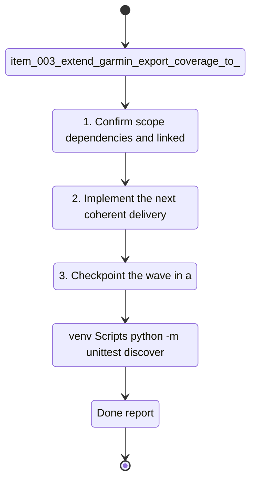

## task_003_extend_garmin_export_coverage_to_the_full_initial_data_surface - Extend Garmin export coverage to the full initial data surface
> From version: 0.1.0
> Schema version: 1.0
> Status: Done
> Understanding: 96
> Confidence: 94
> Progress: 100%
> Complexity: High
> Theme: Health
> Reminder: Update status/understanding/confidence/progress and dependencies/references when you edit this doc.

# Context
Derived from `logics/backlog/item_003_extend_garmin_export_coverage_to_the_full_initial_data_surface.md`.
- Derived from backlog item `item_003_extend_garmin_export_coverage_to_the_full_initial_data_surface`.
- Source file: `logics\backlog\item_003_extend_garmin_export_coverage_to_the_full_initial_data_surface.md`.
- Related request(s): `req_003_extend_garmin_export_coverage_to_the_full_initial_data_surface`.
- Expand the Garmin export import pipeline beyond the first supported slice so it covers the broader set of structured data already produced by Garmin Connect.
- Preserve local-first raw retention and deterministic normalization while extending coverage to more export domains.
- Make the imported archive useful as a complete post-processing source, not only a minimal analytics proof of concept.

# Plan
- [x] 1. Confirm scope, dependencies, and linked acceptance criteria.
- [x] 2. Implement the next coherent delivery wave from the backlog item.
- [x] 3. Checkpoint the wave in a commit-ready state, validate it, and update the linked Logics docs.
- [x] CHECKPOINT: leave the current wave commit-ready and update the linked Logics docs before continuing.
- [x] CHECKPOINT: if the shared AI runtime is active and healthy, run `python logics/skills/logics.py flow assist commit-all` for the current step, item, or wave commit checkpoint.
- [x] GATE: do not close a wave or step until the relevant automated tests and quality checks have been run successfully.
- [x] FINAL: Update related Logics docs

# Delivery checkpoints
- Each completed wave should leave the repository in a coherent, commit-ready state.
- Update the linked Logics docs during the wave that changes the behavior, not only at final closure.
- Prefer a reviewed commit checkpoint at the end of each meaningful wave instead of accumulating several undocumented partial states.
- If the shared AI runtime is active and healthy, use `python logics/skills/logics.py flow assist commit-all` to prepare the commit checkpoint for each meaningful step, item, or wave.
- Do not mark a wave or step complete until the relevant automated tests and quality checks have been run successfully.

# AC Traceability
- AC1 -> Scope: The request defines that coverage should expand beyond the first supported slice to the broader structured Garmin export surface already available in the user's archive.. Proof: capture validation evidence in this doc.
- AC2 -> Scope: The request distinguishes between analytically useful datasets, metadata/provenance files, and unsupported artifacts.. Proof: capture validation evidence in this doc.
- AC3 -> Scope: The request keeps raw retention and deterministic normalization as first-class requirements while coverage expands.. Proof: capture validation evidence in this doc.
- AC4 -> Scope: The request requires a staged delivery approach so the remaining Garmin export surface is added in bounded slices.. Proof: capture validation evidence in this doc.
- AC5 -> Scope: The request requires validation on the user's real Garmin export archive.. Proof: capture validation evidence in this doc.
- AC6 -> Scope: The request remains compatible with the first-slice importer and does not regress the datasets already supported.. Proof: capture validation evidence in this doc.
- AC7 -> Scope: The request is specific enough to break into backlog items for the remaining Garmin export domains.. Proof: capture validation evidence in this doc.
- AC8 -> Scope: The first expansion slice is explicitly narrow but deep on `activities`, `training_load`, `hrv`, and `sleep`.. Proof: capture validation evidence in this doc.
- AC9 -> Scope: `training_history` and `acute_load` are explicitly prioritized as the next coaching-focused slice.. Proof: capture validation evidence in this doc.
- AC10 -> Scope: `profile` and `heart_rate_zones` are normalized as reference data in this expansion effort.. Proof: capture validation evidence in this doc.
- AC11 -> Scope: `device` and `settings` are retained raw-first (indexed in manifests/provenance) before any normalization work.. Proof: capture validation evidence in this doc.

# Decision framing
- Product framing: Required
- Product signals: pricing and packaging, engagement loop, experience scope
- Product follow-up: Create or link a product brief before implementation moves deeper into delivery.
- Architecture framing: Required
- Architecture signals: data model and persistence, state and sync, security and identity
- Architecture follow-up: Create or link an architecture decision before irreversible implementation work starts.

# Links
- Product brief(s): (none yet)
- Architecture decision(s): `adr_000_choose_local_first_garmin_data_sync_and_storage_architecture`
- Backlog item: `item_003_extend_garmin_export_coverage_to_the_full_initial_data_surface`
- Request(s): `req_003_extend_garmin_export_coverage_to_the_full_initial_data_surface`

# AI Context
- Summary: Expand Garmin export coverage beyond the first supported slice so the broader structured archive can be used locally with normalized coaching and reference datasets.
- Keywords: garmin, export, coverage, archive, normalization, provenance, local-first, datasets, metadata
- Use when: Use when planning broader Garmin export coverage after the first supported slice is working.
- Skip when: Skip when the work is only about live authentication, a single dataset fix, or unrelated UI work.
# References
- `coach_garmin/config.py`
- `coach_garmin/storage.py`
- `coach_garmin/analytics.py`
- `tests/test_manual_import.py`

# Validation
- `.venv\Scripts\python -m unittest discover -s tests -v`
- `.venv\Scripts\python -m coach_garmin sync import-export --source "C:\Users\Pmondou\Downloads\garmin-export" --format json`
- `.venv\Scripts\python -m coach_garmin report latest --format json`
- DuckDB verification on `data/normalized/coach_garmin.duckdb`:
- `select count(*) from activities`
- `select count(*) from wellness_daily`
- `select count(*) from acute_load_daily`
- `select count(*) from training_history_daily`
- `select count(*) from profile_snapshots`
- `select count(*) from heart_rate_zones`
- Confirm the completed wave leaves the repository in a commit-ready state.

# Definition of Done (DoD)
- [x] Scope implemented and acceptance criteria covered.
- [x] Validation commands executed and results captured.
- [x] No wave or step was closed before the relevant automated tests and quality checks passed.
- [x] Linked request/backlog/task docs updated during completed waves and at closure.
- [x] Each completed wave left a commit-ready checkpoint or an explicit exception is documented.
- [x] Status is `Done` and progress is `100%`.

# Report
- Expanded dataset detection and extraction in `coach_garmin/storage.py` for:
- `acute_load` from `MetricsAcuteTrainingLoad_*.json`
- `training_history` from `TrainingHistory_*.json`
- `profile` from `user_profile.json` and social-profile payloads
- `heart_rate_zones` from `*_heartRateZones.json`
- `device_raw` from device backup/content files (raw-only)
- `settings_raw` from user settings/reminders files (raw-only)
- Added normalization tables in `coach_garmin/analytics.py`:
- `acute_load_daily`
- `training_history_daily`
- `profile_snapshots`
- `heart_rate_zones`
- Kept `device_raw` and `settings_raw` raw-first by importing artifacts and provenance without promoting them to normalized analytics tables.
- Updated `SUPPORTED_DATASETS` and aliases in `coach_garmin/config.py`.
- Added fixture coverage for the new domains under `tests/fixtures/garmin_full_export`.
- Updated `tests/test_manual_import.py` to validate dataset discovery and normalized table population for the expanded slice.
- Real import results on `C:\Users\Pmondou\Downloads\garmin-export`:
- `artifacts_imported`: 89
- `datasets_seen`: `activities`, `acute_load`, `device_raw`, `heart_rate`, `heart_rate_zones`, `hrv`, `profile`, `settings_raw`, `sleep`, `steps`, `stress`, `training_history`
- `total_records`: 11833
- Analytics table counts:
- `activities`: 2174
- `wellness_daily`: 3517
- `acute_load_daily`: 737
- `training_history_daily`: 739
- `profile_snapshots`: 2
- `heart_rate_zones`: 1
- latest report day: `2026-04-07`

# Notes
