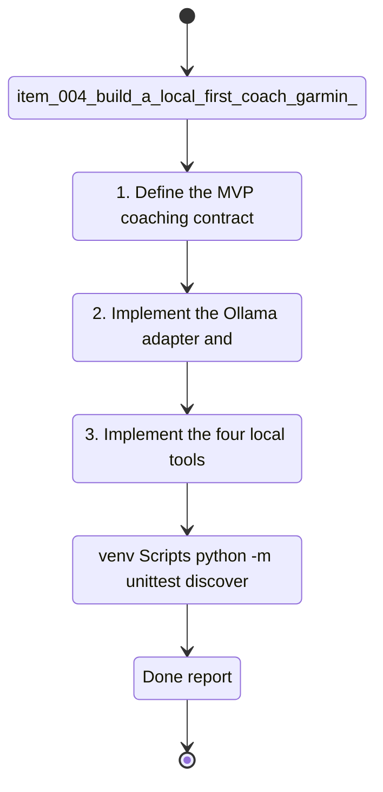

## task_004_build_a_local_first_coach_garmin_chat_cli - Build a local-first coach-garmin chat CLI
> From version: 0.1.0
> Schema version: 1.0
> Status: Done
> Understanding: 95
> Confidence: 92
> Progress: 100%
> Complexity: High
> Theme: Health
> Reminder: Update status/understanding/confidence/progress and dependencies/references when you edit this doc.

# Context
Derived from `logics/backlog/item_004_build_a_local_first_coach_garmin_chat_cli.md`.
- Derived from backlog item `item_004_build_a_local_first_coach_garmin_chat_cli`.
- Source file: `logics\backlog\item_004_build_a_local_first_coach_garmin_chat_cli.md`.
- Related request(s): `req_004_build_a_local_first_coach_garmin_chat_cli`.
- The repository already contains local Garmin ingestion, normalized DuckDB analytics, and a latest metrics report.
- This task adds the first interactive coaching layer on top of that foundation through a CLI chat experience backed by Ollama.
- The MVP should stay intentionally narrow: one CLI entrypoint, one local provider baseline, four bounded tools, a clarification loop, and saved weekly plans.

# Plan
- [x] 1. Define the MVP coaching contract in code: CLI namespace, session flow, local provider configuration, and the four tool interfaces.
- [x] 2. Implement the Ollama adapter and prompt orchestration for a French coaching chat that can ask clarification questions before producing a plan.
- [x] 3. Implement the four local tools:
- [x] `metrics`: summarize current deterministic metrics and recovery or fatigue signals.
- [x] `goals`: read and write the current goal profile.
- [x] `plan`: save a versioned weekly plan artifact under `data/reports/`.
- [x] `history`: summarize recent training history from normalized local data.
- [x] 4. Wire the CLI conversation loop so it can capture a free-form goal, call the local tools, and emit a first weekly plan with referenced signals.
- [x] 5. Add actionable provider error handling for missing Ollama, unreachable Ollama, or missing configured model.
- [x] 6. Add automated tests for the CLI entrypoint, the four tools, the clarification flow, and the main provider error path.
- [x] 7. Run targeted validation and document the output paths, commands, and known MVP limits.
- [x] CHECKPOINT: leave the current wave commit-ready and update the linked Logics docs before continuing.
- [x] CHECKPOINT: if the shared AI runtime is active and healthy, run `python logics/skills/logics.py flow assist commit-all` for the current step, item, or wave commit checkpoint.
- [x] GATE: do not close a wave or step until the relevant automated tests and quality checks have been run successfully.
- [x] FINAL: Update related Logics docs

# Delivery checkpoints
- Each completed wave should leave the repository in a coherent, commit-ready state.
- Update the linked Logics docs during the wave that changes the behavior, not only at final closure.
- Prefer a reviewed commit checkpoint at the end of each meaningful wave instead of accumulating several undocumented partial states.
- If the shared AI runtime is active and healthy, use `python logics/skills/logics.py flow assist commit-all` to prepare the commit checkpoint for each meaningful step, item, or wave.
- Do not mark a wave or step complete until the relevant automated tests and quality checks have been run successfully.

# AC Traceability
- AC1 -> Plan steps 1 and 4. Proof: run `python -m coach_garmin coach chat` and confirm the interactive session starts.
- AC2 -> Plan steps 2 and 4. Proof: submit a free-form running goal in French and capture the first coaching turn.
- AC3 -> Plan steps 2 and 4. Proof: start with an underspecified goal and confirm clarification questions are asked before a plan is returned.
- AC4 -> Plan step 3. Proof: cover `metrics`, `goals`, `plan`, and `history` with targeted tests or direct validation.
- AC5 -> Plan steps 3 and 4. Proof: inspect the generated response or saved plan and confirm it references local data sources.
- AC6 -> Plan steps 3 and 4. Proof: verify a versioned plan artifact exists under `data/reports/` after a successful run.
- AC7 -> Plan step 4. Proof: confirm the plan includes the main local signals that influenced the recommendation.
- AC8 -> Plan step 5. Proof: simulate unavailable Ollama or missing model conditions and confirm the error text is actionable.
- AC9 -> Plan steps 1-5. Proof: implementation uses only local Ollama and local data sources, with no paid API dependency.
- AC10 -> Plan step 6. Proof: run the targeted automated tests and record the exact command and result in `# Report`.

# Decision framing
- Product framing: Required
- Product signals: pricing and packaging, engagement loop
- Product follow-up: Create or link a product brief before implementation moves deeper into delivery.
- Architecture framing: Required
- Architecture signals: data model and persistence, contracts and integration, security and identity
- Architecture follow-up: Reuse the existing ADR baseline and add a focused ADR only if the local coaching contract introduces an irreversible boundary or storage choice.

# Links
- Product brief(s): (none yet)
- Architecture decision(s): `adr_000_choose_local_first_garmin_data_sync_and_storage_architecture`
- Backlog item: `item_004_build_a_local_first_coach_garmin_chat_cli`
- Request(s): `req_004_build_a_local_first_coach_garmin_chat_cli`

# AI Context
- Summary: Build the first local-first coach chat in CLI form using Ollama, Garmin-derived local metrics, four bounded tool adapters, and saved weekly plans.
- Keywords: coaching, running, cli, chat, ollama, goals, history, metrics, weekly-plan, duckdb
- Use when: Use when implementing the MVP coaching loop and its local integrations.
- Skip when: Skip when the work is limited to ingestion or non-interactive analytics only.

# References
- `coach_garmin/cli.py`
- `coach_garmin/analytics.py`
- `coach_garmin/storage.py`
- `logics/backlog/item_004_build_a_local_first_coach_garmin_chat_cli.md`

# Validation
- `.venv\Scripts\python -m unittest discover -s tests -p "test_coach*.py" -v`
- `.venv\Scripts\python -m unittest discover -s tests -v`
- `.venv\Scripts\python -m coach_garmin coach chat`
- Verify that a versioned weekly plan artifact is created under `data/reports/`.
- Verify that an unavailable Ollama path returns an actionable message rather than a stack trace.
- Confirm the completed wave leaves the repository in a commit-ready state.

# Definition of Done (DoD)
- [x] Scope implemented and acceptance criteria covered.
- [x] Validation commands executed and results captured.
- [x] No wave or step was closed before the relevant automated tests and quality checks passed.
- [x] Linked request/backlog/task docs updated during completed waves and at closure.
- [x] Each completed wave left a commit-ready checkpoint or an explicit exception is documented.
- [x] Status is `Done` and progress is `100%`.

# Report
- Implemented new coach modules:
- `coach_garmin/coach_tools.py` for the four local tool surfaces: `metrics`, `goals`, `plan`, and `history`.
- `coach_garmin/coach_ollama.py` for local Ollama connectivity, model validation, and JSON plan generation.
- `coach_garmin/coach_chat.py` for goal parsing, clarification questions, deterministic weekly-plan skeletons, signal normalization, and persistence.
- Extended `coach_garmin/cli.py` with `python -m coach_garmin coach chat`.
- Added versioned weekly-plan persistence under `data/reports/weekly_plan_<timestamp>.json`.
- Added goal-profile persistence under `data/reports/goal_profile.json`.
- Added automated coverage in `tests/test_coach_chat.py` for:
- local tool behavior
- clarification flow
- provider error handling
- partial-model-output normalization to a full 7-day plan
- CLI JSON output mode
- Updated `README.md` with coach chat usage.
- Validation executed:
- `.venv\Scripts\python -m unittest discover -s tests -p "test_coach*.py" -v`
- `.venv\Scripts\python -m unittest discover -s tests -v`
- real local smoke validation with fixture import plus `run_coach_chat(...)` against Ollama `qwen2.5:7b`
- Validation summary:
- targeted coach tests passed
- full repository test suite passed
- local Ollama smoke run succeeded
- versioned weekly plan artifact was created successfully
- Known MVP limits:
- the local model can still return weak session labels or thin justifications, so the deterministic skeleton remains an important safety net
- the coach currently optimizes for a one-week plan rather than a multi-week progression

# Notes
