## task_005_correct_real_garmin_activity_normalization_and_coaching_plausibility_on_local_exports - Correct real Garmin activity normalization and coaching plausibility on local exports
> From version: 0.1.0
> Schema version: 1.0
> Status: Done
> Understanding: 96
> Confidence: 94
> Progress: 100%
> Complexity: High
> Theme: Health
> Reminder: Update status/understanding/confidence/progress and dependencies/references when you edit this doc.

# Context
- Derived from backlog item `item_005_correct_real_garmin_activity_normalization_and_coaching_plausibility_on_local_exports`.
- Source file: `logics\backlog\item_005_correct_real_garmin_activity_normalization_and_coaching_plausibility_on_local_exports.md`.
- Related request(s): `req_005_harden_real_export_normalization_and_clean_repo_delivery_artifacts`.
- Real Garmin export activity data currently produces impossible downstream values in local history and coaching outputs.
- A real local smoke test already showed absurd recent-history aggregates and a weekly plan containing a long run measured in thousands of minutes.
- The correction strategy for this task is tolerant-first: repair units and field mappings where possible, then exclude from downstream coaching only if a record remains implausible after correction attempts.

```mermaid
%% logics-kind: task
%% logics-signature: task|correct-real-garmin-activity-normalizati|item-005-correct-real-garmin-activity-no|1-reproduce-the-anomaly-on-the|venv-scripts-python-m-unittest-discover
flowchart LR
    Backlog[item 005 normalize real export] --> Step1[1 reproduce the anomaly on local export]
    Step1 --> Step2[2 inspect payload fields and fix mapping]
    Step2 --> Step3[3 add plausibility guardrails]
    Step3 --> Step4[4 rerun local coach validation]
    Step4 --> Validation[Run targeted tests and smoke checks]
    Validation --> Report[Done report]
```

# Plan
- [x] 1. Reproduce the anomaly on the copied local export under `data/sources/garmin-export` and record the exact abnormal values observed in history and coaching outputs.
- [x] 2. Inspect the relevant real activity payload fields and identify where units, field selection, or fallback logic are wrong in normalization.
- [x] 3. Implement tolerant-first corrections in the ingestion and analytics path:
- [x] repair duration, distance, load, or activity-shape interpretation where a reliable correction rule exists
- [x] preserve raw artifacts and provenance
- [x] 4. Add plausibility guardrails so corrected-but-still-impossible records do not silently flow into recent-history summaries or saved coaching plans.
- [x] 5. Update the coach-supporting summaries so `history` and plan generation rely on sane activity-derived values.
- [x] 6. Add automated regression coverage for at least one real-shape anomaly case that previously produced absurd outputs.
- [x] 7. Re-run the real local validation flow on `data/sources/garmin-export` and confirm the generated weekly plan is plausible.
- [x] 8. Document the tolerant correction behavior, known limits, and local-only validation handling in the report and related docs.
- [x] CHECKPOINT: leave the current wave commit-ready and update the linked Logics docs before continuing.
- [ ] CHECKPOINT: if the shared AI runtime is active and healthy, run `python logics/skills/logics.py flow assist commit-all` for the current step, item, or wave commit checkpoint.
- [x] GATE: do not close a wave or step until the relevant automated tests and quality checks have been run successfully.
- [x] FINAL: Update related Logics docs

# Delivery checkpoints
- Each completed wave should leave the repository in a coherent, commit-ready state.
- Update the linked Logics docs during the wave that changes the behavior, not only at final closure.
- Prefer a reviewed commit checkpoint at the end of each meaningful wave instead of accumulating several undocumented partial states.
- If the shared AI runtime is active and healthy, use `python logics/skills/logics.py flow assist commit-all` to prepare the commit checkpoint for each meaningful step, item, or wave.
- Do not mark a wave or step complete until the relevant automated tests and quality checks have been run successfully.

# AC Traceability
- AC1 -> Plan steps 1-3. Proof: capture the reproduced anomaly and the corrective mapping or unit fix in the task report.
- AC2 -> Plan steps 4-5. Proof: show that impossible values no longer propagate into `history` or plan generation.
- AC3 -> Plan step 7. Proof: rerun the coach flow on the copied local export and capture a plausible weekly plan artifact.
- AC4 -> Plan step 6. Proof: run the targeted regression test that covers the previously absurd real-shape case.
- AC5 -> Plan steps 1 and 7. Proof: record exact commands and outcomes on the local real-export copy.
- AC6 -> Plan step 8. Proof: document that the copied export remains local-only and outside push-oriented delivery flow.
- AC7 -> Plan steps 2-7. Proof: implementation remains local-first and does not add paid cloud dependencies.

# Decision framing
- Product framing: Consider
- Product signals: pricing and packaging
- Product follow-up: Review whether a product brief is needed before coaching scope becomes harder to change.
- Architecture framing: Required
- Architecture signals: data model and persistence, contracts and integration
- Architecture follow-up: Reuse the existing ADR baseline and add a focused ADR only if the tolerant correction strategy introduces an irreversible normalization policy.

# Links
- Product brief(s): (none yet)
- Architecture decision(s): `adr_000_choose_local_first_garmin_data_sync_and_storage_architecture`
- Backlog item: `item_005_correct_real_garmin_activity_normalization_and_coaching_plausibility_on_local_exports`
- Request(s): `req_005_harden_real_export_normalization_and_clean_repo_delivery_artifacts`

# AI Context
- Summary: Correct real Garmin activity normalization so local history and coach outputs remain plausible on the copied local export, using tolerant-first repair rules.
- Keywords: garmin, normalization, anomaly, duration, distance, load, plausibility, tolerant, local-export, coaching
- Use when: Use when implementing and validating the anomaly fix for real coaching data.
- Skip when: Skip when the work is only about cleanup or local artifact hygiene.

# References
- `coach_garmin/analytics.py`
- `coach_garmin/coach_tools.py`
- `coach_garmin/coach_chat.py`
- `coach_garmin/storage.py`
- `data/sources/garmin-export`
- `data/validation_real_export`

# Validation
- `.venv\Scripts\python -m unittest discover -s tests -p "test_coach*.py" -v`
- `.venv\Scripts\python -m unittest discover -s tests -v`
- `.venv\Scripts\python -m coach_garmin sync import-export --source "data/sources/garmin-export" --data-dir "data/validation_real_export" --format json`
- run a local coach smoke test on `data/validation_real_export` and confirm a plausible weekly plan is saved
- inspect the corrected recent-history summary and confirm durations, distances, and loads are plausible
- confirm the completed wave leaves the repository in a commit-ready state

# Definition of Done (DoD)
- [x] Scope implemented and acceptance criteria covered.
- [x] Validation commands executed and results captured.
- [x] No wave or step was closed before the relevant automated tests and quality checks passed.
- [x] Linked request/backlog/task docs updated during completed waves and at closure.
- [x] Each completed wave left a commit-ready checkpoint or an explicit exception is documented.
- [x] Status is `Done` and progress is `100%`.

# Report
- Implemented a tolerant-first normalization fix in [analytics.py](/c:/Users/paulm/Documents/GitHub/Coach_garmin/coach_garmin/analytics.py) for real Garmin `summarizedActivities` exports whose `duration` is expressed in milliseconds and `distance` in centimeters.
- The fix now detects Garmin summary-unit records by comparing the raw distance-duration ratio with the raw `avgSpeed` hint, then converts them to seconds and meters before plausibility filtering.
- Retained the previous tolerant fallback for malformed activity rows that still look recoverable even without explicit speed hints.
- Updated [coach_tools.py](/c:/Users/paulm/Documents/GitHub/Coach_garmin/coach_garmin/coach_tools.py) so running coaching summaries prioritize running-like activities and do not let cycling-heavy windows dominate running plans.
- Kept the safety cap in [coach_chat.py](/c:/Users/paulm/Documents/GitHub/Coach_garmin/coach_garmin/coach_chat.py) so a semi-marathon plan cannot inherit an absurdly large observed long run.
- Added and passed regression coverage in [test_coach_chat.py](/c:/Users/paulm/Documents/GitHub/Coach_garmin/tests/test_coach_chat.py) for:
- a real-shape Garmin summary activity with millisecond/centimeter units
- running-history prioritization
- long-run capping in weekly plan generation
- Reproduced the original anomaly on the local export before the fix: recent history showed values such as `1197.13 km`, `6166.2 min`, and an observed long run of `131.46 km`, which previously led to a weekly plan with a Saturday long run in the hundreds of minutes.
- Revalidated on the copied local export after the fix: the 21-day running summary now reports `119.71 km`, `616.6 min`, and `13.15 km` long run, and the generated semi-marathon weekly plan proposes a plausible Saturday long run of `70 min`.
- Validation commands executed successfully:
- `.venv\Scripts\python -m unittest discover -s tests -p "test_coach*.py" -v`
- `.venv\Scripts\python -m unittest discover -s tests -v`
- local smoke script using `run_import_export(...)`, `LocalCoachToolkit(...).history(days=21)`, and `run_coach_chat(...)` against `data/sources/garmin-export`
- The copied export under `data/sources/garmin-export` remained local-only during validation and was not introduced into push-oriented repository state.
- Commit checkpoint note: code and Logics docs are now aligned and validation is complete, but no commit was created in this task execution window.
