## task_006_clean_local_validation_artifacts_and_logics_delivery_hygiene - Clean local validation artifacts and Logics delivery hygiene
> From version: 0.1.0
> Schema version: 1.0
> Status: Done
> Understanding: 96
> Confidence: 94
> Progress: 100%
> Complexity: Medium
> Theme: Health
> Reminder: Update status/understanding/confidence/progress and dependencies/references when you edit this doc.

# Context
- Derived from backlog item `item_006_clean_local_validation_artifacts_and_logics_delivery_hygiene`.
- Source file: `logics\backlog\item_006_clean_local_validation_artifacts_and_logics_delivery_hygiene.md`.
- Related request(s): `req_005_harden_real_export_normalization_and_clean_repo_delivery_artifacts`.
- The recent coach delivery wave introduced local validation copies, generated reports, and fresh Logics documents that now need a bounded hygiene pass.
- The copied export under `data/sources/garmin-export` must remain local-only and clearly excluded from push-oriented delivery flow.
- Cleanup should improve trust and clarity without deleting useful validation evidence or widening into unrelated refactors.

```mermaid
%% logics-kind: task
%% logics-signature: task|clean-local-validation-artifacts-and-log|item-006-clean-local-validation-artifact|1-audit-repo-hygiene-around-the|git-status-short
flowchart LR
    Backlog[item 006 cleanup hygiene] --> Step1[1 audit repo and logics hygiene]
    Step1 --> Step2[2 decide what to retain ignore or clarify]
    Step2 --> Step3[3 apply bounded cleanup]
    Step3 --> Step4[4 protect local-only artifacts]
    Step4 --> Validation[Run lint and repo safety checks]
    Validation --> Report[Done report]
```

# Plan
- [x] 1. Audit repo hygiene around the recent coach and real-data validation wave and identify temporary, stale, misleading, or duplicated artifacts that are in scope for cleanup.
- [x] 2. Audit Logics hygiene for stale placeholders, inaccurate indicators, dangling references, or avoidable clutter in the recent request/backlog/task docs.
- [x] 3. Decide what local validation artifacts should be retained, clarified, rotated, or ignored under `data/`.
- [x] 4. Apply a bounded cleanup to the in-scope repo and Logics artifacts without deleting important source-of-truth material.
- [x] 5. Make the local-only handling explicit for copied exports and local validation outputs so they stay out of push-oriented delivery flow.
- [x] 6. Validate that the resulting repo and Logics state is coherent and that useful retained evidence remains understandable.
- [x] 7. Record the retained-versus-cleaned decisions and any local-only handling rules in the task report.
- [x] CHECKPOINT: leave the current wave commit-ready and update the linked Logics docs before continuing.
- [ ] CHECKPOINT: if the shared AI runtime is active and healthy, run `python logics/skills/logics.py flow assist commit-all` for the current step, item, or wave commit checkpoint.
- [x] GATE: do not close a wave or step until the relevant automated tests and quality checks have been run successfully.
- [x] FINAL: Update related Logics docs

# Delivery checkpoints
- Each completed wave should leave the repository in a coherent, commit-ready state.
- Update the linked Logics docs during the wave that changes the behavior, not only at final closure.
- Prefer a reviewed commit checkpoint at the end of each meaningful wave instead of accumulating several undocumented partial states.
- If the shared AI runtime is active and healthy, use `python logics/skills/logics.py flow assist commit-all` to prepare the commit checkpoint for each meaningful step, item, or wave.
- Do not mark a wave or step complete until the relevant automated tests and quality checks have been run successfully.

# AC Traceability
- AC1 -> Plan steps 1-4. Proof: capture the retained versus removed or clarified artifacts in the task report.
- AC2 -> Plan steps 2 and 6. Proof: run Logics validation and capture the coherent status of request/backlog/task docs.
- AC3 -> Plan steps 3-5. Proof: document the chosen local-only protection for copied exports and validation outputs.
- AC4 -> Plan steps 3, 4, and 6. Proof: inspect the retained local validation structure and explain why the evidence remains understandable.
- AC5 -> Plan steps 1 and 4. Proof: review final changed paths against the bounded cleanup scope.

# Decision framing
- Product framing: Not needed
- Product signals: (none required for this cleanup slice)
- Product follow-up: No product brief follow-up is required for this bounded hygiene pass.
- Architecture framing: Consider
- Architecture signals: data model and persistence
- Architecture follow-up: Reuse the existing ADR baseline unless cleanup changes long-term storage or ignore conventions in a meaningful way.

# Links
- Product brief(s): (none yet)
- Architecture decision(s): `adr_000_choose_local_first_garmin_data_sync_and_storage_architecture`
- Backlog item: `item_006_clean_local_validation_artifacts_and_logics_delivery_hygiene`
- Request(s): `req_005_harden_real_export_normalization_and_clean_repo_delivery_artifacts`

# AI Context
- Summary: Clean local validation artifacts and Logics delivery hygiene after the recent coach wave while keeping local-only data protected from push-oriented delivery.
- Keywords: cleanup, hygiene, logics, local-only, validation, gitignore, artifacts, audit
- Use when: Use when performing a bounded repo and Logics cleanup around the coach and real-data validation wave.
- Skip when: Skip when the work is about correcting normalization logic itself.

# References
- `logics/request/req_005_harden_real_export_normalization_and_clean_repo_delivery_artifacts.md`
- `logics/backlog/item_006_clean_local_validation_artifacts_and_logics_delivery_hygiene.md`
- `data/sources/garmin-export`
- `data/validation_real_export`
- `.gitignore`

# Validation
- `git status --short`
- `git diff --stat`
- `.venv\Scripts\python logics\skills\logics.py lint --require-status`
- inspect the final `data/` and `logics/` state and confirm the cleanup remains bounded and understandable

# Definition of Done (DoD)
- [x] Scope implemented and acceptance criteria covered.
- [x] Validation commands executed and results captured.
- [x] No wave or step was closed before the relevant automated tests and quality checks passed.
- [x] Linked request/backlog/task docs updated during completed waves and at closure.
- [x] Each completed wave left a commit-ready checkpoint or an explicit exception is documented.
- [x] Status is `Done` and progress is `100%`.

# Report
- Audited the recent coach delivery wave and kept the cleanup bounded to local validation artifacts, repo documentation, and Logics workflow hygiene.
- Retained `data/sources/garmin-export` as the local-only source of truth for real-export validation.
- Removed the fully regenerable derived workspace `data/validation_real_export` because it was only a disposable local validation output.
- Clarified in [.gitignore](/c:/Users/paulm/Documents/GitHub/Coach_garmin/.gitignore) that the whole `data/` tree is intentionally local-only and excluded from push-oriented delivery.
- Clarified in [README.md](/c:/Users/paulm/Documents/GitHub/Coach_garmin/README.md) how to treat copied real exports versus disposable validation outputs, and documented the exact regeneration command for `data/validation_real_export`.
- Kept the cleanup out of unrelated refactors and did not alter the actual normalization or coaching behavior in this task.
- Resolved the lingering index-only noise on the older `req_000` / `item_000` / `task_000` Logics files without changing their textual content.
- Updated the Logics chain so the cleanup slice has a concrete task document and a completed report.
- Validation commands executed successfully:
- `git status --short`
- `git diff --stat`
- `.venv\Scripts\python logics\skills\logics.py lint --require-status`
- Retained-versus-cleaned decision:
- kept: `data/sources/garmin-export` as local-only validation input
- removed: `data/validation_real_export` as disposable derived validation output
- clarified: local-only handling in repo docs and ignore rules
- Commit checkpoint note: cleanup is documented and the repo is push-safer with respect to local-only data, but no commit was created in this task execution window.
