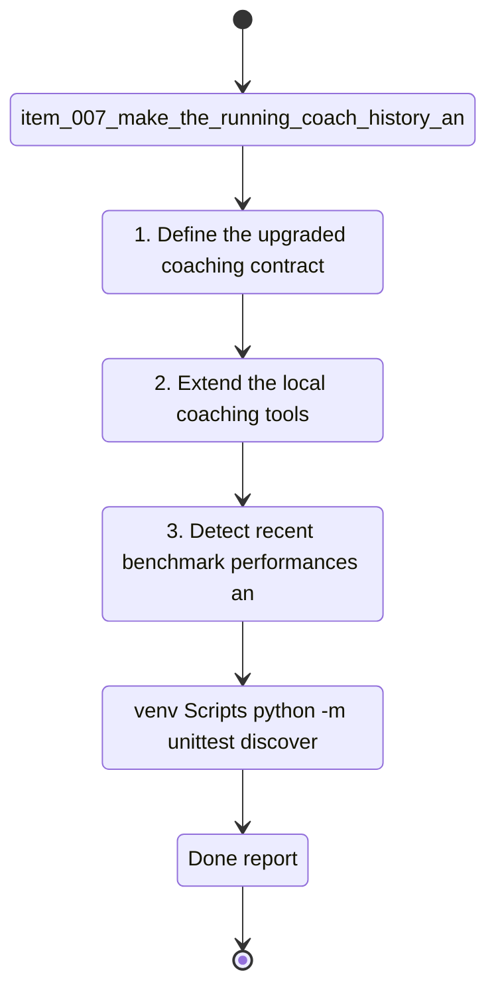

## task_007_make_the_running_coach_history_and_pace_aware - Make the running coach history-aware and pace-aware
> From version: 0.1.0
> Schema version: 1.0
> Status: Done
> Understanding: 98
> Confidence: 96
> Progress: 100%
> Complexity: High
> Theme: Health
> Reminder: Update status/understanding/confidence/progress and dependencies/references when you edit this doc.

# Context
Derived from `logics/backlog/item_007_make_the_running_coach_history_and_pace_aware.md`.
- Derived from backlog item `item_007_make_the_running_coach_history_and_pace_aware`.
- Source file: `logics\backlog\item_007_make_the_running_coach_history_and_pace_aware.md`.
- Related request(s): `req_006_make_the_running_coach_history_and_pace_aware`.
- The repository already contains a local-first coaching CLI backed by Ollama and local Garmin-derived data.
- The current MVP works technically, but the coaching output is still too generic.
- The next coaching-quality slice must use actual running history, observed pace evidence, recent benchmark performances, and direct analysis before generating the weekly plan.
- The intended tone is direct and analytical, with pace-aware recommendations when data quality is good enough.

# Plan
- [x] 1. Define the upgraded coaching contract in code: required analysis sections, historical windows, pace inference outputs, and principal-objective handling.
- [x] 2. Extend the local coaching tools so they expose richer running-history signals across `21-day`, `90-day`, and `365-day` windows.
- [x] 3. Detect recent benchmark performances and strong sessions from local activity history and derive pace-aware guidance when evidence is sufficient.
- [x] 4. Add training-phase or coaching-priority inference, including return-from-injury or reduced-load scenarios.
- [x] 5. Handle multi-goal prompts by selecting or asking for a principal objective before generating the week.
- [x] 6. Upgrade the coaching prompt and response contract so the assistant produces:
- [x] a direct analytical assessment first
- [x] explicit historical signals used
- [x] concrete workouts with structure, reps, blocks, or pace cues when appropriate
- [x] explicit fallback to effort-based guidance when pace precision is weak
- [x] 7. Keep the deterministic weekly-plan safety layer while making the generated sessions more specific and less generic.
- [x] 8. Add automated coverage for at least:
- [x] a recent-race scenario
- [x] a return-from-injury or reduced-load scenario
- [x] a multi-goal scenario requiring a principal objective
- [x] 9. Run targeted validation on realistic prompts and confirm the output becomes materially more specific and history-aware.
- [x] CHECKPOINT: leave the current wave commit-ready and update the linked Logics docs before continuing.
- [x] CHECKPOINT: if the shared AI runtime is active and healthy, run `python logics/skills/logics.py flow assist commit-all` for the current step, item, or wave commit checkpoint.
- [x] GATE: do not close a wave or step until the relevant automated tests and quality checks have been run successfully.
- [x] FINAL: Update related Logics docs

# Delivery checkpoints
- Each completed wave should leave the repository in a coherent, commit-ready state.
- Update the linked Logics docs during the wave that changes the behavior, not only at final closure.
- Prefer a reviewed commit checkpoint at the end of each meaningful wave instead of accumulating several undocumented partial states.
- If the shared AI runtime is active and healthy, use `python logics/skills/logics.py flow assist commit-all` to prepare the commit checkpoint for each meaningful step, item, or wave.
- Do not mark a wave or step complete until the relevant automated tests and quality checks have been run successfully.

# AC Traceability
- AC1 -> Plan steps 1-3. Proof: generated output includes real analysis of recent history and benchmark performances before the plan.
- AC2 -> Plan steps 2-3. Proof: at least one recent-race scenario yields individualized pace guidance from local data.
- AC3 -> Plan step 4. Proof: output explicitly names a training phase or coaching priority from history and injury context.
- AC4 -> Plan step 5. Proof: a multi-goal prompt triggers principal-objective selection or clarification before weekly plan generation.
- AC5 -> Plan steps 6-7. Proof: generated sessions include concrete structure beyond generic labels.
- AC6 -> Plan steps 2 and 6. Proof: output explains which historical signals influenced the recommendation.
- AC7 -> Plan step 6. Proof: sparse-data or low-confidence case explicitly falls back to effort guidance.
- AC8 -> Plan step 8. Proof: targeted regression tests cover recent-race and return-from-injury cases.
- AC9 -> Plan steps 1-9. Proof: implementation remains local-first and does not introduce paid cloud dependencies.

# Decision framing
- Product framing: Required
- Product signals: engagement loop, pricing and packaging
- Product follow-up: Consider a product brief before expanding the coach into a larger training product surface.
- Architecture framing: Required
- Architecture signals: contracts and integration, data model and persistence
- Architecture follow-up: Reuse the existing ADR baseline and add a focused ADR only if pace inference or coaching contracts become durable system boundaries.

# Links
- Product brief(s): (none yet)
- Architecture decision(s): `adr_000_choose_local_first_garmin_data_sync_and_storage_architecture`
- Backlog item: `item_007_make_the_running_coach_history_and_pace_aware`
- Request(s): `req_006_make_the_running_coach_history_and_pace_aware`

# AI Context
- Summary: Improve the running coach so it uses actual training history, benchmark performances, and pace evidence to generate more analytical and individualized weekly sessions.
- Keywords: running, coaching, pace, history, benchmark, recent race, training phase, local-first, garmin, workout structure
- Use when: Use when implementing the next coaching-quality slice beyond the current generic MVP.
- Skip when: Skip when the work is limited to ingestion plumbing, auth sync, or UI-only refinements.

# References
- `coach_garmin/coach_chat.py`
- `coach_garmin/coach_tools.py`
- `coach_garmin/coach_ollama.py`
- `tests/test_coach_chat.py`
- `logics/backlog/item_007_make_the_running_coach_history_and_pace_aware.md`

# Validation
- `.venv\Scripts\python -m unittest discover -s tests -p "test_coach*.py" -v`
- `.venv\Scripts\python -m unittest discover -s tests -v`
- run at least one realistic recent-race prompt and one return-from-injury prompt through `python -m coach_garmin coach chat`
- inspect the generated analysis and weekly plan to confirm the sessions are more specific and pace-aware
- confirm the completed wave leaves the repository in a commit-ready state

# Definition of Done (DoD)
- [x] Scope implemented and acceptance criteria covered.
- [x] Validation commands executed and results captured.
- [x] No wave or step was closed before the relevant automated tests and quality checks passed.
- [x] Linked request/backlog/task docs updated during completed waves and at closure.
- [x] Each completed wave left a commit-ready checkpoint or an explicit exception is documented.
- [x] Status is `Done` and progress is `100%`.

# Report
- Extended [coach_tools.py](/c:/Users/paulm/Documents/GitHub/Coach_garmin/coach_garmin/coach_tools.py) with a richer analysis layer:
- `21d`, `90d`, and `365d` running windows
- benchmark extraction for `5 km`, `10 km`, `semi-marathon`, and `marathon`
- pace inference from observed or user-stated benchmarks
- training-phase inference including `return-from-injury`, `rebuild`, `10k-progression`, and `marathon-base`
- Added user-stated benchmark extraction in [coach_chat.py](/c:/Users/paulm/Documents/GitHub/Coach_garmin/coach_garmin/coach_chat.py) so prompts like `10 km en sub 42` can inform pace inference even when the benchmark is not yet present in the local database.
- Added principal-objective handling for multi-goal prompts in [coach_chat.py](/c:/Users/paulm/Documents/GitHub/Coach_garmin/coach_garmin/coach_chat.py).
- Upgraded the weekly-plan skeleton so it now prescribes more specific sessions, including:
- pace-capped easy runs
- a structured threshold or return-to-quality session
- a more constrained long-run progression
- Strengthened the deterministic safety layer so the generated week cannot silently replace easy or recovery days with extra quality sessions.
- Upgraded [coach_ollama.py](/c:/Users/paulm/Documents/GitHub/Coach_garmin/coach_garmin/coach_ollama.py) so the prompt contract explicitly demands an analytical assessment first, pace use when confidence is sufficient, and explicit fallback to effort guidance otherwise.
- Added and passed regression coverage in [test_coach_chat.py](/c:/Users/paulm/Documents/GitHub/Coach_garmin/tests/test_coach_chat.py) for:
- benchmark and pace inference
- optional-table tolerance
- multi-goal clarification with principal-objective selection
- Validation executed successfully:
- `.venv\Scripts\python -m unittest discover -s tests -p "test_coach*.py" -v`
- `.venv\Scripts\python -m unittest discover -s tests -v`
- realistic CLI smoke test on the local `data/` workspace with a recent `10 km sub 42` prompt plus periostitis context
- Observed outcome:
- the coach now asks for a principal objective when several goals are stated
- the coach surfaces benchmark-aware and phase-aware signals
- the generated week includes more specific session structure and pace cues instead of only generic workout labels
- Remaining limitation:
- the local LLM can still phrase the top-level analysis too generically at times, so the deterministic analysis layer remains an important backstop.

# Notes
