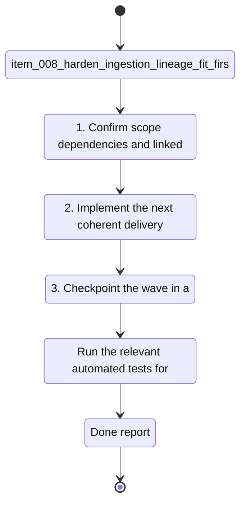

## task_008_harden_ingestion_lineage_fit_first_activity_parsing_and_coaching_feature_coverage_reporting - Harden ingestion lineage, FIT-first activity parsing, and coaching feature coverage reporting
> From version: 0.1.0
> Schema version: 1.0
> Status: Done
> Understanding: 96
> Confidence: 93
> Progress: 100%
> Complexity: High
> Theme: Health
> Reminder: Update status/understanding/confidence/progress and linked request/backlog references when you edit this doc.

# Context
- Derived from backlog item `item_008_harden_ingestion_lineage_fit_first_activity_parsing_and_coaching_feature_coverage_reporting`.
- Source file: `logics\backlog\item_008_harden_ingestion_lineage_fit_first_activity_parsing_and_coaching_feature_coverage_reporting.md`.
- Related request(s): `req_007_harden_ingestion_lineage_fit_first_activity_parsing_and_coaching_feature_coverage_reporting`.
- Make the Garmin ingestion pipeline more robust by tracking provenance and lineage for every imported artifact.
- Prefer FIT-based activity parsing as the most stable source of activity truth, while keeping Garmin export JSON as context and fallback.
- Make it obvious, after each import, which data is only present in raw form, which data is normalized, which data is available as features, and which data actually feeds coaching decisions.

# Plan
- [ ] 1. Confirm scope, dependencies, and linked acceptance criteria.
- [ ] 2. Implement the next coherent delivery wave from the backlog item.
- [ ] 3. Checkpoint the wave in a commit-ready state, validate it, and update the linked Logics docs.
- [ ] CHECKPOINT: leave the current wave commit-ready and update the linked Logics docs before continuing.
- [ ] CHECKPOINT: if the shared AI runtime is active and healthy, run `python logics/skills/logics.py flow assist commit-all` for the current step, item, or wave commit checkpoint.
- [ ] GATE: do not close a wave or step until the relevant automated tests and quality checks have been run successfully.
- [ ] FINAL: Update related Logics docs

# Delivery checkpoints
- Each completed wave should leave the repository in a coherent, commit-ready state.
- Update the linked Logics docs during the wave that changes the behavior, not only at final closure.
- Prefer a reviewed commit checkpoint at the end of each meaningful wave instead of accumulating several undocumented partial states.
- If the shared AI runtime is active and healthy, use `python logics/skills/logics.py flow assist commit-all` to prepare the commit checkpoint for each meaningful step, item, or wave.
- Do not mark a wave or step complete until the relevant automated tests and quality checks have been run successfully.

# AC Traceability
- AC1 -> Scope: Imported artifacts retain explicit provenance and lineage metadata linking source files to normalized records.. Proof: capture validation evidence in this doc.
- AC2 -> Scope: Activity parsing prefers FIT inputs when available and falls back to other export shapes only when necessary.. Proof: capture validation evidence in this doc.
- AC3 -> Scope: The pipeline still works on the current local Garmin export fixtures and on the copied real export.. Proof: capture validation evidence in this doc.
- AC4 -> Scope: Duplicate or repeated imports remain deterministic and do not create duplicate normalized records.. Proof: capture validation evidence in this doc.
- AC5 -> Scope: A coverage report is generated after import that distinguishes raw, normalized, feature-level, and coach-used data coverage.. Proof: capture validation evidence in this doc.
- AC6 -> Scope: The coach can consume the new coverage report to avoid overclaiming unavailable signals.. Proof: capture validation evidence in this doc.
- AC7 -> Scope: At least one test covers a FIT-first activity path and one test covers a missing-FIT fallback path.. Proof: capture validation evidence in this doc.
- AC8 -> Scope: At least one test covers lineage/provenance fields or artifact identity handling.. Proof: capture validation evidence in this doc.
- AC9 -> Scope: The implementation remains local-first and does not require any paid cloud API token.. Proof: capture validation evidence in this doc.

# Decision framing
- Product framing: Not needed
- Product signals: (none detected)
- Product follow-up: No product brief follow-up is expected based on current signals.
- Architecture framing: Required
- Architecture signals: data model and persistence, contracts and integration, state and sync
- Architecture follow-up: Create or link an architecture decision before irreversible implementation work starts.

# Links
- Product brief(s): (none yet)
- Architecture decision(s): `adr_000_choose_local_first_garmin_data_sync_and_storage_architecture`
- Backlog item: `item_008_harden_ingestion_lineage_fit_first_activity_parsing_and_coaching_feature_coverage_reporting`
- Request(s): `req_007_harden_ingestion_lineage_fit_first_activity_parsing_and_coaching_feature_coverage_reporting`

# AI Context
- Summary: Harden Garmin ingestion with explicit lineage, FIT-first parsing for activities, and a coverage report that shows what data...
- Keywords: ingestion, lineage, provenance, fit, activity parsing, coverage report, deduplication, local-first, garmin
- Use when: Use when improving the reliability and trustworthiness of the Garmin data substrate before expanding coaching logic.
- Skip when: Skip when the work is only about UI, marketing, or unrelated feature areas.
# References
- `logics/skills/logics-ui-steering/SKILL.md`

# Validation
- Run the relevant automated tests for the changed surface before closing the current wave or step.
- Run the relevant lint or quality checks before closing the current wave or step.
- Confirm the completed wave leaves the repository in a commit-ready state.
- Finish workflow executed on 2026-04-09.
- Linked backlog/request close verification passed.

# Definition of Done (DoD)
- [x] Scope implemented and acceptance criteria covered.
- [x] Validation commands executed and results captured.
- [x] No wave or step was closed before the relevant automated tests and quality checks passed.
- [x] Linked request/backlog/task docs updated during completed waves and at closure.
- [x] Each completed wave left a commit-ready checkpoint or an explicit exception is documented.
- [x] Status is `Done` and progress is `100%`.

# Report
- Finished on 2026-04-09.
- Linked backlog item(s): `item_008_harden_ingestion_lineage_fit_first_activity_parsing_and_coaching_feature_coverage_reporting`
- Related request(s): `req_007_harden_ingestion_lineage_fit_first_activity_parsing_and_coaching_feature_coverage_reporting`
