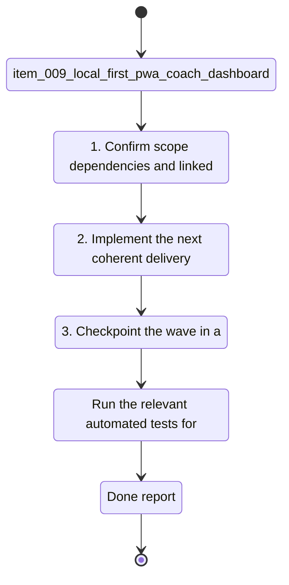

## task_009_local_first_pwa_coach_dashboard - Local-first PWA coach dashboard
> From version: 0.1.0
> Schema version: 1.0
> Status: Done
> Understanding: 97%
> Confidence: 94%
> Progress: 100%
> Complexity: High
> Theme: UI
> Reminder: Update status/understanding/confidence/progress and linked request/backlog references when you edit this doc.

# Context
Derived from `logics/backlog/item_009_local_first_pwa_coach_dashboard.md`.
- Derived from backlog item `item_009_local_first_pwa_coach_dashboard`.
- Source file: `logics\backlog\item_009_local_first_pwa_coach_dashboard.md`.
- Related request(s): `req_008_local_first_pwa_coach_dashboard`.
Coach Garmin needs a first browser-installable product surface that keeps the current local-first data foundation, adds a chat-first coaching experience, and exposes a simple dashboard for health, import, and analysis status.
The current CLI coach works, but it is not yet a product surface that a user can install, open, and understand quickly from a browser.

# Plan
- [x] 1. Confirm scope, dependencies, and linked acceptance criteria.
- [x] 2. Implement the next coherent delivery wave from the backlog item.
- [x] 3. Checkpoint the wave in a commit-ready state, validate it, and update the linked Logics docs.
- [x] CHECKPOINT: leave the current wave commit-ready and update the linked Logics docs before continuing.
- [x] CHECKPOINT: if the shared AI runtime is active and healthy, run `python logics/skills/logics.py flow assist commit-all` for the current step, item, or wave commit checkpoint.
- [x] GATE: do not close a wave or step until the relevant automated tests and quality checks have been run successfully.
- [x] FINAL: Update related Logics docs

# Delivery checkpoints
- Each completed wave should leave the repository in a coherent, commit-ready state.
- Update the linked Logics docs during the wave that changes the behavior, not only at final closure.
- Prefer a reviewed commit checkpoint at the end of each meaningful wave instead of accumulating several undocumented partial states.
- If the shared AI runtime is active and healthy, use `python logics/skills/logics.py flow assist commit-all` to prepare the commit checkpoint for each meaningful step, item, or wave.
- Do not mark a wave or step complete until the relevant automated tests and quality checks have been run successfully.

# AC Traceability
- AC1 -> Scope: A user can install the app as a PWA on desktop from the browser.. Proof: capture validation evidence in this doc.
- AC2 -> Scope: The app opens to a chat surface that can ask coaching questions and accept a running goal.. Proof: capture validation evidence in this doc.
- AC3 -> Scope: The user can choose a local storage directory from settings.. Proof: capture validation evidence in this doc.
- AC4 -> Scope: The user can choose the AI backend from Ollama, Gemini, or OpenAI, with Ollama as the default.. Proof: capture validation evidence in this doc.
- AC5 -> Scope: The dashboard shows app health, latest import status, and multiple recent analysis metrics.. Proof: capture validation evidence in this doc.
- AC6 -> Scope: The app stays offline-first by default and does not require a paid cloud API to open or inspect local data.. Proof: capture validation evidence in this doc.
- AC7 -> Scope: The app can surface import and analysis status without requiring the user to dig through logs.. Proof: capture validation evidence in this doc.
- AC8 -> Scope: The first version is clean enough to serve as the base for a later Android APK path.. Proof: capture validation evidence in this doc.

# Decision framing
- Product framing: Required
- Product signals: pricing and packaging, experience scope
- Product follow-up: Create or link a product brief before implementation moves deeper into delivery.
- Architecture framing: Required
- Architecture signals: data model and persistence, contracts and integration, state and sync
- Architecture follow-up: Create or link an architecture decision before irreversible implementation work starts.

# Links
- Product brief(s): (none yet)
- Architecture decision(s): (none yet)
- Backlog item: `item_009_local_first_pwa_coach_dashboard`
- Request(s): `req_008_local_first_pwa_coach_dashboard`

# AI Context
- Summary: Build an installable offline-first PWA for Coach Garmin with chat, local directory storage, AI provider settings, and a...
- Keywords: local-first, pwa, coach, chat, dashboard, storage, provider, ollama, gemini, openai, garmin
- Use when: Use when planning the first browser-installable product surface on top of the existing Garmin coaching stack.
- Skip when: Skip when the work is limited to backend ingestion, raw parsing, or CLI-only coaching.
# References
- `logics/skills/logics-ui-steering/SKILL.md`

# Validation
- Run the relevant automated tests for the changed surface before closing the current wave or step.
- Run the relevant lint or quality checks before closing the current wave or step.
- Confirm the completed wave leaves the repository in a commit-ready state.

# Definition of Done (DoD)
- [ ] Scope implemented and acceptance criteria covered.
- [ ] Validation commands executed and results captured.
- [ ] No wave or step was closed before the relevant automated tests and quality checks passed.
- [ ] Linked request/backlog/task docs updated during completed waves and at closure.
- [ ] Each completed wave left a commit-ready checkpoint or an explicit exception is documented.
- [ ] Status is `Done` and progress is `100%`.

# Report
- Implemented a local-first PWA shell with a chat-first experience, compact dashboard, and local workspace controls.
- Added provider support for Ollama, Gemini, and OpenAI with Ollama as the default.
- Added local HTTP endpoints for health, import, coach preparation, and weekly plan generation.
- Added `web serve` CLI wiring and PWA assets (`manifest`, service worker, offline shell).
- Added tests covering the PWA service, HTTP smoke flow, and existing coach/provider flows.
- Validation:
  - `.venv\\Scripts\\python -m unittest discover -s tests -v` -> `28/28 OK`
  - `.venv\\Scripts\\python -m compileall coach_garmin tests` -> OK

# Notes
