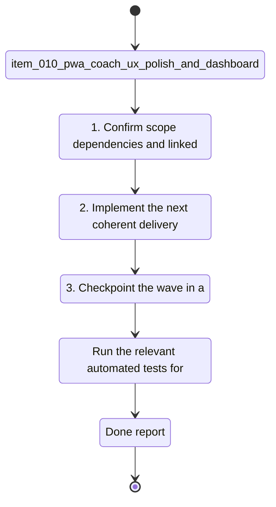

## task_010_pwa_coach_ux_polish_and_dashboard_enrichment - PWA coach UX polish and dashboard enrichment
> From version: 0.1.0
> Schema version: 1.0
> Status: Done
> Understanding: 96%
> Confidence: 93%
> Progress: 100%
> Complexity: High
> Theme: UI
> Reminder: Update status/understanding/confidence/progress and linked request/backlog references when you edit this doc.

# Context
- Derived from backlog item `item_010_pwa_coach_ux_polish_and_dashboard_enrichment`.
- Source file: `logics\backlog\item_010_pwa_coach_ux_polish_and_dashboard_enrichment.md`.
- Related request(s): `req_009_pwa_coach_ux_polish_and_dashboard_enrichment`.
- Make the first PWA version feel balanced, clear, and responsive instead of visually uneven.
- Improve the title and first impression so the app reads like a premium coaching product, not a technical demo.
- Clarify whether Garmin data is already imported, where it lives locally, and what state the app is in.

# Plan
- [ ] 1. Confirm scope, dependencies, and linked acceptance criteria.
- [ ] 2. Implement the next coherent delivery wave from the backlog item.
- [ ] 3. Checkpoint the wave in a commit-ready state, validate it, and update the linked Logics docs.
- [ ] CHECKPOINT: leave the current wave commit-ready and update the linked Logics docs before continuing.
- [ ] CHECKPOINT: if the shared AI runtime is active and healthy, run `python logics/skills/logics.py flow assist commit-all` for the current step, item, or wave commit checkpoint.
- [ ] GATE: do not close a wave or step until the relevant automated tests and quality checks have been run successfully.
- [ ] FINAL: Update related Logics docs

# Delivery checkpoints
- Each completed wave should leave the repository in a coherent, commit-ready state.
- Update the linked Logics docs during the wave that changes the behavior, not only at final closure.
- Prefer a reviewed commit checkpoint at the end of each meaningful wave instead of accumulating several undocumented partial states.
- If the shared AI runtime is active and healthy, use `python logics/skills/logics.py flow assist commit-all` to prepare the commit checkpoint for each meaningful step, item, or wave.
- Do not mark a wave or step complete until the relevant automated tests and quality checks have been run successfully.

# AC Traceability
- AC1 -> Scope: The PWA landing screen presents a clearer premium coaching identity, with a better title and more balanced visual hierarchy.. Proof: capture validation evidence in this doc.
- AC2 -> Scope: The provider status is displayed in a compact way that does not dominate the layout.. Proof: capture validation evidence in this doc.
- AC3 -> Scope: The app clearly indicates whether Garmin data has already been imported and where the active local workspace lives.. Proof: capture validation evidence in this doc.
- AC4 -> Scope: While the LLM or another long-running action is working, the UI shows a clear busy state or progress indicator.. Proof: capture validation evidence in this doc.
- AC5 -> Scope: The user does not need to repeatedly re-enter the local import directory when a workspace is already known and available.. Proof: capture validation evidence in this doc.
- AC6 -> Scope: The dashboard shows richer coaching metrics, including training load, weekly volume, heart rate / pace context, resting heart rate, sleep duration, and estimated max heart rate when available.. Proof: capture validation evidence in this doc.
- AC7 -> Scope: The dashboard exposes at least one trend-oriented view or summary that helps interpret the latest data, not just raw status badges.. Proof: capture validation evidence in this doc.
- AC8 -> Scope: The app remains local-first and continues to work without requiring a paid cloud API just to inspect local data.. Proof: capture validation evidence in this doc.

# Decision framing
- Product framing: Required
- Product signals: pricing and packaging, experience scope
- Product follow-up: Create or link a product brief before implementation moves deeper into delivery.
- Architecture framing: Required
- Architecture signals: data model and persistence, contracts and integration, state and sync
- Architecture follow-up: Create or link an architecture decision before irreversible implementation work starts.

# Links
- Product brief(s): `prod_000_local_first_pwa_coach_dashboard`
- Architecture decision(s): `adr_001_choose_local_pwa_storage_and_provider_integration`
- Backlog item: `item_010_pwa_coach_ux_polish_and_dashboard_enrichment`
- Request(s): `req_009_pwa_coach_ux_polish_and_dashboard_enrichment`

# AI Context
- Summary: Refine the local-first PWA coach UI so the first impression is balanced, the loading state is obvious, data...
- Keywords: pwa, coach, ux, dashboard, loading state, import state, training load, weekly volume, heart rate, sleep, local-first
- Use when: Use when improving the first browser-installable coaching experience so it feels clear, responsive, and analytically useful.
- Skip when: Skip when the work is limited to backend ingestion, raw parsing, or provider integration only.
# References
- `logics/skills/logics-ui-steering/SKILL.md`

# Validation
- Run the relevant automated tests for the changed surface before closing the current wave or step.
- Run the relevant lint or quality checks before closing the current wave or step.
- Confirm the completed wave leaves the repository in a commit-ready state.
- Finish workflow executed on 2026-04-12.
- Linked backlog/request close verification passed.

# Definition of Done (DoD)
- [x] Scope implemented and acceptance criteria covered.
- [x] Validation commands executed and results captured.
- [x] No wave or step was closed before the relevant automated tests and quality checks passed.
- [x] Linked request/backlog/task docs updated during completed waves and at closure.
- [x] Each completed wave left a commit-ready checkpoint or an explicit exception is documented.
- [x] Status is `Done` and progress is `100%`.

# Report
- Finished on 2026-04-12.
- Linked backlog item(s): `item_010_pwa_coach_ux_polish_and_dashboard_enrichment`
- Related request(s): `req_009_pwa_coach_ux_polish_and_dashboard_enrichment`
