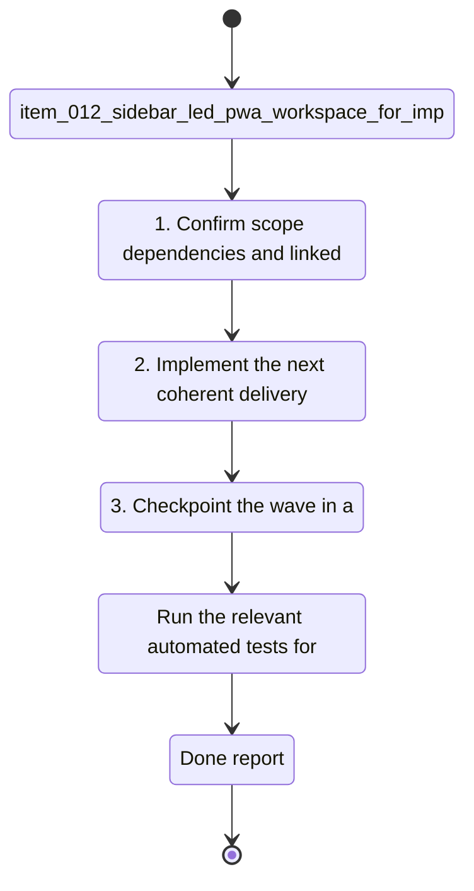

## task_012_sidebar_led_pwa_workspace_for_import_dashboard_coach_terminal_and_settings - Sidebar-led PWA workspace for import, dashboard, coach, terminal, and settings
> From version: 0.1.0
> Schema version: 1.0
> Status: Done
> Understanding: 96
> Confidence: 93
> Progress: 100%
> Complexity: High
> Theme: UI
> Reminder: Update status/understanding/confidence/progress and linked request/backlog references when you edit this doc.

# Context
Derived from `logics/backlog/item_012_sidebar_led_pwa_workspace_for_import_dashboard_coach_terminal_and_settings.md`.
- Derived from backlog item `item_012_sidebar_led_pwa_workspace_for_import_dashboard_coach_terminal_and_settings`.
- Source file: `logics\backlog\item_012_sidebar_led_pwa_workspace_for_import_dashboard_coach_terminal_and_settings.md`.
- Related request(s): `req_011_sidebar_led_pwa_workspace_for_import_dashboard_coach_terminal_and_settings`.
- The project already has:
- - a local-first Garmin data foundation

# Plan
- [x] 1. Confirm scope, dependencies, and linked acceptance criteria.
- [x] 2. Implement the next coherent delivery wave from the backlog item.
- [x] 3. Checkpoint the wave in a commit-ready state, validate it, and update the linked Logics docs.
- [x] CHECKPOINT: leave the current wave commit-ready and update the linked Logics docs before continuing.
- [x] CHECKPOINT: if the shared AI runtime is active and healthy, run `python logics/skills/logics.py flow assist commit-all` for the current step, item, or wave commit checkpoint.
- [x] GATE: do not close a wave or step until the relevant automated tests and quality checks have been run successfully.
- [x] FINAL: Update related Logics docs

# Delivery checkpoints
- Each completed wave should leave the repository in a coherent, commit-ready state.
- Update the linked Logics docs during the wave that changes the behavior, not only at final closure.
- Prefer a reviewed commit checkpoint at the end of each meaningful wave instead of accumulating several undocumented partial states.
- If the shared AI runtime is active and healthy, use `python logics/skills/logics.py flow assist commit-all` to prepare the commit checkpoint for each meaningful step, item, or wave.
- Do not mark a wave or step complete until the relevant automated tests and quality checks have been run successfully.

# AC Traceability
- AC1 -> Scope: The app shows a left sidebar navigation with Import, Dashboard, Chat, Terminal, and Settings in that order.. Proof: capture validation evidence in this doc.
- AC2 -> Scope: Import is the default landing section when the app opens.. Proof: capture validation evidence in this doc.
- AC3 -> Scope: The main workspace occupies the dominant right-hand area and switches content based on the selected section.. Proof: capture validation evidence in this doc.
- AC4 -> Scope: The Import section clearly shows whether local Garmin data exists and what the latest date is.. Proof: capture validation evidence in this doc.
- AC5 -> Scope: The Dashboard shows 6 to 9 primary cards and each card can be opened or enlarged for closer inspection.. Proof: capture validation evidence in this doc.
- AC6 -> Scope: The Chat section makes data availability, analyzed state, provider selection, and active objective visible and editable where relevant.. Proof: capture validation evidence in this doc.
- AC7 -> Scope: The Terminal section exposes logs or action output with selectable log levels above it.. Proof: capture validation evidence in this doc.
- AC8 -> Scope: The Settings section includes at least theme selection, terminal visibility behavior, and other useful technical options.. Proof: capture validation evidence in this doc.
- AC9 -> Scope: The app clearly indicates when data is available locally and when a refresh may be needed.. Proof: capture validation evidence in this doc.
- AC10 -> Scope: The design remains sober, readable, and suitable for frequent daily use.. Proof: capture validation evidence in this doc.

# Decision framing
- Product framing: Required
- Product signals: navigation and discoverability, experience scope
- Product follow-up: Create or link a product brief before implementation moves deeper into delivery.
- Architecture framing: Required
- Architecture signals: data model and persistence, contracts and integration, state and sync
- Architecture follow-up: Create or link an architecture decision before irreversible implementation work starts.

# Links
- Product brief(s): `prod_000_local_first_pwa_coach_dashboard`
- Architecture decision(s): `adr_001_choose_local_pwa_storage_and_provider_integration`
- Backlog item: `item_012_sidebar_led_pwa_workspace_for_import_dashboard_coach_terminal_and_settings`
- Request(s): `req_011_sidebar_led_pwa_workspace_for_import_dashboard_coach_terminal_and_settings`

# AI Context
- Summary: Redesign the local-first PWA into a sidebar-led workspace with Import, Dashboard, Chat, Terminal, and Settings as the main...
- Keywords: pwa, sidebar, navigation, workspace, import, dashboard, coach, terminal, settings, local-first, ui, ux
- Use when: Use when the app needs a stronger information architecture and clearer daily workflow around data import, analysis, coaching, and debugging.
- Skip when: Skip when the change is only about charts, model behavior, or data normalization.
# References
- `logics/skills/logics-ui-steering/SKILL.md`

# Validation
- Run the relevant automated tests for the changed surface before closing the current wave or step.
- Run the relevant lint or quality checks before closing the current wave or step.
- Confirm the completed wave leaves the repository in a commit-ready state.

# Definition of Done (DoD)
- [ ] Scope implemented and acceptance criteria covered.
- [ ] Validation commands executed and results captured.
- [ ] No wave or step was closed before the relevant automated tests and quality checks passed.
- [ ] Linked request/backlog/task docs updated during completed waves and at closure.
- [ ] Each completed wave left a commit-ready checkpoint or an explicit exception is documented.
- [ ] Status is `Done` and progress is `100%`.

# Report
- Implemented a sidebar-led PWA workspace with Import, Dashboard, Chat, Terminal, and Settings.
- Added a full-screen dashboard modal, local freshness indicators, settings for theme/provider/terminal visibility, and a filtered terminal log surface.
- Added provider error handling in the PWA server so Gemini/OpenAI/Ollama failures now return a clean retryable JSON response instead of a crash.
- Validation passed:
  - `node --check web/app.js`
  - `node --check web/sw.js`
  - `.venv\Scripts\python -m unittest tests.test_pwa_service -v`
  - `.venv\Scripts\python -m unittest discover -s tests -v`

# Notes
