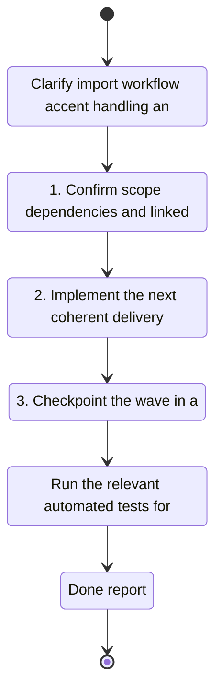

## task_013_clarify_import_workflow_accent_handling_and_refresh_actions - Clarify import workflow, accent handling, and refresh actions
> From version: 0.1.0
> Schema version: 1.0
> Status: Done
> Understanding: 98%
> Confidence: 95%
> Progress: 100%
> Complexity: Medium
> Theme: UI
> Reminder: Update status/understanding/confidence/progress and linked request/backlog references when you edit this doc.

# Context
- Execute the bounded delivery slice for Clarify import workflow, accent handling, and refresh actions.

# Plan
- [ ] 1. Confirm scope, dependencies, and linked acceptance criteria.
- [ ] 2. Implement the next coherent delivery wave.
- [ ] 3. Checkpoint the wave in a commit-ready state, validate it, and update the linked Logics docs.
- [ ] CHECKPOINT: leave the current wave commit-ready and update the linked Logics docs before continuing.
- [ ] CHECKPOINT: if the shared AI runtime is active and healthy, run `python logics/skills/logics.py flow assist commit-all` for the current step, item, or wave commit checkpoint.
- [ ] GATE: do not close a wave or step until the relevant automated tests and quality checks have been run successfully.
- [ ] FINAL: Update related Logics docs

# Delivery checkpoints
- Each completed wave should leave the repository in a coherent, commit-ready state.
- Update the linked Logics docs during the wave that changes the behavior, not only at final closure.
- Prefer a reviewed commit checkpoint at the end of each meaningful wave instead of accumulating several undocumented partial states.
- If the shared AI runtime is active and healthy, use `python logics/skills/logics.py flow assist commit-all` to prepare the commit checkpoint for each meaningful step, item, or wave.
- Do not mark a wave or step complete until the relevant automated tests and quality checks have been run successfully.

# AC Traceability
- AC1 -> Scope: Execute the bounded delivery slice for Clarify import workflow, accent handling, and refresh actions. Proof: capture validation evidence in this doc.

# Decision framing
- Product framing: Not needed
- Product signals: (none detected)
- Product follow-up: No product brief follow-up is expected based on current signals.
- Architecture framing: Not needed
- Architecture signals: (none detected)
- Architecture follow-up: No architecture decision follow-up is expected based on current signals.

# Links
- Product brief(s): [prod_001_import_workflow_clarity_and_non_blocking_garmin_sync](../product/prod_001_import_workflow_clarity_and_non_blocking_garmin_sync.md)
- Architecture decision(s): [adr_002_place_workspace_in_settings_and_add_non_blocking_garmin_sync](../architecture/adr_002_place_workspace_in_settings_and_add_non_blocking_garmin_sync.md)
- Backlog item: [item_013_clarify_import_workflow_accent_handling_and_refresh_actions](../backlog/item_013_clarify_import_workflow_accent_handling_and_refresh_actions.md)
- Request(s): [req_012_clarify_import_workflow_accent_handling_and_refresh_actions](../request/req_012_clarify_import_workflow_accent_handling_and_refresh_actions.md)

# AI Context
- Summary: Clarify import workflow, accent handling, and refresh actions
- Keywords: clarify, import, workflow, accent, handling, and, refresh, actions
- Use when: Use when executing the current implementation wave for Clarify import workflow, accent handling, and refresh actions.
- Skip when: Skip when the work belongs to another backlog item or a different execution wave.
# Validation
- Run the relevant automated tests for the changed surface before closing the current wave or step.
- Run the relevant lint or quality checks before closing the current wave or step.
- Confirm the completed wave leaves the repository in a commit-ready state.

# Definition of Done (DoD)
- [ ] Scope implemented and acceptance criteria covered.
- [ ] Validation commands executed and results captured.
- [ ] No wave or step was closed before the relevant automated tests and quality checks passed.
- [ ] Linked request/backlog/task docs updated during completed waves and at closure.
- [ ] Each completed wave left a commit-ready checkpoint or an explicit exception is documented.
- [ ] Status is `Done` and progress is `100%`.

# Report
