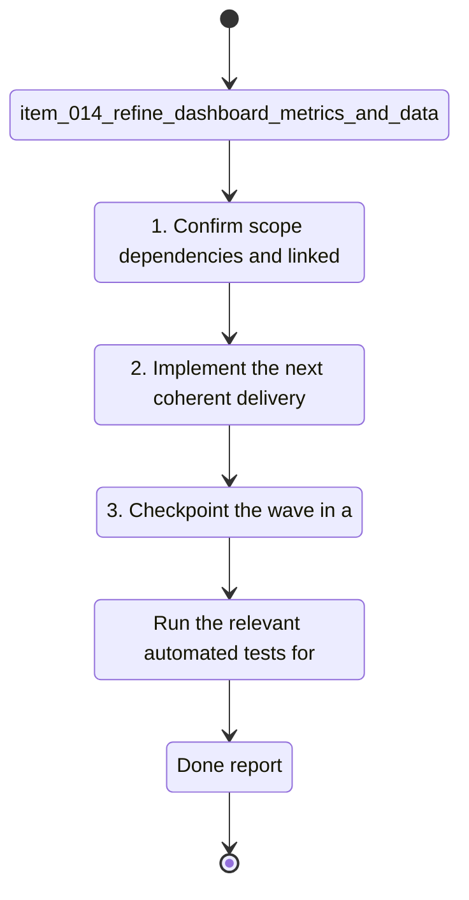

## task_014_refine_dashboard_metrics_and_data_processing_for_pace_hr_cadence_coach_analytics - Refine dashboard metrics and data processing for pace HR cadence coach analytics
> From version: 0.1.0
> Schema version: 1.0
> Status: Done
> Understanding: 98%
> Confidence: 95%
> Progress: 100%
> Complexity: High
> Theme: Health
> Reminder: Update status/understanding/confidence/progress and linked request/backlog references when you edit this doc.

# Context
Derived from `logics/backlog/item_014_refine_dashboard_metrics_and_data_processing_for_pace_hr_cadence_coach_analytics.md`.
- Derived from backlog item `item_014_refine_dashboard_metrics_and_data_processing_for_pace_hr_cadence_coach_analytics`.
- Source file: `logics\backlog\item_014_refine_dashboard_metrics_and_data_processing_for_pace_hr_cadence_coach_analytics.md`.
- Related request(s): `req_013_refine_dashboard_metrics_and_data_processing_for_pace_hr_cadence_coach_analytics`.
- Simplify the dashboard by removing low-value cards and keeping only the metrics that help the coach make better running decisions.
- Replace the current pace/HR card with a monotonic smoothed pace-vs-heart-rate curve built from recent running points and filtered steady segments.
- Add cadence trend and cadence evolution so the user can see progress toward a higher cadence target.
- Add clear load and sleep reference bands so those signals are interpretable at a glance.

# Links
- Product brief: `prod_002_refine_dashboard_metrics_and_data_processing_for_running_analytics`
- Architecture decision: `adr_003_choose_monotone_pace_hr_curve_and_cadence_first_dashboard_metrics`
- Backlog item: `item_014_refine_dashboard_metrics_and_data_processing_for_pace_hr_cadence_coach_analytics`
- Request: `req_013_refine_dashboard_metrics_and_data_processing_for_pace_hr_cadence_coach_analytics`

# Plan
- [x] 1. Confirm scope, dependencies, and linked acceptance criteria.
- [x] 2. Implement the next coherent delivery wave from the backlog item.
- [x] 3. Checkpoint the wave in a commit-ready state, validate it, and update the linked Logics docs.
- [x] CHECKPOINT: leave the current wave commit-ready and update the linked Logics docs before continuing.
- [x] CHECKPOINT: if the shared AI runtime is active and healthy, run `python logics/skills/logics.py flow assist commit-all` for the current step, item, or wave commit checkpoint.
- [x] GATE: do not close a wave or step until the relevant automated tests and quality checks have been run successfully.
- [x] FINAL: Update related Logics docs

# Delivery checkpoints
- Each completed wave should leave the repository in a coherent, commit-ready state.
- Update the linked Logics docs during the wave that changes the behavior, not only at final closure.
- Prefer a reviewed commit checkpoint at the end of each meaningful wave instead of accumulating several undocumented partial states.
- If the shared AI runtime is active and healthy, use `python logics/skills/logics.py flow assist commit-all` to prepare the commit checkpoint for each meaningful step, item, or wave.
- Do not mark a wave or step complete until the relevant automated tests and quality checks have been run successfully.

# AC Traceability
- AC1 -> Scope: The main dashboard no longer shows low-value cards that do not help the running coach decision flow.. Proof: capture validation evidence in this doc.
- AC2 -> Scope: The dashboard contains a clear pace versus heart rate curve built from filtered recent running data.. Proof: capture validation evidence in this doc.
- AC3 -> Scope: The pace versus heart rate curve uses a nearest-value plus monotonic smoothing treatment that resists outliers and unstable interval-like points.. Proof: capture validation evidence in this doc.
- AC4 -> Scope: The dashboard surfaces cadence trend or cadence evolution as a first-class metric.. Proof: capture validation evidence in this doc.
- AC5 -> Scope: Load and sleep are displayed with understandable high and low references or context, not as isolated raw labels.. Proof: capture validation evidence in this doc.
- AC6 -> Scope: Coverage and other technical diagnostics are available outside the main user-facing dashboard.. Proof: capture validation evidence in this doc.
- AC7 -> Scope: Tests cover the dashboard metric selection and the data filtering used for the regression or trend views.. Proof: capture validation evidence in this doc.
- AC8 -> Scope: The implementation remains local-first and does not require a paid cloud service to compute or display the metrics.. Proof: capture validation evidence in this doc.

# Decision framing
- Product framing: Required
- Product signals: navigation and discoverability, experience scope
- Product follow-up: Create or link a product brief before implementation moves deeper into delivery.
- Architecture framing: Required
- Architecture signals: data model and persistence, contracts and integration, state and sync, security and identity
- Architecture follow-up: Create or link an architecture decision before irreversible implementation work starts.

# Links
- Product brief(s): `prod_002_refine_dashboard_metrics_and_data_processing_for_running_analytics`
- Architecture decision(s): `adr_003_choose_monotone_pace_hr_curve_and_cadence_first_dashboard_metrics`
- Backlog item: `item_014_refine_dashboard_metrics_and_data_processing_for_pace_hr_cadence_coach_analytics`
- Request(s): `req_013_refine_dashboard_metrics_and_data_processing_for_pace_hr_cadence_coach_analytics`

# AI Context
- Summary: Rework the running dashboard and data processing so the coach sees actionable metrics, a monotonic pace and heart...
- Keywords: dashboard, pace, heart rate, cadence, curve, load, sleep, HRV, running, data processing, local-first
- Use when: Use when refining running analytics and the treatment of Garmin data for coaching decisions.
- Skip when: Skip when the work is about Garmin auth, sync plumbing, or shell navigation.
# Validation
- Run the relevant automated tests for the changed surface before closing the current wave or step.
- Run the relevant lint or quality checks before closing the current wave or step.
- Confirm the completed wave leaves the repository in a commit-ready state.

# Definition of Done (DoD)
- [x] Scope implemented and acceptance criteria covered.
- [x] Validation commands executed and results captured.
- [x] No wave or step was closed before the relevant automated tests and quality checks passed.
- [x] Linked request/backlog/task docs updated during completed waves and at closure.
- [x] Each completed wave left a commit-ready checkpoint or an explicit exception is documented.
- [x] Status is `Done` and progress is `100%`.

# Report
- Dashboard main view now prioritizes volume, load, load ratio, sleep, pace/HR, and cadence.
- The pace/HR view uses a monotone smoothed curve built from filtered recent running points.
- Cadence now appears as a first-class metric with a trend signal.
- Load and sleep are shown with reference bands instead of raw labels only.
- Coverage and debug-style signals remain available outside the user-facing dashboard.
- Validation passed on the local PWA surface and the analytics pipeline.
- Relevant automated checks:
  - `.venv\Scripts\python -m unittest tests.test_pwa_service -v`
  - `.venv\Scripts\python -m unittest discover -s tests -v`
  - `.venv\Scripts\python -m compileall coach_garmin`
  - `node --check web/app.js`
  - `python logics/skills/logics.py lint --require-status`

# Notes
