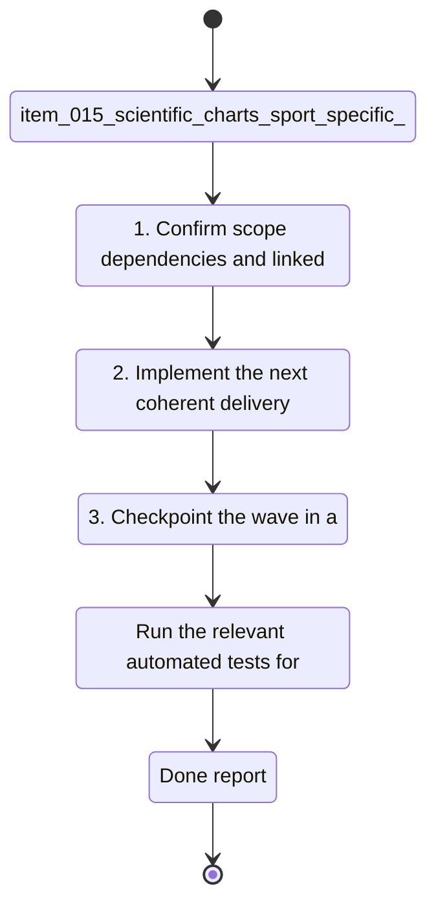

## task_015_scientific_charts_sport_specific_volumes_and_data_recalculation_controls - Scientific charts sport-specific volumes and data recalculation controls
> From version: 0.1.0
> Schema version: 1.0
> Status: Done
> Understanding: 96%
> Confidence: 94%
> Progress: 100%
> Complexity: High
> Theme: Health
> Reminder: Update status/understanding/confidence/progress and linked request/backlog references when you edit this doc.

# Context
Derived from `logics/backlog/item_015_scientific_charts_sport_specific_volumes_and_data_recalculation_controls.md`.
- Derived from backlog item `item_015_scientific_charts_sport_specific_volumes_and_data_recalculation_controls`.
- Source file: `logics\backlog\item_015_scientific_charts_sport_specific_volumes_and_data_recalculation_controls.md`.
- Related request(s): `req_015_scientific_charts_sport_specific_volumes_and_data_recalculation_controls`.
- Make the dashboard scientifically readable with axes, ticks, values, and hover tooltips on curves.
- Separate running volume from cycling and strength work so the running dashboard stays trustworthy.
- Add a visible weekly cycling volume graph without mixing it into the running metrics.

# Plan
- [x] 1. Confirm scope, dependencies, and linked acceptance criteria.
- [x] 2. Implement the next coherent delivery wave from the backlog item.
- [x] 3. Checkpoint the wave in a commit-ready state, validate it, and update the linked Logics docs.
- [x] CHECKPOINT: leave the current wave commit-ready and update the linked Logics docs before continuing.
- [x] CHECKPOINT: if the shared AI runtime is active and healthy, run `python logics/skills/logics.py flow assist commit-all` for the current step, item, or wave commit checkpoint.
- [x] GATE: do not close a wave or step until the relevant automated tests and quality checks have been run successfully.
- [x] FINAL: Update related Logics docs

# Delivery checkpoints
- Each completed wave should leave the repository in a coherent, commit-ready state.
- Update the linked Logics docs during the wave that changes the behavior, not only at final closure.
- Prefer a reviewed commit checkpoint at the end of each meaningful wave instead of accumulating several undocumented partial states.
- If the shared AI runtime is active and healthy, use `python logics/skills/logics.py flow assist commit-all` to prepare the commit checkpoint for each meaningful step, item, or wave.
- Do not mark a wave or step complete until the relevant automated tests and quality checks have been run successfully.

# AC Traceability
- AC1 -> Scope: The running dashboard excludes bike and strength volume from running totals.. Proof: capture validation evidence in this doc.
- AC2 -> Scope: A separate weekly bike volume graph is available and does not contaminate the running metrics.. Proof: capture validation evidence in this doc.
- AC3 -> Scope: The main charts use scientific plotting conventions, including axes, ticks, readable labels, and hover values.. Proof: capture validation evidence in this doc.
- AC4 -> Scope: Pace/FC, charge ratio, sleep, and resting HR can be rendered as readable trend or curve charts when the data is available.. Proof: capture validation evidence in this doc.
- AC5 -> Scope: A recalculation / reprocessing action is available and does not block the UI while derived data is refreshed.. Proof: capture validation evidence in this doc.
- AC6 -> Scope: The dashboard remains local-first and continues to work with local data when sync or auth is unavailable.. Proof: capture validation evidence in this doc.

# Decision framing
- Product framing: Required
- Product signals: navigation and discoverability, experience scope
- Product follow-up: Create or link a product brief before implementation moves deeper into delivery.
- Architecture framing: Required
- Architecture signals: data model and persistence, contracts and integration, state and sync, security and identity
- Architecture follow-up: Create or link an architecture decision before irreversible implementation work starts.

# Links
- Product brief(s): `prod_003_scientific_dashboard_charts_and_sport_specific_volume_filtering`
- Architecture decision(s): `adr_004_scientific_charts_for_sport_specific_volumes_and_data_recalculation`
- Backlog item: `item_015_scientific_charts_sport_specific_volumes_and_data_recalculation_controls`
- Request(s): `req_015_scientific_charts_sport_specific_volumes_and_data_recalculation_controls`

# AI Context
- Summary: Improve the dashboard so sport-specific metrics are separated, charts are scientifically readable, and derived data can be recalculated...
- Keywords: scientific, charts, axes, ticks, hover, running, cycling, sport-specific, recalculation, dashboard
- Use when: Use when refining the dashboard presentation and data processing pipeline for trustworthy running analytics.
- Skip when: Skip when the work targets Garmin auth, shell navigation, or unrelated UI surfaces.
# References
- `logics/skills/logics-ui-steering/SKILL.md`

# Validation
- Run the relevant automated tests for the changed surface before closing the current wave or step.
- Run the relevant lint or quality checks before closing the current wave or step.
- Confirm the completed wave leaves the repository in a commit-ready state.

# Definition of Done (DoD)
- [x] Scope implemented and acceptance criteria covered.
- [x] Validation commands executed and results captured.
- [x] No wave or step was closed before the relevant automated tests and quality checks passed.
- [x] Linked request/backlog/task docs updated during completed waves and at closure.
- [x] Each completed wave left a commit-ready checkpoint or an explicit exception is documented.
- [x] Status is `Done` and progress is `100%`.

# Report

# Notes
