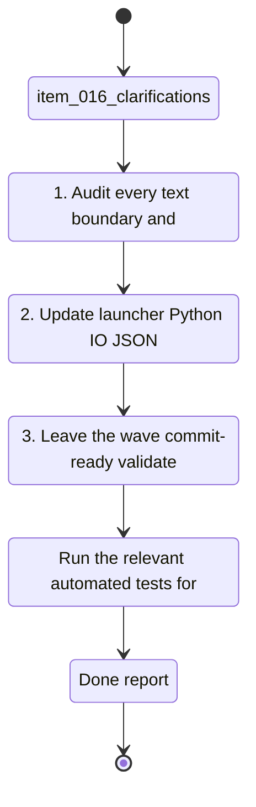

## task_016_clarifications - Harden UTF-8 and French Text Handling End to End
> From version: 0.0.0
> Schema version: 1.0
> Status: Done
> Understanding: 96%
> Confidence: 95%
> Progress: 100%
> Complexity: High
> Theme: General
> Reminder: Update status/understanding/confidence/progress and linked request/backlog references when you edit this doc.

# Context
Derived from `logics/backlog/item_016_clarifications.md`.
- Derived from backlog item `item_016_clarifications`.
- Source file: `logics\backlog\item_016_clarifications.md`.
- Related request(s): `req_016_harden_utf_8_and_french_text_handling_end_to_end`.
- Related ADR: `adr_005_choose_end_to_end_utf_8_and_nfc_text_policy`.
- Establish a single UTF-8 and NFC policy for every user-visible and persisted text path in the app.
- Remove accent corruption and mojibake from the PWA, CLI, launcher, diagnostics, logs, and generated files.
- Make the runtime explicit about encodings so the project no longer depends on ambient Windows or browser defaults.

# Plan
- [x] 1. Audit every text boundary and introduce the shared UTF-8/NFC policy helpers.
- [x] 2. Update launcher, Python IO, JSON/Markdown writers, PWA shell, and diagnostics to use the policy end to end.
- [x] 3. Leave the wave commit-ready, validate it, and update the linked Logics docs.
- [x] CHECKPOINT: leave the current wave commit-ready and update the linked Logics docs before continuing.
- [x] CHECKPOINT: if the shared AI runtime is active and healthy, run `python logics/skills/logics.py flow assist commit-all` for the current step, item, or wave commit checkpoint.
- [x] GATE: do not close a wave or step until the relevant automated tests and quality checks have been run successfully.
- [x] FINAL: Update related Logics docs

# Delivery checkpoints
- Each completed wave should leave the repository in a coherent, commit-ready state.
- Update the linked Logics docs during the wave that changes the behavior, not only at final closure.
- Prefer a reviewed commit checkpoint at the end of each meaningful wave instead of accumulating several undocumented partial states.
- If the shared AI runtime is active and healthy, use `python logics/skills/logics.py flow assist commit-all` to prepare the commit checkpoint for each meaningful step, item, or wave.
- Do not mark a wave or step complete until the relevant automated tests and quality checks have been run successfully.

# AC Traceability
- AC1 -> Scope: French accents and diacritics display correctly in the PWA, terminal logs, diagnostics, and generated text outputs.. Proof: capture validation evidence in this doc.
- AC2 -> Scope: User-entered text is normalized consistently before persistence so round trips preserve readable French characters.. Proof: capture validation evidence in this doc.
- AC3 -> Scope: Batch files, PowerShell launchers, Python outputs, JSON, markdown, and HTML pages all use a coherent UTF-8 path end to end.. Proof: capture validation evidence in this doc.
- AC7 -> Scope: The launcher, logs, and browser shell expose enough diagnostics to show where a text corruption originated when one still appears.. Proof: capture validation evidence in this doc.
- AC8 -> Scope: New or edited text-bearing files in the active workflow do not reintroduce raw mojibake artifacts in committed output.. Proof: capture validation evidence in this doc.

# Decision framing
- Product framing: Not needed
- Product signals: (none detected)
- Product follow-up: No product brief follow-up is expected based on current signals.
- Architecture framing: Required
- Architecture signals: data model and persistence, contracts and integration, state and sync
- Architecture follow-up: Create or link an architecture decision before irreversible implementation work starts.

# Links
- Product brief(s): (none yet)
- Architecture decision(s): [adr_005_choose_end_to_end_utf_8_and_nfc_text_policy](../architecture/adr_005_choose_end_to_end_utf_8_and_nfc_text_policy.md)
- Backlog item: [item_016_clarifications](../backlog/item_016_clarifications.md)
- Request(s): [req_016_harden_utf_8_and_french_text_handling_end_to_end](../request/req_016_harden_utf_8_and_french_text_handling_end_to_end.md)
- Follow-up task(s): [task_017_french_text_encoding_regression_tests_and_diagnostics](./task_017_french_text_encoding_regression_tests_and_diagnostics.md)

# AI Context
- Summary: Harden UTF-8 and French text handling end to end so accents and French strings survive every UI, log...
- Keywords: utf-8, unicode, nfc, french, accents, mojibake, encoding, logs, pwa, windows
- Use when: Use when executing the current implementation wave for the UTF-8 and French text policy.
- Skip when: Skip when the work belongs to another backlog item or a different execution wave.
# Validation
- Run the relevant automated tests for the changed surface before closing the current wave or step.
- Run the relevant lint or quality checks before closing the current wave or step.
- Confirm the completed wave leaves the repository in a commit-ready state.

# Definition of Done (DoD)
- [x] Scope implemented and acceptance criteria covered.
- [x] Validation commands executed and results captured.
- [x] No wave or step was closed before the relevant automated tests and quality checks passed.
- [x] Linked request/backlog/task docs updated during completed waves and at closure.
- [x] Each completed wave left a commit-ready checkpoint or an explicit exception is documented.
- [x] Status is `Done` and progress is `100%`.

# Report

- Implemented UTF-8/NFC repair helpers for read/write paths, PWA shell rendering, CLI output, sync diagnostics, and JSON payloads.
- Added regression coverage for French mojibake repair, recursive payload repair, and readable cache reset copy.
- Validation:
  - `python -m unittest tests.test_text_encoding -v`
  - `python -m unittest discover -s tests -v`
  - `node --check web/app.js`
  - `node --check web/sw.js`

# Notes
