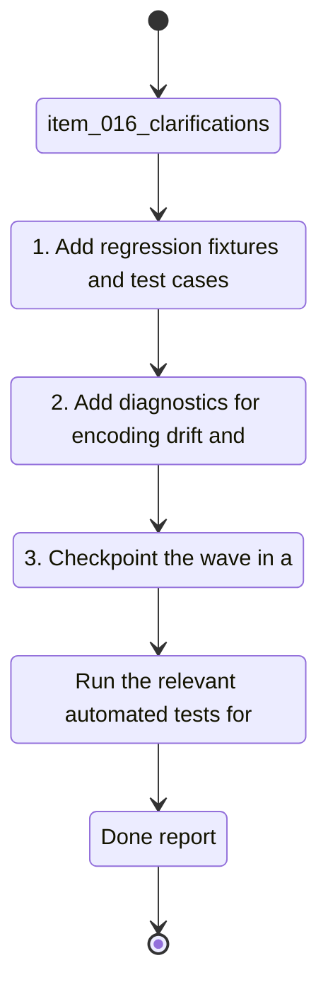

## task_017_french_text_encoding_regression_tests_and_diagnostics - French Text Encoding Regression Tests and Diagnostics
> From version: 0.0.0
> Schema version: 1.0
> Status: Done
> Understanding: 95%
> Confidence: 94%
> Progress: 100%
> Complexity: Medium
> Theme: General
> Reminder: Update status/understanding/confidence/progress and linked request/backlog references when you edit this doc.

# Context
- Derived from backlog item `item_016_clarifications`.
- Source file: `logics\backlog\item_016_clarifications.md`.
- Related request(s): `req_016_harden_utf_8_and_french_text_handling_end_to_end`.
- Related ADR: `adr_005_choose_end_to_end_utf_8_and_nfc_text_policy`.
- Add regression coverage that fails on mojibake, broken accents, or unexpected encoding drift.
- Surface the first point of corruption in diagnostics so broken text is easy to trace back to launcher, CLI, browser, storage, or generated output.
- Keep the tests focused on French strings, reload round trips, and local persistence rather than on a single UI surface.

# Plan
- [x] 1. Add regression fixtures and test cases for French strings, NFC round trips, and mojibake detection.
- [x] 2. Add or extend diagnostics so launcher, CLI, and PWA report the first point of corruption and the active encoding path.
- [x] 3. Validate the new tests, update docs, and close with a commit-ready checkpoint.
- [x] CHECKPOINT: leave the current wave commit-ready and update the linked Logics docs before continuing.
- [x] CHECKPOINT: if the shared AI runtime is active and healthy, run `python logics/skills/logics.py flow assist commit-all` for the current step, item, or wave commit checkpoint.
- [x] GATE: do not close a wave or step until the relevant automated tests and quality checks have been run successfully.
- [x] FINAL: Update related Logics docs

# Delivery checkpoints
- Each completed wave should leave the repository in a coherent, commit-ready state.
- Update the linked Logics docs during the wave that changes the behavior, not only at final closure.
- Prefer a reviewed commit checkpoint at the end of each meaningful wave instead of accumulating several undocumented partial states.
- If the shared AI runtime is active and healthy, use `python logics/skills/logics.py flow assist commit-all` to prepare the commit checkpoint for each meaningful step, item, or wave.
- Do not mark a wave or step complete until the relevant automated tests and quality checks have been run successfully.

# AC Traceability
- AC4 -> Scope: The project includes regression tests or validation checks that fail when mojibake or encoding regressions reappear.. Proof: capture validation evidence in this doc.
- AC5 -> Scope: The resulting behavior prevents recurring manual fixes for the same family of accent and encoding bugs.. Proof: capture validation evidence in this doc.
- AC6 -> Scope: Known French strings in the UI and debug surfaces remain readable after a full reload, cache refresh, and local persistence round trip.. Proof: capture validation evidence in this doc.
- AC7 -> Scope: The launcher, logs, and browser shell expose enough diagnostics to show where a text corruption originated when one still appears.. Proof: capture validation evidence in this doc.
- AC8 -> Scope: New or edited text-bearing files in the active workflow do not reintroduce raw mojibake artifacts in committed output.. Proof: capture validation evidence in this doc.

# Decision framing
- Product framing: Not needed
- Product signals: (none detected)
- Product follow-up: No product brief follow-up is expected based on current signals.
- Architecture framing: Required
- Architecture signals: contracts and integration, state and sync, observability
- Architecture follow-up: Create or link an architecture decision before irreversible implementation work starts.

# Links
- Product brief(s): (none yet)
- Architecture decision(s): [adr_005_choose_end_to_end_utf_8_and_nfc_text_policy](../architecture/adr_005_choose_end_to_end_utf_8_and_nfc_text_policy.md)
- Backlog item: [item_016_clarifications](../backlog/item_016_clarifications.md)
- Request(s): [req_016_harden_utf_8_and_french_text_handling_end_to_end](../request/req_016_harden_utf_8_and_french_text_handling_end_to_end.md)
- Primary task(s): [task_016_clarifications](./task_016_clarifications.md)

# AI Context
- Summary: Harden UTF-8 and French text handling end to end so accents and French strings survive every UI, log...
- Keywords: utf-8, unicode, nfc, french, accents, mojibake, encoding, logs, pwa, windows
- Use when: Use when adding regression tests, fixtures, or diagnostics for text encoding and French strings.
- Skip when: Skip when the work belongs to the runtime boundary hardening task or another backlog item.
# Validation
- Run the relevant automated tests for the changed surface before closing the current wave or step.
- Run the relevant lint or quality checks before closing the current wave or step.
- Confirm the completed wave leaves the repository in a commit-ready state.

# Definition of Done (DoD)
- [x] Scope implemented and acceptance criteria covered.
- [x] Validation commands executed and results captured.
- [x] No wave or step was closed before the relevant automated tests and quality checks passed.
- [x] Linked request/backlog/task docs updated during completed waves and at closure.
- [x] Each completed wave left a commit-ready checkpoint or an explicit exception is documented.
- [x] Status is `Done` and progress is `100%`.

# Report

- Added regression tests for French mojibake repair, recursive payload repair, UTF-8 JSON round trips, and readable cache reset copy.
- Added diagnostics and repair logic so old JSON artifacts and runtime traces are repaired on load before they reach user-facing surfaces.
- Validation:
  - `python -m unittest tests.test_text_encoding -v`
  - `python -m unittest discover -s tests -v`
  - `python -m py_compile coach_garmin/text_encoding.py coach_garmin/storage.py coach_garmin/coach_tools.py coach_garmin/sync_state.py coach_garmin/pwa_service.py coach_garmin/coach_chat.py coach_garmin/coach_ollama.py coach_garmin/coach_gemini.py coach_garmin/coach_openai.py coach_garmin/analytics.py coach_garmin/garmin_auth.py tests/test_text_encoding.py`

# Notes

