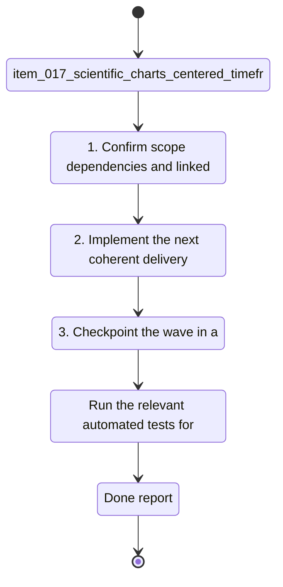

## task_018_scientific_charts_centered_timeframe_selector_and_french_text_fixes - Scientific charts centered, timeframe selector, and French text fixes
> From version: 0.0.0
> Schema version: 1.0
> Status: Obsolete
> Understanding: 96%
> Confidence: 93%
> Progress: 100%
> Complexity: Medium
> Theme: General
> Reminder: Update status/understanding/confidence/progress and linked request/backlog references when you edit this doc.

# Context
- Derived from backlog item `item_017_scientific_charts_centered_timeframe_selector_and_french_text_fixes`.
- Source file: `logics\backlog\item_017_scientific_charts_centered_timeframe_selector_and_french_text_fixes.md`.
- Related request(s): `req_017_scientific_charts_centered_timeframe_selector_and_french_text_fixes`.
- Center the chart area inside the modal and improve the visual balance of graph panels.
- Add a chart timeframe selector with 1 month, 3 months, and 1 year views.
- Fix French text rendering in chart titles, axis labels, legends, and helper copy.

# Plan
- [ ] 1. Confirm scope, dependencies, and linked acceptance criteria.
- [ ] 2. Implement the next coherent delivery wave from the backlog item.
- [ ] 3. Checkpoint the wave in a commit-ready state, validate it, and update the linked Logics docs.
- [ ] CHECKPOINT: leave the current wave commit-ready and update the linked Logics docs before continuing.
- [ ] CHECKPOINT: if the shared AI runtime is active and healthy, run `python logics/skills/logics.py flow assist commit-all` for the current step, item, or wave commit checkpoint.
- [ ] GATE: do not close a wave or step until the relevant automated tests and quality checks have been run successfully.
- [ ] FINAL: Update related Logics docs

# Delivery checkpoints
- Each completed wave should leave the repository in a coherent, commit-ready state.
- Update the linked Logics docs during the wave that changes the behavior, not only at final closure.
- Prefer a reviewed commit checkpoint at the end of each meaningful wave instead of accumulating several undocumented partial states.
- If the shared AI runtime is active and healthy, use `python logics/skills/logics.py flow assist commit-all` to prepare the commit checkpoint for each meaningful step, item, or wave.
- Do not mark a wave or step complete until the relevant automated tests and quality checks have been run successfully.

# AC Traceability
- AC1 -> Scope: Chart modals are centered and the main plot area visually dominates the available space.. Proof: capture validation evidence in this doc.
- AC2 -> Scope: Each chart can switch between 1 month, 3 months, and 1 year windows.. Proof: capture validation evidence in this doc.
- AC3 -> Scope: The selected window updates the data shown on the chart and its labels.. Proof: capture validation evidence in this doc.
- AC4 -> Scope: French text is rendered correctly in titles, legends, axes, helper copy, and diagnostics.. Proof: capture validation evidence in this doc.
- AC5 -> Scope: Axes, ticks, grid, and hover values remain visible in enlarged chart views.. Proof: capture validation evidence in this doc.

# Decision framing
- Product framing: Not needed
- Product signals: (none detected)
- Product follow-up: No product brief follow-up is expected based on current signals.
- Architecture framing: Consider
- Architecture signals: data model and persistence
- Architecture follow-up: Review whether an architecture decision is needed before implementation becomes harder to reverse.

# Links
- Product brief(s): `prod_004_scientific_chart_centering_and_timeframe_selector`
- Architecture decision(s): (none yet)
- Backlog item: `item_017_scientific_charts_centered_timeframe_selector_and_french_text_fixes`
- Request(s): `req_017_scientific_charts_centered_timeframe_selector_and_french_text_fixes`

# AI Context
- Summary: Scientific charts centered, timeframe selector, and French text fixes
- Keywords: charts, centered, timeframe, selector, French text, axes, ticks, hover
- Use when: Use when framing chart layout, timeframe selection, and French text rendering fixes.
- Skip when: Skip when the work targets another feature, repository, or workflow stage.
# References
- `logics/skills/logics-ui-steering/SKILL.md`

# Validation
- Run the relevant automated tests for the changed surface before closing the current wave or step.
- Run the relevant lint or quality checks before closing the current wave or step.
- Confirm the completed wave leaves the repository in a commit-ready state.

# Definition of Done (DoD)
- [x] Scope was superseded by later bounded delivery waves and this task now serves as traceability only.
- [x] The successor docs are explicit.
- [x] Linked request/backlog/task docs were updated at reconciliation time.
- [x] Status is `Obsolete` and progress is `100%` because no direct execution is expected from this task anymore.

# Report
- Marked `Obsolete` on `2026-04-25`.
- This task was not executed directly. Its original scope was absorbed by:
  - `task_019_dynamic_chart_timeframes_and_cadence_unit_correction`
  - `task_024_refine_volume_relative_load_and_heart_rate_zone_chart_semantics`
  - `task_025_repair_wellness_raw_views_cadence_and_combined_pace_cadence_hr_chart`
  - `task_026_refine_dashboard_zone_load_session_typing_and_metric_documentation`
  - `task_027_finish_adr_005_source_text_cleanup_and_reconcile_dashboard_logics_continuity`
- Keep this doc for historical continuity only; do not use it as the next execution entrypoint.
