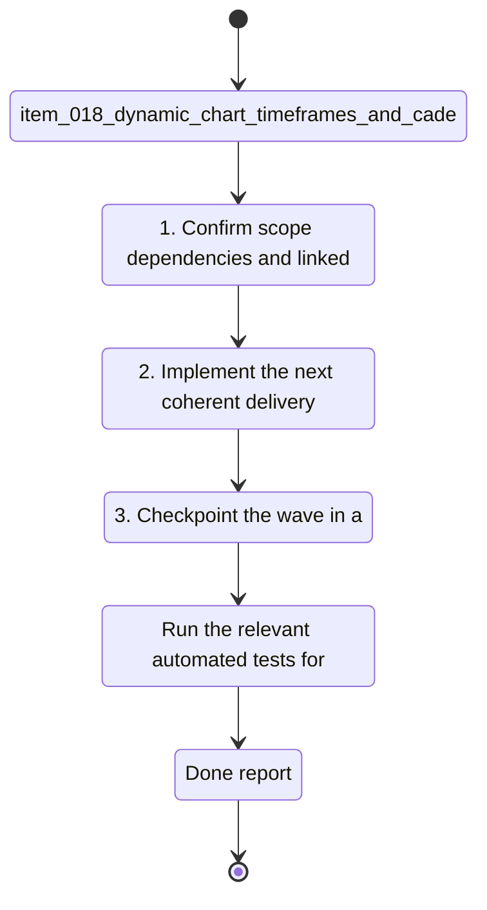

## task_019_dynamic_chart_timeframes_and_cadence_unit_correction - Dynamic chart timeframes and cadence unit correction
> From version: 20260414-navfix26
> Schema version: 1.0
> Status: Done
> Understanding: 95%
> Confidence: 93%
> Progress: 100%
> Complexity: High
> Theme: UI
> Reminder: Update status/understanding/confidence/progress and linked request/backlog references when you edit this doc.

# Context
Derived from `logics/backlog/item_018_dynamic_chart_timeframes_and_cadence_unit_correction.md`.
- Derived from backlog item `item_018_dynamic_chart_timeframes_and_cadence_unit_correction`.
- Source file: `logics\backlog\item_018_dynamic_chart_timeframes_and_cadence_unit_correction.md`.
- Related request(s): `req_018_dynamic_chart_timeframes_and_cadence_unit_correction`.
- Related architecture decision(s): `adr_006_choose_dynamic_chart_windows_and_cadence_normalization`.
- Make chart time windows actually change the data shown in the graph.
- Make the y-axis scale adapt to the selected time window so the plotted area uses the available vertical space well.
- Investigate and fix cadence so it is consistently treated as steps per minute, not a distance metric or a mixed unit.

# Plan
- [x] 1. Confirm scope, dependencies, and linked acceptance criteria.
- [x] 2. Implement the next coherent delivery wave from the backlog item.
- [x] 3. Checkpoint the wave in a commit-ready state, validate it, and update the linked Logics docs.
- [x] CHECKPOINT: leave the current wave commit-ready and update the linked Logics docs before continuing.
- [x] CHECKPOINT: if the shared AI runtime is active and healthy, run `python logics/skills/logics.py flow assist commit-all` for the current step, item, or wave commit checkpoint.
- [x] GATE: do not close a wave or step until the relevant automated tests and quality checks have been run successfully.
- [x] FINAL: Update related Logics docs

# Delivery checkpoints
- Each completed wave should leave the repository in a coherent, commit-ready state.
- Update the linked Logics docs during the wave that changes the behavior, not only at final closure.
- Prefer a reviewed commit checkpoint at the end of each meaningful wave instead of accumulating several undocumented partial states.
- If the shared AI runtime is active and healthy, use `python logics/skills/logics.py flow assist commit-all` to prepare the commit checkpoint for each meaningful step, item, or wave.
- Do not mark a wave or step complete until the relevant automated tests and quality checks have been run successfully.

# AC Traceability
- AC1 -> Scope: Choosing 1 month, 3 months, or 1 year changes the actual dataset used by the chart, not only the label.. Proof: capture validation evidence in this doc.
- AC2 -> Scope: The graph y-axis rescales to the selected time window and uses the available chart height effectively.. Proof: capture validation evidence in this doc.
- AC3 -> Scope: Cadence is traced back to a step-rate source and displayed as steps per minute, with any distance-unit confusion removed or explained.. Proof: capture validation evidence in this doc.
- AC4 -> Scope: Charts keep French text correctly rendered in titles, axes, labels, legends, and helper copy after reloads and cache refreshes.. Proof: capture validation evidence in this doc.
- AC5 -> Scope: The pace / cadence / FC related graphs expose enough diagnostics to explain when data are missing, filtered, or not yet stable.. Proof: capture validation evidence in this doc.

# Decision framing
- Product framing: Consider
- Product signals: experience scope
- Product follow-up: Review whether a product brief is needed before scope becomes harder to change.
- Architecture framing: Required
- Architecture signals: data model and persistence, state and sync, delivery and operations
- Architecture follow-up: Create or link an architecture decision before irreversible implementation work starts.

# Links
- Product brief(s): (none yet)
- Architecture decision(s): (none yet)
- Architecture decision ref: `logics/architecture/adr_006_choose_dynamic_chart_windows_and_cadence_normalization.md`
- Backlog item: `item_018_dynamic_chart_timeframes_and_cadence_unit_correction`
- Request(s): `req_018_dynamic_chart_timeframes_and_cadence_unit_correction`

# AI Context
- Summary: Make graph time windows dynamic and fix cadence unit handling.
- Keywords: chart, timeframe, y-axis, autoscale, cadence, step rate, spm, French text
- Use when: Use when refining chart windowing, axis scaling, or cadence normalization.
- Skip when: Skip when the work targets another feature, repository, or workflow stage.
# References
- `logics/skills/logics-ui-steering/SKILL.md`

# Validation
- Run the relevant automated tests for the changed surface before closing the current wave or step.
- Run the relevant lint or quality checks before closing the current wave or step.
- Confirm the completed wave leaves the repository in a commit-ready state.

# Definition of Done (DoD)
- [x] Scope implemented and acceptance criteria covered.
- [x] Validation commands executed and results captured.
- [x] No wave or step was closed before the relevant automated tests and quality checks passed.
- [x] Linked request/backlog/task docs updated during completed waves and at closure.
- [x] Each completed wave left a commit-ready checkpoint or an explicit exception is documented.
- [x] Status is `Done` and progress is `100%`.

# Report

# Notes

