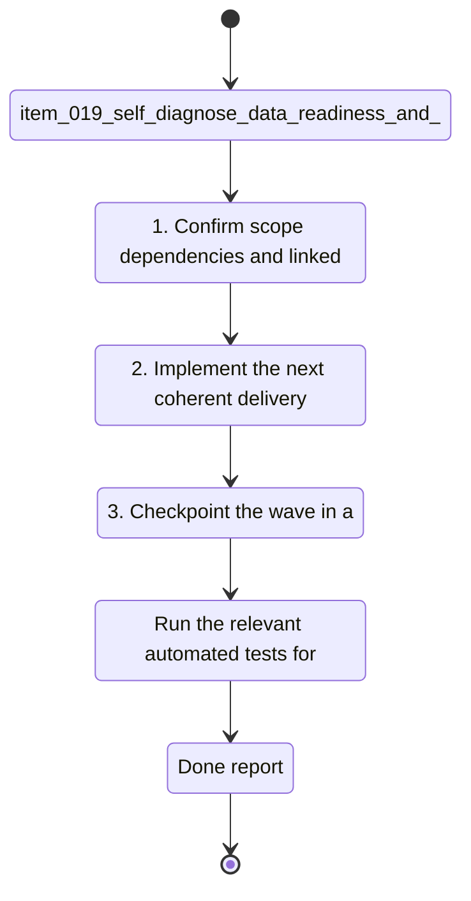

## task_020_self_diagnose_data_readiness_and_chart_recovery - Self-diagnose data readiness and chart recovery
> From version: 20260414-navfix26
> Schema version: 1.0
> Status: Done
> Understanding: 94%
> Confidence: 91%
> Progress: 100%
> Complexity: High
> Theme: General
> Reminder: Update status/understanding/confidence/progress and linked request/backlog references when you edit this doc.

# Context
- Derived from backlog item `item_019_self_diagnose_data_readiness_and_chart_recovery`.
- Source file: `logics\backlog\item_019_self_diagnose_data_readiness_and_chart_recovery.md`.
- Related request(s): `req_019_self_diagnose_data_readiness_and_chart_recovery`.
- Related architecture decision(s): `adr_004_scientific_charts_for_sport_specific_volumes_and_data_recalculation`.
- Make the app state about data readiness explicit instead of a generic "analysis ready" label.
- Surface when the workspace needs a recalculation, when charts have partial data, and when data are genuinely ready.
- Prevent chart previews and modal opens from turning empty data into a JS error or a broken boot state.

# Plan
- [ ] 1. Confirm scope, dependencies, and linked acceptance criteria.
- [ ] 2. Implement the next coherent delivery wave from the backlog item.
- [ ] 3. Checkpoint the wave in a commit-ready state, validate it, and update the linked Logics docs.
- [ ] CHECKPOINT: leave the current wave commit-ready and update the linked Logics docs before continuing.
- [ ] CHECKPOINT: if the shared AI runtime is active and healthy, run `python logics/skills/logics.py flow assist commit-all` for the current step, item, or wave commit checkpoint.
- [ ] GATE: do not close a wave or step until the relevant automated tests and quality checks have been run successfully.
- [ ] FINAL: Update related Logics docs

# Delivery checkpoints
- Each completed wave should leave the repository in a coherent, commit-ready state.
- Update the linked Logics docs during the wave that changes the behavior, not only at final closure.
- Prefer a reviewed commit checkpoint at the end of each meaningful wave instead of accumulating several undocumented partial states.
- If the shared AI runtime is active and healthy, use `python logics/skills/logics.py flow assist commit-all` to prepare the commit checkpoint for each meaningful step, item, or wave.
- Do not mark a wave or step complete until the relevant automated tests and quality checks have been run successfully.

# AC Traceability
- AC1 -> Scope: The UI distinguishes ready, recalculation required, partial data, and unavailable states with explicit labels.. Proof: capture validation evidence in this doc.
- AC2 -> Scope: Reloading the app with stale or incomplete data shows a clear "recalculation required" or equivalent state instead of a generic ready state.. Proof: capture validation evidence in this doc.
- AC3 -> Scope: Opening an empty or incomplete chart shows an explanation of missing inputs or filters instead of triggering a JS error.. Proof: capture validation evidence in this doc.
- AC4 -> Scope: Recalculating data refreshes the derived chart payloads and the preview/modals follow the refreshed state.. Proof: capture validation evidence in this doc.
- AC5 -> Scope: The app keeps running even when a chart has no exploitable points.. Proof: capture validation evidence in this doc.

# Decision framing
- Product framing: Consider
- Product signals: experience scope
- Product follow-up: Review whether a product brief is needed before scope becomes harder to change.
- Architecture framing: Consider
- Architecture signals: data model and persistence
- Architecture follow-up: Review whether an architecture decision is needed before implementation becomes harder to reverse.

# Links
- Product brief(s): (none yet)
- Architecture decision(s): `logics/architecture/adr_004_scientific_charts_for_sport_specific_volumes_and_data_recalculation.md`
- Backlog item: `item_019_self_diagnose_data_readiness_and_chart_recovery`
- Request(s): `req_019_self_diagnose_data_readiness_and_chart_recovery`

# AI Context
- Summary: Self-diagnose data readiness and chart recovery
- Keywords: data readiness, recalculation, chart recovery, empty state, JS error, diagnostics
- Use when: Use when the app needs to explain stale, partial, or missing chart data and avoid empty-chart crashes.
- Skip when: Skip when the work targets another feature, repository, or workflow stage.
# References
- `logics/skills/logics-ui-steering/SKILL.md`

# Validation
- Run the relevant automated tests for the changed surface before closing the current wave or step.
- Run the relevant lint or quality checks before closing the current wave or step.
- Confirm the completed wave leaves the repository in a commit-ready state.
- Finish workflow executed on 2026-04-15.
- Linked backlog/request close verification passed.

# Definition of Done (DoD)
- [x] Scope implemented and acceptance criteria covered.
- [x] Validation commands executed and results captured.
- [x] No wave or step was closed before the relevant automated tests and quality checks passed.
- [x] Linked request/backlog/task docs updated during completed waves and at closure.
- [x] Each completed wave left a commit-ready checkpoint or an explicit exception is documented.
- [x] Status is `Done` and progress is `100%`.

# Report
- Finished on 2026-04-15.
- Linked backlog item(s): `item_019_self_diagnose_data_readiness_and_chart_recovery`
- Related request(s): `req_019_self_diagnose_data_readiness_and_chart_recovery`
