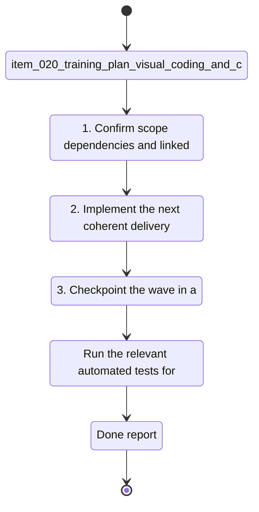

## task_021_training_plan_visual_coding_and_chart_fidelity_repairs - Training plan visual coding and chart fidelity repairs
> From version: 20260415-navfix29
> Schema version: 1.0
> Status: Done
> Understanding: 96%
> Confidence: 93%
> Progress: 100%
> Complexity: High
> Theme: UI
> Reminder: Update status/understanding/confidence/progress and linked request/backlog references when you edit this doc.

# Context
- Derived from backlog item `item_020_training_plan_visual_coding_and_chart_fidelity_repairs`.
- Source file: `logics\backlog\item_020_training_plan_visual_coding_and_chart_fidelity_repairs.md`.
- Related request(s): `req_020_training_plan_visual_coding_and_chart_fidelity_repairs`.
- Add a clear visual coding to training-plan days so rest, easy runs, and specific sessions are readable at a glance.
- Repair chart interactions and rendering so hover, timeframe changes, modal layouts, and detail sections behave consistently.
- Improve chart data quality and presentation for running volume, bike volume, resting HR, sleep, HRV, pace / FC, and cadence.

# Plan
- [x] 1. Confirm scope, dependencies, and linked acceptance criteria.
- [x] 2. Implement the next coherent delivery wave from the backlog item.
- [x] 3. Checkpoint the wave in a commit-ready state, validate it, and update the linked Logics docs.
- [x] CHECKPOINT: leave the current wave commit-ready and update the linked Logics docs before continuing.
- [x] CHECKPOINT: if the shared AI runtime is active and healthy, run `python logics/skills/logics.py flow assist commit-all` for the current step, item, or wave commit checkpoint.
- [x] GATE: do not close a wave or step until the relevant automated tests and quality checks have been run successfully.
- [x] FINAL: Update related Logics docs

# Delivery checkpoints
- Each completed wave should leave the repository in a coherent, commit-ready state.
- Update the linked Logics docs during the wave that changes the behavior, not only at final closure.
- Prefer a reviewed commit checkpoint at the end of each meaningful wave instead of accumulating several undocumented partial states.
- If the shared AI runtime is active and healthy, use `python logics/skills/logics.py flow assist commit-all` to prepare the commit checkpoint for each meaningful step, item, or wave.
- Do not mark a wave or step complete until the relevant automated tests and quality checks have been run successfully.

# AC Traceability
- AC1 -> Scope: Training plan days use theme-aware visual coding:. Proof: capture validation evidence in this doc.
- AC2 -> Scope: rest day = green family. Proof: capture validation evidence in this doc.
- AC3 -> Scope: easy run = blue family. Proof: capture validation evidence in this doc.
- AC4 -> Scope: quality or long session = orange family. Proof: capture validation evidence in this doc.
- AC2 -> Scope: The visual coding works across the existing theme system without breaking contrast or readability.. Proof: capture validation evidence in this doc.
- AC3 -> Scope: Hover tooltips on charts always show meaningful values, labels, and details instead of an empty black box.. Proof: capture validation evidence in this doc.
- AC4 -> Scope: Switching `1 mois / 3 mois / 1 an` while a chart modal is open refreshes the active modal immediately, without needing to close and reopen it.. Proof: capture validation evidence in this doc.
- AC5 -> Scope: All main chart modals expose the same explanation structure as the most complete HRV modal:. Proof: capture validation evidence in this doc.
- AC6 -> Scope: calculation. Proof: capture validation evidence in this doc.
- AC7 -> Scope: provenance. Proof: capture validation evidence in this doc.
- AC8 -> Scope: reading. Proof: capture validation evidence in this doc.
- AC9 -> Scope: references. Proof: capture validation evidence in this doc.
- AC6 -> Scope: Running and bike volume charts render zero-heavy periods in a less cluttered way, either by hiding redundant zero emphasis or by reducing visual noise while preserving true zero data.. Proof: capture validation evidence in this doc.
- AC7 -> Scope: Resting HR, sleep, and HRV charts preserve realistic day-to-day variability instead of appearing over-smoothed.. Proof: capture validation evidence in this doc.
- AC8 -> Scope: The `pace / cadence / FC` chart renders at a readable size and uses the modal space correctly.. Proof: capture validation evidence in this doc.
- AC9 -> Scope: The `allure / FC` curve becomes denser or explains clearly why enough usable points are still missing.. Proof: capture validation evidence in this doc.
- AC10 -> Scope: Cadence is traced back to the correct running step-rate source and displayed in steps per minute, with implausible low values investigated and corrected.. Proof: capture validation evidence in this doc.
- AC11 -> Scope: French text and accented characters render correctly in figure titles, axes, legends, tooltips, helper text, and modal sections.. Proof: capture validation evidence in this doc.

# Decision framing
- Product framing: Reuse existing chart and dashboard framing.
- Product signals: experience scope, chart readability, training-plan presentation
- Product follow-up: Reuse and refine existing product briefs if the new visual coding or chart reading rules need sharper language.
- Architecture framing: Reuse existing chart and cadence decisions.
- Architecture signals: chart payload shape, interaction refresh contract, metric normalization
- Architecture follow-up: Reuse and refine existing ADRs if cadence sourcing or modal refresh mechanics need a deeper contract update.

# Links
- Product brief(s): `prod_003_scientific_dashboard_charts_and_sport_specific_volume_filtering`, `prod_004_scientific_chart_centering_and_timeframe_selector`
- Architecture decision(s): `adr_004_scientific_charts_for_sport_specific_volumes_and_data_recalculation`, `adr_006_choose_dynamic_chart_windows_and_cadence_normalization`
- Backlog item: `item_020_training_plan_visual_coding_and_chart_fidelity_repairs`
- Request(s): `req_020_training_plan_visual_coding_and_chart_fidelity_repairs`

# AI Context
- Summary: Repair chart fidelity, tooltip behavior, cadence sourcing, and training-plan visual coding.
- Keywords: training plan colors, chart tooltip, modal refresh, chart fidelity, cadence spm, pace fc, hrv, utf-8, french text
- Use when: Use when refining the visual quality, data correctness, or interaction behavior of dashboard charts and training plan presentation.
- Skip when: Skip when the work targets another feature, repository, or workflow stage.
# References
- `logics/skills/logics-ui-steering/SKILL.md`

# Validation
- Run the relevant automated tests for the changed surface before closing the current wave or step.
- Run the relevant lint or quality checks before closing the current wave or step.
- Confirm the completed wave leaves the repository in a commit-ready state.
- Minimum expected checks for this slice:
- `node --check web/app.js`
- `node --check web/sw.js`
- `.venv\Scripts\python -m unittest tests.test_pwa_service -v`

# Definition of Done (DoD)
- [x] Scope implemented and acceptance criteria covered.
- [x] Validation commands executed and results captured.
- [x] No wave or step was closed before the relevant automated tests and quality checks passed.
- [x] Linked request/backlog/task docs updated during completed waves and at closure.
- [x] Each completed wave left a commit-ready checkpoint or an explicit exception is documented.
- [x] Status is `Done` and progress is `100%`.

# Report
- Implemented theme-aware training-plan colors for rest, easy, and quality / long sessions.
- Fixed chart modal live refresh when switching `1 mois / 3 mois / 1 an`.
- Reworked tooltip rendering so hover content is visible and populated.
- Upgraded volume, sleep, resting HR, HRV, cadence, pace / FC, and triptych charts with better labels, larger modal rendering, and richer explanatory blocks.
- Corrected cadence sourcing to use step-rate semantics (`spm`) and added a PWA-side fallback when stale analytics still expose half-cadence metrics.
- Validation:
  - `node --check web/app.js`
  - `node --check web/sw.js`
  - `.venv\Scripts\python -m unittest tests.test_pwa_service -v`
  - `.venv\Scripts\python -m unittest discover -s tests -v`
