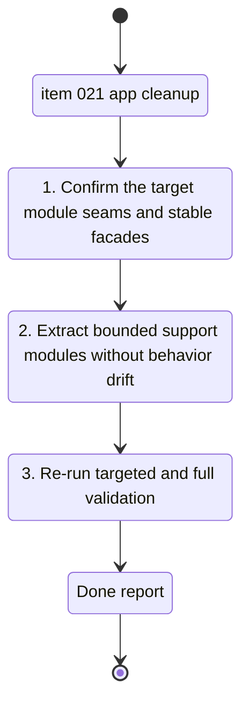

## task_022_clean_up_oversized_app_modules_with_bounded_refactors - Clean up oversized app modules with bounded refactors
> From version: 0.1.0
> Schema version: 1.0
> Status: Done
> Understanding: 96%
> Confidence: 93%
> Progress: 100%
> Complexity: Medium
> Theme: General
> Reminder: Update status/understanding/confidence/progress and linked request/backlog references when you edit this doc.

# Context
- Derived from backlog item `item_021_clean_up_oversized_app_modules_with_bounded_refactors`.
- Source file: `logics/backlog/item_021_clean_up_oversized_app_modules_with_bounded_refactors.md`.
- Related request(s): `req_021_clean_up_oversized_app_modules_and_stale_logics_hygiene`.
- This task covers the code-structure cleanup slice only.

# Plan
- [x] 1. Confirm the target seams in `coach_garmin/analytics.py`, `coach_garmin/pwa_service_support.py`, and `coach_garmin/coach_chat.py`.
- [x] 2. Extract one bounded responsibility at a time into support or domain modules while preserving stable entrypoints.
- [x] 3. Re-run targeted tests after each meaningful wave when patch seams or import surfaces move.
- [x] 4. Run the full test suite and verify the repo is clean.
- [x] 5. Update linked Logics docs with validation evidence and final state.

# AC Traceability
- AC1 -> Reduce the target file concentration through coherent extractions. Proof: new module boundaries and reduced orchestration files.
- AC2 -> Preserve current import and runtime behavior. Proof: CLI, PWA, coach, analytics, and sync tests still pass.
- AC3 -> Run targeted plus full tests. Proof: captured commands and passing outcomes.
- AC4 -> Verify clean repo state at the end of the wave. Proof: final `git status`.

# Links
- Product brief(s): (none yet)
- Architecture decision(s): (none yet)
- Backlog item: `item_021_clean_up_oversized_app_modules_with_bounded_refactors`
- Request(s): `req_021_clean_up_oversized_app_modules_and_stale_logics_hygiene`

# AI Context
- Summary: Execute the bounded refactor slice for the remaining oversized app modules.
- Keywords: analytics, pwa, coach chat, support module, facade, refactor, validation
- Use when: Use when implementing the code cleanup portion of req_021.
- Skip when: Skip when the work is about Logics metadata rather than app code.

# Validation
- Minimum expected checks for this slice:
- `.venv\Scripts\python -m unittest tests.test_pwa_service -v`
- `.venv\Scripts\python -m unittest tests.test_coach_chat -v`
- `.venv\Scripts\python -m unittest discover -s tests -v`
- `git status --short --branch`

# Definition of Done (DoD)
- [x] Target module boundaries are improved without behavior drift.
- [x] Validation commands executed and results captured.
- [x] Linked request/backlog/task docs updated.
- [x] Status is `Done` and progress is `100%` only after tests pass and repo state is clean.

# Report
- Completed on `2026-04-16`.
- Extracted thin facades plus support modules:
  - `coach_garmin/analytics.py` -> `coach_garmin/analytics_support.py`
  - `coach_garmin/coach_chat.py` -> `coach_garmin/coach_chat_support.py`
  - `coach_garmin/pwa_service_support.py` -> `coach_garmin/pwa_service_runtime_support.py`
- Preserved public entrypoints while fixing the import seams introduced during extraction.
- Validation:
  - `.venv\Scripts\python -m unittest tests.test_coach_chat -v` -> passed
  - `.venv\Scripts\python -m unittest tests.test_pwa_service -v` -> passed
  - `.venv\Scripts\python -m unittest discover -s tests -v` -> `36/36` passed
  - `git status --short --branch` captured after completion
