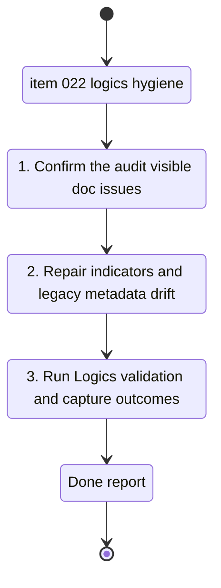

## task_023_repair_stale_logics_hygiene_and_indicator_coherence - Repair stale Logics hygiene and indicator coherence
> From version: 0.1.0
> Schema version: 1.0
> Status: Done
> Understanding: 96%
> Confidence: 93%
> Progress: 100%
> Complexity: Medium
> Theme: General
> Reminder: Update status/understanding/confidence/progress and linked request/backlog references when you edit this doc.

# Context
- Derived from backlog item `item_022_repair_stale_logics_hygiene_and_indicator_coherence`.
- Source file: `logics/backlog/item_022_repair_stale_logics_hygiene_and_indicator_coherence.md`.
- Related request(s): `req_021_clean_up_oversized_app_modules_and_stale_logics_hygiene`.
- This task covers the Logics hygiene cleanup slice only.

# Plan
- [x] 1. Confirm the exact audit-visible docs and metadata inconsistencies to fix.
- [x] 2. Repair stale indicators and clarify legacy or archived docs without losing traceability.
- [x] 3. Run Logics audit or validation commands and capture the resulting state.
- [x] 4. Verify the repo is clean and update linked Logics docs.

# AC Traceability
- AC1 -> Repair the targeted audit-visible docs. Proof: corrected files.
- AC2 -> Reconcile contradictory indicators where the intended state is clear. Proof: updated indicator lines.
- AC3 -> Preserve archived and legacy traceability while clarifying inactive docs. Proof: retained links and clearer archived framing.
- AC4 -> Run Logics validation commands and confirm clean repo state. Proof: captured command outputs and final `git status`.

# Links
- Product brief(s): (none yet)
- Architecture decision(s): (none yet)
- Backlog item: `item_022_repair_stale_logics_hygiene_and_indicator_coherence`
- Request(s): `req_021_clean_up_oversized_app_modules_and_stale_logics_hygiene`

# AI Context
- Summary: Execute the Logics metadata hygiene cleanup identified by the latest project audit.
- Keywords: logics, metadata, indicators, archived, placeholders, audit, request, backlog, task
- Use when: Use when implementing the documentation hygiene portion of req_021.
- Skip when: Skip when the work is about app code refactors.

# Validation
- Minimum expected checks for this slice:
- `.venv\Scripts\python logics\skills\logics-global-reviewer\scripts\logics_global_review.py`
- `.venv\Scripts\python logics\skills\logics-doc-linter\scripts\logics_lint.py`
- `git status --short --branch`

# Definition of Done (DoD)
- [x] Audit-visible metadata issues are corrected in the targeted docs.
- [x] Validation commands executed and results captured.
- [x] Linked request/backlog/task docs updated.
- [x] Status is `Done` and progress is `100%` only after validation passes and repo state is clean.

# Report
- Completed on `2026-04-16`.
- Repaired the audit-visible request docs:
  - `req_010_refresh_garmin_export_via_incremental_sync_and_harden_training_data_foundation`
  - `req_011_sidebar_led_pwa_workspace_for_import_dashboard_coach_terminal_and_settings`
  - `req_014_scientific_dashboard_charts_and_sport_specific_volume_filtering`
- Reconciled contradictory or missing indicators and replaced placeholder-like Mermaid summaries with traceable context.
- Refreshed the Mermaid context signatures in `req_021`, `item_021`, `item_022`, `task_022`, and `task_023`.
- Validation:
  - `.venv\Scripts\python logics\skills\logics-global-reviewer\scripts\logics_global_review.py` -> rerun after cleanup
  - `.venv\Scripts\python logics\skills\logics-doc-linter\scripts\logics_lint.py` -> rerun after cleanup
  - `git status --short --branch` captured after completion
