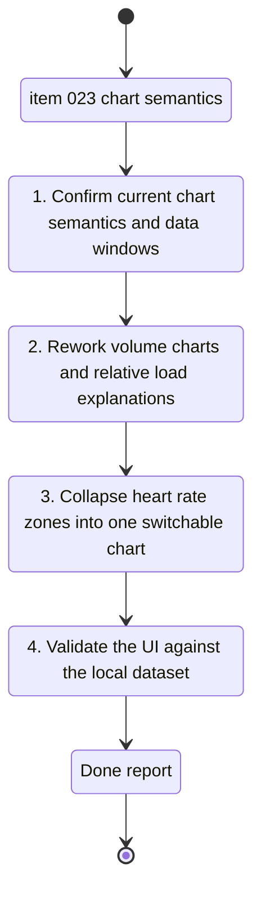

## task_024_refine_volume_relative_load_and_heart_rate_zone_chart_semantics - Refine volume, relative load, and heart-rate zone chart semantics
> From version: 20260416-chart31
> Schema version: 1.0
> Status: Done
> Understanding: 97%
> Confidence: 94%
> Progress: 100%
> Complexity: Medium
> Theme: UI
> Reminder: Update status/understanding/confidence/progress and linked request/backlog references when you edit this doc.

# Context
- Derived from backlog item `item_023_refine_volume_relative_load_and_heart_rate_zone_chart_semantics`.
- Source file: `logics/backlog/item_023_refine_volume_relative_load_and_heart_rate_zone_chart_semantics.md`.
- Related request(s): `req_022_refine_scientific_chart_semantics_unsmoothed_wellness_views_and_cadence_zone_repairs`.
- This task covers the chart-semantics slice only:
  - separate bar charts for running and bike volume
  - relative load explanation structure
  - one heart-rate zone chart with a mode switch

# Plan
- [x] 1. Confirm where running volume, bike volume, relative load, and heart-rate zone charts are built, and identify the current timeframe aggregation path.
- [x] 2. Replace running and bike line semantics with separate bar-based charts while preserving the locked aggregation strategy:
  - `1 mois` and `3 mois` = daily bars
  - `1 an` = weekly bars
- [x] 3. Strengthen the relative load modal with:
  - calculation
  - provenance
  - reading
  - references
- [x] 4. Remove duplicated heart-rate zone charts and keep one switchable chart between `all activities` and `running`.
- [x] 5. Clarify the surviving heart-rate zone explanation in BPM with correct French text and accents.
- [x] 6. Run validation on the current local dataset and update the linked Logics docs with results.

# AC Traceability
- AC1 -> Replace sparse connected lines with bar-based semantics on separate running and bike charts. Proof: chart rendering and code diff.
- AC2 -> Implement daily versus weekly aggregation by selected timeframe. Proof: `1 mois`, `3 mois`, and `1 an` chart behavior.
- AC3 -> Keep running and bike fully separated in the UI. Proof: no merged comparison chart.
- AC4 -> Expand the relative load scientific explanation block. Proof: modal sections and visible copy.
- AC5 -> Collapse heart-rate zone duplication into one switchable chart. Proof: mode switch and single chart container.
- AC6 -> Explain zones in BPM with correct French text. Proof: labels, helper copy, and references.

# Links
- Product brief(s): `prod_003_scientific_dashboard_charts_and_sport_specific_volume_filtering`, `prod_004_scientific_chart_centering_and_timeframe_selector`
- Architecture decision(s): `adr_004_scientific_charts_for_sport_specific_volumes_and_data_recalculation`, `adr_005_choose_end_to_end_utf_8_and_nfc_text_policy`, `adr_006_choose_dynamic_chart_windows_and_cadence_normalization`
- Backlog item: `item_023_refine_volume_relative_load_and_heart_rate_zone_chart_semantics`
- Request(s): `req_022_refine_scientific_chart_semantics_unsmoothed_wellness_views_and_cadence_zone_repairs`

# AI Context
- Summary: Execute the chart semantics slice for separate volume bars, stronger relative load explanations, and one switchable heart-rate zone chart.
- Keywords: running volume bars, bike volume bars, weekly aggregation, relative load, heart rate zones, bpm, switch, french text
- Use when: Use when implementing the semantic and explanation slice from item_023.
- Skip when: Skip when the work is about cadence, raw wellness charts, or the combined pace cadence HR chart.

# Validation
- Minimum expected checks for this slice:
- `.venv\Scripts\python -m unittest tests.test_pwa_service -v`
- `.venv\Scripts\python -m unittest discover -s tests -v`
- manual validation in the PWA on the current local dataset for:
  - running volume chart
  - bike volume chart
  - relative load modal
  - heart-rate zone switch
- `git status --short --branch`

# Definition of Done (DoD)
- [x] Separate running and bike volume bar charts are implemented with the locked timeframe aggregation.
- [x] Relative load exposes calculation, provenance, reading, and references.
- [x] Only one heart-rate zone chart remains, with a clear switch and BPM explanations.
- [x] Validation commands executed and results captured.
- [x] Linked request/backlog/task docs updated.
- [x] Status is `Done` and progress is `100%` only after validation passes and repo state is coherent.

# Report
- `web/app.js` now renders running and bike volume as separate bar charts, keeps yearly aggregation weekly through `aggregateSeriesByWindow`, expands the relative-load modal copy, and collapses heart-rate zones into one switchable chart with BPM ranges in the legend.
- `web/index.html` and `web/styles.css` were aligned to the single zone-chart layout.
- Validation executed on `2026-04-16`:
  - `.venv\Scripts\python -m unittest tests.test_pwa_service -v`
  - `.venv\Scripts\python -m unittest discover -s tests -v`
  - `node --check web/app.js`
