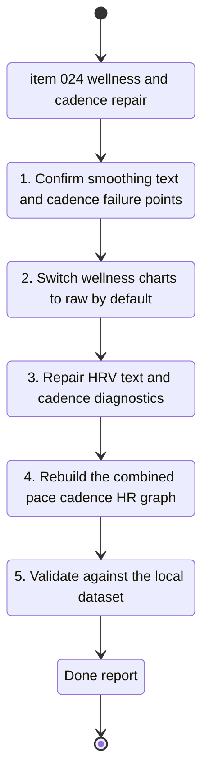

## task_025_repair_wellness_raw_views_cadence_and_combined_pace_cadence_hr_chart - Repair wellness raw views, cadence, and the combined pace / cadence / HR chart
> From version: 20260416-chart31
> Schema version: 1.0
> Status: Done
> Understanding: 97%
> Confidence: 94%
> Progress: 100%
> Complexity: High
> Theme: UI
> Reminder: Update status/understanding/confidence/progress and linked request/backlog references when you edit this doc.

# Context
- Derived from backlog item `item_024_repair_wellness_raw_views_cadence_and_combined_pace_cadence_hr_chart`.
- Source file: `logics/backlog/item_024_repair_wellness_raw_views_cadence_and_combined_pace_cadence_hr_chart.md`.
- Related request(s): `req_022_refine_scientific_chart_semantics_unsmoothed_wellness_views_and_cadence_zone_repairs`.
- This task covers the data-quality and scientific-visualization slice only:
  - raw-by-default wellness charts
  - HRV text and reference accent repairs
  - cadence diagnosis and correction
  - one combined pace / cadence / HR graph with three visible y-axes

# Plan
- [x] 1. Confirm the current smoothing path for resting HR, HRV, and sleep, plus the current rendering path for HRV explanations and references.
- [x] 2. Make resting HR, HRV, and sleep raw by default, and keep a smoothing toggle only if both modes remain explicit and stable.
- [x] 3. Repair UTF-8 and NFC handling in HRV explanations, helper copy, and chart references so French accents render correctly.
- [x] 4. Investigate cadence end to end:
  - source field(s)
  - normalized value
  - detected unit
  - chart point density
  - y-axis bounds
- [x] 5. Add a cadence diagnostic view or debug surface exposing:
  - raw source value
  - normalized value
  - detected unit
  - plotting bounds
- [x] 6. Rebuild the pace / cadence / HR visualization into one coherent chart with three visible y-axes and hover detail.
- [x] 7. Run validation on the current local dataset and update the linked Logics docs with results.

# AC Traceability
- AC1 -> Default wellness charts to raw data. Proof: initial chart state and code diff.
- AC2 -> Keep smoothing only as an explicit stable option if it remains in scope. Proof: UI behavior in both modes.
- AC3 -> Repair French accents in HRV-related scientific copy. Proof: visible copy and render path review.
- AC4 -> Correct cadence sourcing and axis bounds until the plotted signal is plausible in `spm`. Proof: chart output on local data.
- AC5 -> Expose cadence diagnostics for raw value, normalized value, detected unit, and bounds. Proof: debug payload or diagnostic panel.
- AC6 -> Replace the broken triple display with one combined chart and three visible y-axes. Proof: UI rendering and hover behavior.
- AC7 -> Validate the result against the current local dataset. Proof: deterministic checks, manual review, and captured evidence.

# Links
- Product brief(s): `prod_003_scientific_dashboard_charts_and_sport_specific_volume_filtering`, `prod_004_scientific_chart_centering_and_timeframe_selector`
- Architecture decision(s): `adr_004_scientific_charts_for_sport_specific_volumes_and_data_recalculation`, `adr_005_choose_end_to_end_utf_8_and_nfc_text_policy`, `adr_006_choose_dynamic_chart_windows_and_cadence_normalization`
- Backlog item: `item_024_repair_wellness_raw_views_cadence_and_combined_pace_cadence_hr_chart`
- Request(s): `req_022_refine_scientific_chart_semantics_unsmoothed_wellness_views_and_cadence_zone_repairs`

# AI Context
- Summary: Execute the raw wellness, cadence diagnostics, HRV text, and combined pace cadence HR graph slice from item_024.
- Keywords: raw wellness, hrv accents, cadence spm, diagnostics, y-axis bounds, three axes, pace cadence hr
- Use when: Use when implementing the data-quality and scientific rendering slice from item_024.
- Skip when: Skip when the work targets volume bars, relative load modal structure, or the heart-rate zone switch.

# Validation
- Minimum expected checks for this slice:
- `.venv\Scripts\python -m unittest tests.test_pwa_service -v`
- `.venv\Scripts\python -m unittest discover -s tests -v`
- manual validation in the PWA on the current local dataset for:
  - resting HR chart
  - HRV chart and explanation block
  - sleep chart
  - cadence chart
  - cadence diagnostic surface
  - combined pace / cadence / HR chart
- `git status --short --branch`

# Definition of Done (DoD)
- [x] Resting HR, HRV, and sleep are raw by default, with any remaining smoothing control behaving correctly.
- [x] HRV explanations and references render correct French accents.
- [x] Cadence becomes plausible in `spm` and exposes diagnostics.
- [x] The pace / cadence / HR display is rebuilt as one coherent graph with three visible y-axes.
- [x] Validation commands executed and results captured.
- [x] Linked request/backlog/task docs updated.
- [x] Status is `Done` and progress is `100%` only after validation passes and repo state is coherent.

# Report
- `coach_garmin/pwa_service_runtime_support.py`, `coach_garmin/pwa_service_support.py`, and `coach_garmin/analytics.py` now expose raw wellness daily series, cadence diagnostics, and zone BPM ranges to the PWA.
- `web/app.js` now defaults sleep, resting HR, and HRV to raw daily values, uses cadence diagnostics in the UI, and replaces the broken triple display with one combined pace / cadence / FC chart with three visible y-axes.
- Validation executed on `2026-04-16`:
  - `.venv\Scripts\python -m unittest tests.test_pwa_service -v`
  - `.venv\Scripts\python -m unittest discover -s tests -v`
  - `node --check web/app.js`
