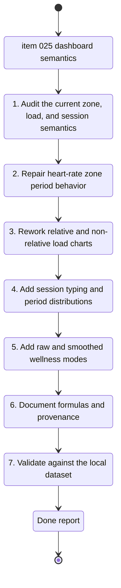

## task_026_refine_dashboard_zone_load_session_typing_and_metric_documentation - Refine dashboard zone controls, load semantics, session typing, and metric documentation
> From version: d4506d3
> Schema version: 1.0
> Status: Done
> Understanding: 98%
> Confidence: 95%
> Progress: 100%
> Complexity: High
> Theme: Analytics
> Reminder: Update status/understanding/confidence/progress and linked request/backlog references when you edit this doc.

# Context
- Derived from backlog item `item_025_refine_dashboard_zone_controls_load_semantics_session_typing_and_metric_documentation`.
- Source file: `logics/backlog/item_025_refine_dashboard_zone_controls_load_semantics_session_typing_and_metric_documentation.md`.
- Related request(s): `req_023_refine_dashboard_zone_load_session_typing_and_metric_documentation`.
- This task covers one bounded dashboard analytics slice:
  - repair the period control semantics on the heart-rate zone chart
  - audit and correct the relative-load definition and explanation
  - restore the non-relative load chart
  - add running session typing and period views
  - add raw versus optional 7-day smoothing for sleep and HRV
  - write a technical metric-calculation document

# Plan
- [x] 1. Audit the current implementation paths for:
  - heart-rate zone chart periods
  - relative load
  - non-relative load
  - sleep and HRV smoothing
  - running session classification inputs
- [x] 2. Make the heart-rate zone period control truthful:
  - apply `1 mois`, `3 mois`, and `1 an` to the rendered data
  - or remove the control from that chart if the concept is not meaningful there
- [x] 3. Recompute and explain relative load so a stable athlete reads around `1`, not structurally around `0.4`.
- [x] 4. Restore a non-relative load chart as simple daily load data without a default moving average.
- [x] 5. Add raw-by-default and optional 7-day moving-average modes for sleep and HRV, with a clear toggle in the UI.
- [x] 6. Implement running session typing with the locked priority:
  - `sortie longue` first
  - `qualité` next
  - `jogg facile` otherwise
- [x] 7. Show running session-type distribution over `1 mois`, `3 mois`, and `1 an` using:
  - a histogram-style view
  - a distribution summary
- [x] 8. Write a very technical documentation artifact covering:
  - raw sources
  - extraction logic
  - transformations
  - smoothing rules
  - formulas
  - interpretation notes
- [x] 9. Validate the resulting dashboard behavior on the current local dataset and update linked Logics docs.

# AC Traceability
- AC1 -> Make the heart-rate zone period control truthful or remove it. Proof: live chart behavior and code diff.
- AC2 -> Simplify the combined pace / cadence / HR graph by removing the low/high cadence band when it overloads readability. Proof: updated chart rendering.
- AC3 -> Keep sleep and HRV raw by default and add an optional 7-day moving average. Proof: UI toggle behavior and payload review.
- AC4 -> Audit and correct or redefine the relative-load metric. Proof: formula, code path, and updated explanation.
- AC5 -> Restore the non-relative load chart. Proof: visible dashboard or modal chart.
- AC6 -> Add a documented running session-typing heuristic. Proof: code path and documentation.
- AC7 -> Show session-type distribution over `1 mois`, `3 mois`, and `1 an`. Proof: rendered histogram and summary.
- AC8 -> Make the session-type view distinguish `jogg facile`, `qualité`, and `sortie longue`. Proof: labels, legend, and sample data.
- AC9 -> Publish a dedicated technical metric-calculation document. Proof: new documentation artifact.
- AC10 -> Keep UI and documentation compliant with `ADR 005`. Proof: French accents render correctly in UI and docs.

# Links
- Product brief(s): `prod_003_scientific_dashboard_charts_and_sport_specific_volume_filtering`, `prod_004_scientific_chart_centering_and_timeframe_selector`
- Architecture decision(s): `adr_004_scientific_charts_for_sport_specific_volumes_and_data_recalculation`, `adr_005_choose_end_to_end_utf_8_and_nfc_text_policy`, `adr_006_choose_dynamic_chart_windows_and_cadence_normalization`
- Backlog item: `item_025_refine_dashboard_zone_controls_load_semantics_session_typing_and_metric_documentation`
- Request(s): `req_023_refine_dashboard_zone_load_session_typing_and_metric_documentation`

# AI Context
- Summary: Execute the dashboard semantics slice for zone periods, load formulas, session typing, optional smoothing, and technical metric documentation.
- Keywords: heart-rate zones, relative load, daily load, sleep smoothing, hrv smoothing, session typing, long run, quality, easy jog, analytics formulas, documentation
- Use when: Use when implementing the trusted-semantics wave from item_025.
- Skip when: Skip when the work is about auth, imports, or unrelated chart layout polish.

# Validation
- Minimum expected checks for this slice:
- `.venv\Scripts\python -m unittest tests.test_pwa_service -v`
- `.venv\Scripts\python -m unittest discover -s tests -v`
- `node --check web/app.js`
- manual validation in the PWA on the current local dataset for:
  - heart-rate zone period control
  - relative load chart and explanation
  - non-relative load chart
  - sleep toggle raw versus lissé 7 jours
  - HRV toggle raw versus lissé 7 jours
  - running session-type distribution views
  - French accents in chart titles, legends, and helper copy
- `git status --short --branch`

# Definition of Done (DoD)
- [x] The heart-rate zone chart uses truthful period behavior or the misleading control is removed.
- [x] Relative load is corrected or explicitly redefined so the metric is interpretable.
- [x] The non-relative load chart is visible again.
- [x] Sleep and HRV are raw by default with an explicit optional 7-day smoothing mode.
- [x] Running session typing and period distributions are implemented and understandable.
- [x] A technical document explains formulas, provenance, and transformations.
- [x] Validation commands are executed and results are captured.
- [x] Linked request/backlog/task docs are updated.
- [x] Status is `Done` and progress is `100%` only after validation passes and repo state is coherent.

# Report
- `coach_garmin/analytics_support.py` now recenters relative load on `load_7d / (load_28d / 4)`, restores a daily load series, exposes smoothed sleep and HRV series, and derives running session types with the locked priority `sortie longue -> qualité -> jogg facile`.
- `coach_garmin/pwa_service_runtime_support.py` and `coach_garmin/pwa_service_support.py` now project the new analytics payload to the PWA, including window-filtered zone distributions, daily load, optional smoothed wellness series, and running session-type rows.
- `web/app.js` and `web/index.html` now render:
  - a restored `Charge quotidienne` chart
  - a corrected `Charge relative` explanation centered on `1.00`
  - raw-by-default sleep and HRV with on-demand `Lissé 7 jours`
  - a `Types de séance running` chart over `1 mois / 3 mois / 1 an`
  - zone distributions driven by the active dashboard window
- `docs/dashboard_metric_calculations.md` documents the formulas, provenance, and extraction logic in a technical format.
- Validation executed on `2026-04-16`:
  - `node --check web/app.js`
  - `.venv\\Scripts\\python -m py_compile coach_garmin\\analytics.py coach_garmin\\analytics_support.py coach_garmin\\analytics_series.py coach_garmin\\pwa_service_support.py coach_garmin\\pwa_service_runtime_support.py`
  - `.venv\\Scripts\\python -m unittest tests.test_pwa_service -v`
  - `.venv\\Scripts\\python -m unittest discover -s tests -v`
