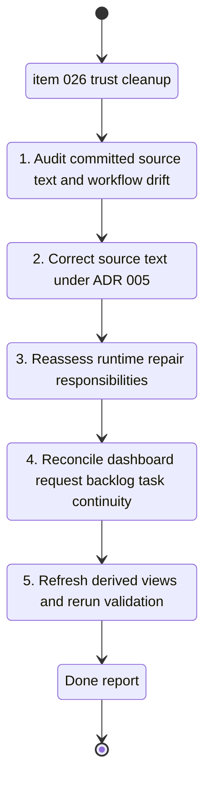

## task_027_finish_adr_005_source_text_cleanup_and_reconcile_dashboard_logics_continuity - Finish ADR 005 source text cleanup and reconcile dashboard Logics continuity
> From version: 20ee215
> Schema version: 1.0
> Status: Done
> Understanding: 95%
> Confidence: 93%
> Progress: 100%
> Complexity: High
> Theme: General
> Reminder: Update status/understanding/confidence/progress and linked request/backlog references when you edit this doc.

# Context
- Derived from backlog item `item_026_finish_adr_005_source_text_cleanup_and_reconcile_dashboard_logics_continuity`.
- Source file: `logics/backlog/item_026_finish_adr_005_source_text_cleanup_and_reconcile_dashboard_logics_continuity.md`.
- Related request(s): `req_024_finish_adr_005_source_text_cleanup_and_reconcile_dashboard_logics_continuity`.
- This task covers one bounded trust-and-continuity cleanup slice:
  - identify and correct committed mojibake or broken French strings on active source paths
  - review whether runtime text-repair hooks still carry source regressions that should instead be fixed in code or docs
  - reconcile the dashboard Logics continuity across the `017`, `018`, `022`, `023`, `024`, `025`, and `026` waves
  - refresh derived workflow views if the reconciliation changes the active story

# Plan
- [x] 1. Audit the active source surfaces for committed mojibake or broken French text:
  - PWA UI strings
  - diagnostics and terminal-facing copy
  - analytics-facing explanations or blocking reasons
  - docs and launcher-facing text touched by the current dashboard waves
- [x] 2. Separate true source regressions from intentional repair fixtures or tests that must remain to validate mojibake handling.
- [x] 3. Correct the source strings directly in the affected code and documentation paths while preserving `UTF-8 + NFC`.
- [x] 4. Review `coach_garmin/text_encoding.py` and frontend repair hooks to confirm whether each repair path is still needed as fallback after the source cleanup.
- [x] 5. Reconcile the dashboard Logics chain across:
  - `req/item/task_017`
  - `req/item/task_018`
  - `req_022` plus `item/task_023` and `item/task_024`
  - `req_023` plus `item/task_025` and `task_026`
- [x] 6. Update any stale status, progress, or outcome notes so delivered work, absorbed scope, and any real remainder are explicit without losing traceability.
- [x] 7. Refresh `logics/INDEX.md` and `logics/RELATIONSHIPS.md` if the document reconciliation leaves them stale.
- [x] 8. Run the relevant targeted searches, automated tests, and workflow checks, then capture the final state in this task and linked docs.

# AC Traceability
- AC1 -> Audit and correct committed source strings on active user-facing and workflow-facing paths. Proof: corrected files and targeted mojibake search review.
- AC2 -> Preserve `UTF-8 + NFC` handling on every edited text-bearing path. Proof: edited files, encoding-safe writes, and text validation checks.
- AC3 -> Reassess runtime repair hooks after source cleanup and keep only justified fallback behavior. Proof: code diff and rationale in report.
- AC4 -> Run targeted encoding checks plus the relevant automated test suite. Proof: captured validation commands and outcomes.
- AC5 -> Reconcile dashboard request/backlog/task continuity across the recent waves. Proof: updated linked docs and indicators.
- AC6 -> Preserve historical traceability while reconciling document state. Proof: retained links, references, and explicit notes instead of destructive cleanup.
- AC7 -> Refresh derived workflow views when reconciliation changes the active document story. Proof: regenerated `INDEX` and `RELATIONSHIPS` when needed.
- AC8 -> Leave the repository with an explicit post-cleanup remainder, if any still exists. Proof: final report and linked doc notes.

# Links
- Product brief(s): `prod_003_scientific_dashboard_charts_and_sport_specific_volume_filtering`, `prod_004_scientific_chart_centering_and_timeframe_selector`
- Architecture decision(s): `adr_005_choose_end_to_end_utf_8_and_nfc_text_policy`, `adr_006_choose_dynamic_chart_windows_and_cadence_normalization`
- Backlog item: `item_026_finish_adr_005_source_text_cleanup_and_reconcile_dashboard_logics_continuity`
- Request(s): `req_024_finish_adr_005_source_text_cleanup_and_reconcile_dashboard_logics_continuity`

# AI Context
- Summary: Execute the cleanup wave that removes remaining ADR 005 source regressions and restores trustworthy dashboard Logics continuity.
- Keywords: adr 005, utf-8, nfc, mojibake, source cleanup, text repair hooks, dashboard workflow, logics reconciliation
- Use when: Use when implementing the trust-and-continuity cleanup after the recent dashboard waves.
- Skip when: Skip when the work is about a new feature, auth, imports, or unrelated refactoring.

# Validation
- Minimum expected checks for this slice:
- `rg -n "Ã|Â|â|�|’|—|é|è|ê" coach_garmin web docs logics`
- `.venv\Scripts\python -m unittest tests.test_text_encoding -v`
- `.venv\Scripts\python -m unittest tests.test_pwa_service -v`
- `.venv\Scripts\python -m unittest discover -s tests -v`
- `node --check web/app.js`
- manual review of the touched Logics docs for:
  - request/backlog/task continuity
  - retained references and traceability
  - explicit remainder notes when applicable
- `git status --short --branch`

# Definition of Done (DoD)
- [x] Active source regressions covered by this slice are corrected at the source.
- [x] Runtime repair behavior is left in a justified fallback-only state where feasible.
- [x] Dashboard Logics continuity is reconciled without losing traceability.
- [x] Derived workflow views are refreshed when needed.
- [x] Validation commands are executed and results are captured.
- [x] Linked request/backlog/task docs are updated.
- [x] Status is `Done` and progress is `100%` only after validation passes and the repository state is coherent.

# Report
- Corrected committed French strings on active PWA and analytics-facing paths:
  - `web/app.js`
  - `coach_garmin/analytics_series.py`
- Left intentional mojibake fixtures in `tests/test_text_encoding.py` and the fallback markers in `coach_garmin/text_encoding.py` / `web/app.js` because they still validate repair behavior and compatibility handling.
- Reconciled the older chart-centering execution path:
  - `req_017` -> `Obsolete`
  - `item_017` -> `Obsolete`, `Progress: 100%`
  - `task_018` -> `Obsolete`, `Progress: 100%`
  - explicit successor notes now point to `req_018`, `req_022`, `req_023`, and `req_024`
- Refreshed derived workflow views:
  - `logics/INDEX.md`
  - `logics/RELATIONSHIPS.md`
- Validation executed on `2026-04-25`:
  - `.venv\Scripts\python -m unittest tests.test_text_encoding -v`
  - `.venv\Scripts\python -m unittest tests.test_pwa_service -v`
  - `.venv\Scripts\python -m unittest discover -s tests -v`
  - `node --check web/app.js`
  - `git status --short --branch`
- Residual repo state noted during closure:
  - unrelated local changes already existed under `.claude/`, `logics/instructions.md`, `logics/skills`, and `logs/`
  - those changes were not reverted or normalized by this task
