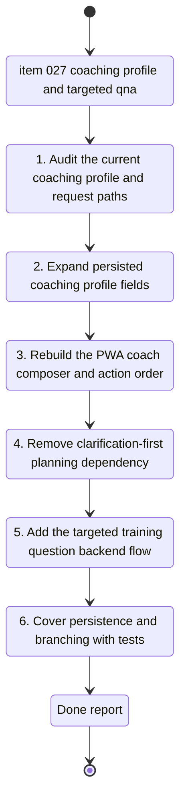

## task_028_expand_coaching_inputs_persist_constraints_and_add_targeted_training_questions_flow - Expand coaching inputs, persist constraints, and add a targeted training questions flow
> From version: 20260416-navfix30
> Schema version: 1.0
> Status: Done
> Understanding: 95%
> Confidence: 93%
> Progress: 100%
> Complexity: High
> Theme: Health
> Reminder: Update status/understanding/confidence/progress and linked request/backlog references when you edit this doc.

# Context
- Derived from backlog item `item_027_expand_coaching_inputs_persist_constraints_and_add_targeted_training_questions_flow`.
- Source file: `logics/backlog/item_027_expand_coaching_inputs_persist_constraints_and_add_targeted_training_questions_flow.md`.
- Related request(s): `req_025_expand_coaching_inputs_persist_constraints_and_add_targeted_training_questions_flow`.
- This task covers one bounded coaching product wave:
  - expand the persistent coaching profile in the PWA with separate free-form health and logistics fields
  - remove the old clarification-first step from the main planning journey
  - keep direct plan generation from the richer profile
  - add a separate targeted training question flow grounded in recent data and the latest saved plan
  - keep the first delivery slice transcript-driven for targeted question answers

# Plan
- [x] 1. Audit the current coaching state model and entrypoints across:
  - `web/index.html`
  - `web/app.js`
  - `coach_garmin/pwa_service_support.py`
  - `coach_garmin/pwa_service_runtime_support.py`
  - `coach_garmin/coach_chat_support.py`
  - `coach_garmin/coach_tools_support.py`
- [x] 2. Define the expanded persisted coaching profile shape with explicit nullable keys for:
  - `goal_text`
  - `blessure`
  - `fatigue`
  - `maladie`
  - `emploi_du_temps`
  - `disponibilite`
  - `temperature`
  - `deplacements`
  - `autres_sports`
  - targeted question field if it belongs in persisted UI state for prefill
- [x] 3. Keep backward compatibility with existing `goal_profile.json` content so older saved profiles still load cleanly.
- [x] 4. Rework the PWA coaching composer to:
  - expose the new separate free-form fields
  - keep `objective` as the only required field
  - remove the `Poser les questions` button
  - place `Générer le planning` after the objective and constraint fields
  - place the targeted question action after the targeted question field
- [x] 5. Update local state persistence and prefill behavior in the PWA so small edits can be made without retyping the entire profile.
- [x] 6. Remove the explicit clarification-first dependency from the main planning flow:
  - no dedicated prepare action in the UI
  - no blocking clarification round before plan generation
  - only missing `objective` blocks plan generation
- [x] 7. Update the backend planning path so generated plans use the expanded coaching profile and all non-null constraints as input context.
- [x] 8. Add a separate targeted training question flow that:
  - receives the current coaching profile
  - receives recent local metrics and recent training history
  - includes the latest saved plan when available
  - answers in the visible transcript only
  - does not overwrite or regenerate the saved weekly plan by default
- [x] 9. Implement explicit fallback behavior for targeted questions when no saved plan exists yet.
- [x] 10. Normalize all touched French UI and workflow strings under ADR 005 and choose the final button copy during implementation.
- [x] 11. Add or update automated coverage for:
  - persisted profile loading and saving
  - direct plan generation without clarification
  - targeted question behavior with a saved plan
  - targeted question behavior without a saved plan
  - PWA endpoint routing and payload handling
- [x] 12. Run targeted validation, update linked Logics docs, and capture the delivery report only after the repository is coherent.

# AC Traceability
- AC1 -> Expand the PWA composer with separate free-form health, logistics, and targeted question fields. Proof: rendered form and bound state.
- AC2 -> Keep all non-objective fields optional and nullable. Proof: empty optional fields do not block plan generation.
- AC3 -> Persist and prefill the expanded coaching profile locally. Proof: saved profile artifact and restored UI state.
- AC4 -> Generate plans directly from the richer profile without a separate clarification round. Proof: successful plan flow and updated backend handling.
- AC5 -> Remove the dedicated `Poser les questions` action. Proof: updated UI markup and event wiring.
- AC6 -> Reorder actions so planning and targeted question buttons align with the new field groups. Proof: rendered composer order.
- AC7 -> Add a separate targeted question flow using recent data and the latest saved plan when available. Proof: request payload and transcript answer path.
- AC8 -> Provide an explicit fallback when no saved plan exists. Proof: targeted question response without prior plan.
- AC9 -> Keep targeted question answers transcript-only for this slice. Proof: no dedicated persisted Q and A artifact written.
- AC10 -> Keep plan generation and targeted question answering separate at the UI, API, and persistence levels. Proof: distinct handlers and no unintended plan mutation.
- AC11 -> Cover persistence, prefill, null handling, and both coach branches in validation. Proof: targeted automated tests and checks.
- AC12 -> Preserve correct French accents and ADR 005 compliance on touched surfaces. Proof: reviewed strings and regression checks.

# Links
- Product brief(s): `prod_000_local_first_pwa_coach_dashboard`
- Architecture decision(s): `adr_005_choose_end_to_end_utf_8_and_nfc_text_policy`
- Backlog item: `item_027_expand_coaching_inputs_persist_constraints_and_add_targeted_training_questions_flow`
- Request(s): `req_025_expand_coaching_inputs_persist_constraints_and_add_targeted_training_questions_flow`
- Derived from `logics/backlog/item_027_expand_coaching_inputs_persist_constraints_and_add_targeted_training_questions_flow.md`

# AI Context
- Summary: Implement the major coaching UX wave that expands the persistent profile, removes clarification-first planning, and adds a separate targeted question flow.
- Keywords: coaching, pwa, profile persistence, injury, fatigue, illness, availability, planning, targeted question, latest plan, transcript
- Use when: Use when executing the coaching overhaul described in item_027.
- Skip when: Skip when the work is limited to dashboard analytics, import flows, or unrelated copy polish.

# Validation
- Minimum expected checks for this slice:
- `.venv\Scripts\python -m unittest tests.test_pwa_service -v`
- `.venv\Scripts\python -m unittest tests.test_coach_chat -v`
- `.venv\Scripts\python -m unittest discover -s tests -v`
- `node --check web/app.js`
- manual validation in the PWA for:
  - first load with empty optional fields
  - prefill after editing the expanded coaching profile
  - direct plan generation without a clarification step
  - targeted question answer with an existing saved plan
  - targeted question answer without an existing saved plan
- `git status --short --branch`

# Definition of Done (DoD)
- [x] The expanded coaching profile fields exist and persist locally.
- [x] The PWA prefill behavior works for the expanded coaching profile.
- [x] The dedicated clarification-first action is removed from the main planning flow.
- [x] Direct plan generation works from the richer profile with only `objective` as required input.
- [x] The targeted training question flow is implemented and remains transcript-only.
- [x] The targeted question path uses the latest saved plan when available and falls back explicitly when absent.
- [x] Validation commands are executed and results are captured.
- [x] Linked request/backlog/task docs are updated.
- [x] Status is `Done` and progress is `100%` only after validation passes and the repository state is coherent.

# Report
- `web/index.html` and `web/app.js` now expose separate free-form fields for `blessure`, `fatigue`, `maladie`, `emploi du temps`, `disponibilité`, `température`, `déplacements`, `autres sports`, plus one targeted question field.
- The old `Poser les questions` action is removed from the main PWA journey. The coach section now keeps:
  - `Enregistrer le contexte`
  - `Générer le planning`
  - `Poser la question`
- The PWA persists the expanded coaching draft in browser storage and hydrates it from `goal_profile.json` returned by the workspace status payload when needed.
- `coach_garmin/pwa_service_support.py`, `coach_garmin/pwa_service_runtime_support.py`, and `coach_garmin/pwa_service.py` now support:
  - `save_coach_profile`
  - direct plan generation from a structured profile payload
  - `answer_coach_question` with transcript-only output and explicit fallback when no saved plan exists
- `coach_garmin/coach_tools_support.py` now exposes `latest_plan()`, and the provider clients now support targeted question answering without abusing the weekly-plan contract.
- The plan-generation path remains backward-compatible with the older clarification payload shape for existing non-PWA callers, while the active PWA flow no longer depends on a clarification round.
- PWA build bumped to `20260427-coach31` to invalidate cached shell assets after the coaching overhaul.
- Validation executed on `2026-04-27`:
  - `.venv\Scripts\python -m unittest tests.test_pwa_service -v`
  - `.venv\Scripts\python -m unittest tests.test_coach_chat -v`
  - `.venv\Scripts\python -m unittest discover -s tests -v`
  - `node --check web/app.js`
  - `git status --short --branch`
- Residual repo state during closure:
  - unrelated existing changes remain under `.claude/`, `logics/`, and `logs/`
  - those changes were not reverted or normalized by this task
